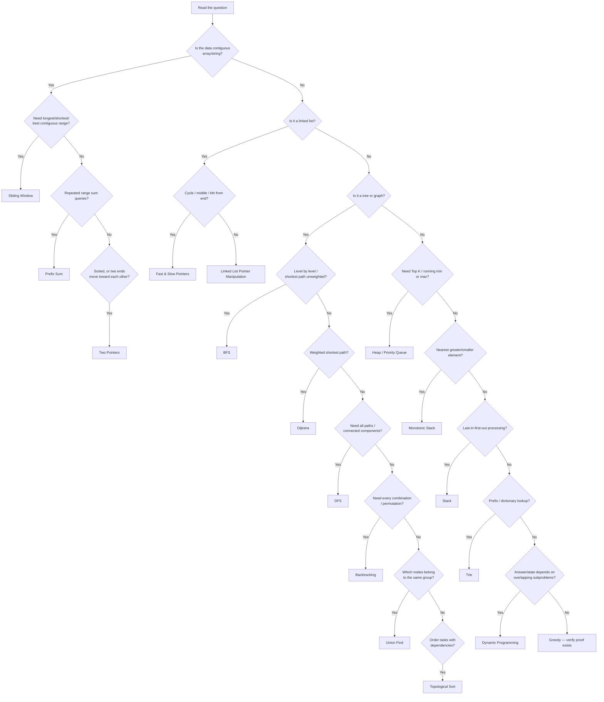
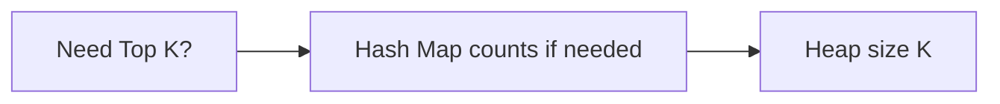
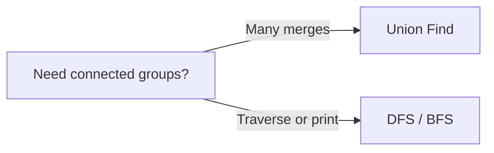
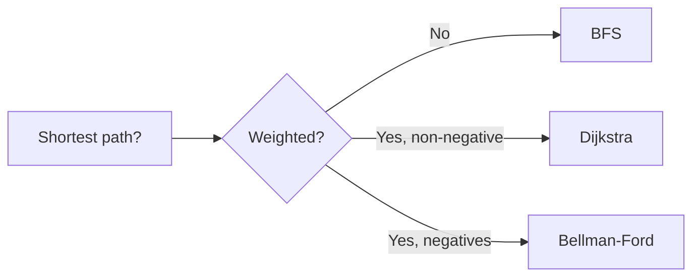
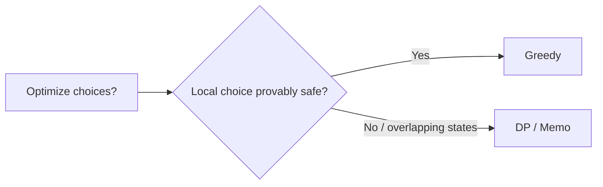
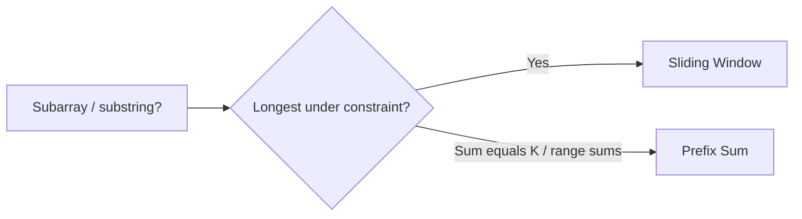

# Decision Trees

These are the "which pattern?" flowcharts. Part 3
(`part-3-pattern-recognition/`) turns them into a full walkthrough. Keep this
file in sync with Part 3.

## The Quick Recognition Cheat Sheet

Read the left column like a quiz: if the question sounds like that, start with
the pattern on the right.

| If the question says... | Think... |
| --- | --- |
| Pair in sorted array | Two Pointers |
| Longest substring / contiguous constraint | Sliding Window |
| Frequency / count / complement | Hash Map |
| Range sums / subarray sum equals K | Prefix Sum (+ map); window only if all ≥0 |
| Sorted search / min-max feasible value | Binary Search |
| Reverse / merge linked list | Linked List Pointer Manipulation |
| Nested parentheses | Stack |
| Nearest greater / smaller | Monotonic Stack |
| Shortest path (unweighted) | BFS |
| Explore components / deep paths | DFS |
| Generate combinations / permutations | Backtracking |
| Count ways / max-min overlapping states | Dynamic Programming |
| Top K / Kth largest/smallest | Heap |
| Merge overlapping ranges | Intervals |
| Max concurrent meetings / events on a line | Sweep Line |
| Which nodes belong together | Union Find |
| Prefix / dictionary / autocomplete | Trie |
| Shortest path, weighted ≥0 | Dijkstra |
| Order tasks with dependencies | Topological Sort |
| Connect all with min total weight | MST |
| Local choice with a proof | Greedy (Family 5 full pattern) |

## Master Decision Tree

## Dual-Home Routing

| Problem | Primary (deep) | Secondary (see also) |
| --- | --- | --- |
| Top K Frequent | Heap (select) | Hash Map (count) |
| Subarray Sum Equals K | Prefix Sum + map | Hash Map — **not** Sliding Window unless all values ≥ 0 |
| Longest Consecutive Sequence | Hash Set (left-edge runs) | Hash Map only if you store lengths as values |
| Meeting Rooms II | Sweep Line | Intervals |
| Daily Temperatures / Histogram | Monotonic Stack | Stack |
| Word Search | Backtracking | DFS |
| Merge k Sorted Lists | Heap | Linked List ops |
| Jump Game / Gas Station | Greedy (prove local choice) | DP if proof fails / need all ways |

## Focused Trees

**"I need the Top K elements"**

**"I need connected groups"**

**"I need a shortest path"**

**"Greedy or DP?"**

**"Contiguous constraint vs equals-K sum"**

