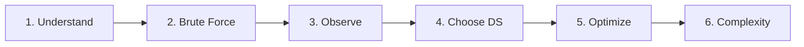

# Chapter 1 — How to Solve Any DSA Problem

Interview problems feel endless — until you notice that strong solvers share one
habit. They run the **same six-step plan** every time. The plan turns panic into
a checklist. This whole handbook follows that plan.

## The Six-Step Framework



Each arrow is a pause. Skip a step and you invent a clever *wrong* answer under
time pressure.

### 1. Understand

Say the problem in one plain sentence. Name what comes in, what goes out, and
how big the input can be. A tiny `n` (size) and a huge `n` need different plans.
Ask: sorted? unique? negative numbers? empty input?

> 🚀 **Interview Tip:** Say your restatement out loud. Interviewers catch
> misunderstandings early when they hear them.

### 2. Brute Force

"Brute force" means the slow-but-correct idea — nested loops, try every pair,
scan from scratch. That is allowed. It proves you understand the rules before
you speed things up.

### 3. Observe Patterns

Where are you doing the same work twice? Same pair checked twice? Same range
sum rebuilt? Same recursive call with the same inputs? The slowdown is almost
always **wasted repeat work**, not "missing a fancy algorithm."

### 4. Choose a Data Structure / Pattern

Match the slowdown to a family from Part 2. Need instant lookup → Hash Map
(a labeled toy box keyed by name). Need the best contiguous stretch → Sliding
Window. Need Top K → Heap. Part 3's decision trees are this step, written out.

### 5. Optimize

Apply the pattern. Check a tiny example by hand before you code. Only then type.

### 6. Analyze Complexity

"Complexity" means: how does time and memory grow when the input gets bigger?
Say time and space in one line each ("one pass over n items," "at most n keys
in the map"). Compare that to the constraints.

---

## Worked Example: Two Sum

**Problem:** You get a list of numbers and a target. Return the indices of two
numbers that add up to the target. Exactly one answer exists.

### Understand

Input: `nums`, `target`. Output: two indices `[i, j]`, and `i ≠ j`. Values can
repeat. Order of indices does not matter for correctness.

Tiny example: `nums = [2, 7, 11, 15]`, `target = 9` → `[0, 1]` because
`2 + 7 = 9`.

### Brute Force

For every index `i`, scan every later `j` and test `nums[i] + nums[j] == target`.

Bottleneck: every pair is checked → about n² additions. Fine for n = 100; fails
the "n = 100,000 in under a second" bar from Chapter 2.

### Observe

For a fixed `nums[i]`, you only need the **complement** — the partner number
`target - nums[i]`. The inner scan is really asking: "have I already seen that
partner?"

### Choose Data Structure

A **Hash Map** stores `value → index` as you walk left to right. Lookup is about
**O(1)** on average — Big O shorthand for “does not grow with the list size”
(Chapter 2 unpacks the language). It feels like finding a toy by its label,
not scanning the whole box. That is Family 1's Hash Maps pattern (the golden
chapter in Part 2).

### Optimize

```pseudo
map = empty hash map          # value → index
for i from 0 to n-1:
    need = target - nums[i]
    if need in map:
        return [map[need], i]
    map[nums[i]] = i
```

Hand-check: after seeing `2` at index 0, at `7` the map already has `2`, and
`9 - 7 = 2` hits → return `[0, 1]`.

### Complexity

- **Time:** O(n) — one pass; each lookup/insert is about O(1) on average
- **Space:** O(n) — at most n keys stored

---

## How This Connects to the Rest of the Book

| Framework step | Where this handbook deepens it |
| --- | --- |
| Understand + Brute force | Every pattern's "problem → naive → bottleneck" arc |
| Observe + Choose DS | Part 2 families + Part 3 recognition guide |
| Optimize | Generic templates in each pattern chapter |
| Complexity | Chapter 2 + each pattern's Complexity section |

> 🧠 **Pattern Recognition:** When brute force is "check all pairs," ask whether
> a hash map of partners (Two Sum family) or two sorted pointers can replace
> the inner loop.

---

## False Pattern: When It Looks Like a Window

A problem can *sound* like Sliding Window and still not be one. Example: “find
two numbers that sum to the target” (Two Sum). The wording never says
“substring,” but beginners sometimes try a growing/shrinking window anyway.

Why that fails: the answer pair does **not** have to be a continuous stretch.
Indexes `0` and `3` can be valid even if everything between them is junk. A
window only helps when the answer is a contiguous segment with a running rule
(longest unique substring, shortest covering range). Two Sum’s bottleneck is
“have I seen the partner?” → Hash Map.

**Takeaway:** Match the bottleneck, not a lucky keyword. Contiguous + running
rule → window. Partner / frequency → map. Sorted ends walking inward → two
pointers.

Master the plan once. Pattern chapters then become drop-in answers for
steps 3–5 — not disconnected recipes to memorize.
