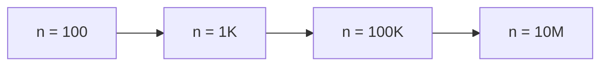

# Chapter 2 — Big O in Practical Terms

Big O is not a secret club handshake. It is a **capacity check**. Before you
code, ask: "With this growth rate, does this finish for the interview's `n`?"

## What Big O Actually Measures

Big O describes how runtime (or memory) **grows** as input size `n` grows. It
ignores constants and smaller terms. `O(n)` means "roughly grows with n." It
does **not** mean "always faster than O(n log n) for every tiny n" — constants
matter at small sizes — but it does tell you what happens when `n` jumps from
100 to 10 million.

Each jump is roughly 10–100× more work for a linear algorithm — and much worse
for nested loops (a loop inside a loop).

---

## The Practical Table

Assume ~100 million simple operations per second as a rough interview gut check
(real machines vary; this is not a benchmark).

| Complexity | Rough feel | n = 100 | n = 1,000 | n = 100,000 | n = 10,000,000 |
| --- | --- | --- | --- | --- | --- |
| O(1) | Constant | Instant | Instant | Instant | Instant |
| O(log n) | Halve each time | Instant | Instant | Instant | Instant |
| O(n) | One pass | Fine | Fine | Fine | Borderline OK |
| O(n log n) | Sort + linear | Fine | Fine | Fine | Usually OK |
| O(n²) | Nested loops | Fine | Risky | Too slow | Impossible |
| O(2ⁿ) / O(n!) | Try all subsets/orderings | Only tiny n | No | No | No |

**Rule of thumb for interviews:** if constraints say `n ≤ 100,000`, aim for
`O(n)` or `O(n log n)`. If `n ≤ 20`, trying all options (backtracking) may be
fine. If `n ≤ 1,000`, a careful `O(n²)` sometimes passes.

---

## Analogies (Not Proofs)

- **O(1) — opening a labeled toy box** — You know the shelf; you go once.
- **O(log n) — guessing a number by always picking the middle** — Discard half
  each time (like binary search in a phone book).
- **O(n) — reading every email in the inbox** — Work grows with the inbox.
- **O(n log n) — sorting a messy deck carefully** — Typical "sort then scan"
  ceiling for compare-based sorts.
- **O(n²) — every kid shakes hands with every other kid** — Pairs explode.

> 💡 **Intuition:** The gap between O(n) and O(n²) is not "a bit slower." It
> is the difference between one walk down the line and walking the whole line
> again for every kid.

---

## Space Complexity Matters Too

Time is not the only scarce resource. "Space complexity" means how much
**extra memory** you need:

- **O(1) extra space** — a few variables (flip an array in place).
- **O(n)** — a hash map or a copy of the input.
- **O(n²)** — a big DP table or a full grid of edges.

Interview follow-up: "Can you do it with less memory?" Often means trading
time for space, or reusing the input array.

---

## Connecting Constraints to Patterns

| Constraint signal | Likely complexity target | Patterns that often fit |
| --- | --- | --- |
| n ≤ 20 | O(2ⁿ) OK | Backtracking, subset DP |
| n ≤ 10³ | O(n²) may pass | Some DP, nested two-pointers variants |
| n ≤ 10⁵ | O(n) / O(n log n) | Hash map, sliding window, sort + scan, heap |
| n ≤ 10⁶+ | Strict linear / near-linear | Prefix sums, streaming, careful constants |

Chapter 1's Step 6 ("Analyze Complexity") is this table applied to your chosen
pattern. Part 2 states time and space for every template so you can compare
against constraints without redoing the math from scratch.

> ⚠️ **Common Mistake:** Saying "O(n)" while your code has a hidden nested
> loop or a "does this list contain x?" check that costs O(n) each time.
> Complexity is about what your **code** does, not the name of the pattern you
> meant to use.
