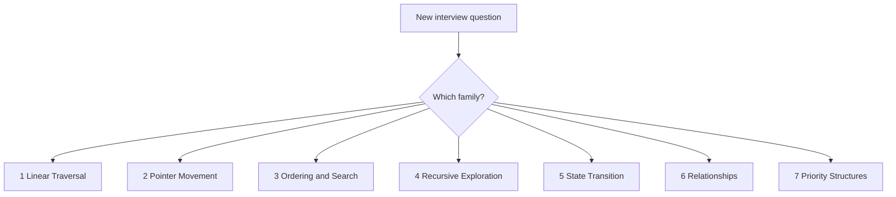

# Chapter 3 — Pattern Recognition

Thousands of interview questions collapse into a handful of **families**. Once
you can name the family, the solution shape is mostly decided. You stop inventing
algorithms from scratch and start **recognizing**.

## Why Families Exist

Problems that look different ("longest substring," "max sum of size K,"
"fruits into baskets") share the same core move: keep a contiguous window and
update counts as the edges move. That shared move is a **pattern**. Patterns
cluster into seven families by the kind of structure they walk or the kind of
state they keep.

Think of it like a video-game map with seven biomes. New quest? First ask which
biome you are in — then open the right walkthrough.

The diagram above is the first fork. Part 3 and [`DECISION_TREES.md`](../DECISION_TREES.md)
turn that fork into a full decision tree.

---

## The Seven Families at a Glance

| # | Family | Core idea | Example patterns |
| --- | --- | --- | --- |
| 1 | Linear Traversal | One pass + fast lookup or precompute | Arrays, Hash Map/Set, Prefix Sum |
| 2 | Pointer Movement | Fingers that move with a rule | Two Pointers, Sliding Window, Fast/Slow |
| 3 | Ordering & Search | Sort or binary-search the answer space | Sorting, Binary Search, Intervals, Sweep |
| 4 | Recursive Exploration | Go deep, combine, or try-and-undo | DFS, Tree walks, D&C, Backtracking |
| 5 | State Transition | Build the answer from smaller states | Memoization, DP (+ Greedy cross-ref) |
| 6 | Relationships | Nodes and edges (friend maps, roads) | BFS, Graphs, UF, Topo, Dijkstra, MST |
| 7 | Priority Structures | Process next by a rule | Stack, Queue, Heap, Mono Stack, Trie |

Part 2 deepens each pattern with the full ten-section template. This chapter
only answers: **when do I walk into that family's section?**

---

## Keyword → Family (Starter Heuristics)

| Question wording | Start here |
| --- | --- |
| Frequency / complement / "pair that sums to" | Family 1 — Hash Map |
| Contiguous longest / shortest / at most K distinct | Family 2 — Sliding Window |
| Sorted array, ends move toward each other | Family 2 — Two Pointers |
| Sorted search / min feasible capacity | Family 3 — Binary Search |
| Overlapping ranges / meeting rooms | Family 3 — Intervals / Sweep |
| Connected components / islands / paths | Family 4 DFS or Family 6 BFS |
| All permutations / combinations / constraints | Family 4 — Backtracking |
| Count ways / minimize / maximize with overlap | Family 5 — DP |
| Shortest path unweighted / level order | Family 6 — BFS |
| Top K / running median | Family 7 — Heap |
| Nearest greater / next warmer day | Family 7 — Monotonic Stack |

> 🧠 **Pattern Recognition:** Read the question twice — once for the story,
> once for the **structure** (contiguous? pairwise? graph? ordered?). Structure
> beats story every time.

---

## Dual-Home Problems

Some questions honestly sit on two patterns. This handbook teaches them
**deep once**, then says "see also" elsewhere:

- **Top K Frequent** — Hash Map counts; Heap picks the Top K
- **Subarray Sum Equals K** — Prefix Sum insight; Hash Map for prefix counts
- **Daily Temperatures** — Stack story; Monotonic Stack owns the template

When stuck between two names, ask: "What is the **hard** part?" Counting is
easy; picking Top K is the pattern. Contiguous range is the window; the hash
map is just the window's notebook.

---

## How to Use the Rest of the Book

1. **Part 2** — Learn each pattern's mental model and template (how to build it).
2. **Part 3** — Practice going from wording → pattern without peeking at answers.
3. **Part 4** — One-page refreshers before interviews.
4. **Part 5** — Curated drills (5–8 problems per pattern), not endless grind.

> 💡 **Intuition:** Pattern recognition is a **search** over a small catalog.
> Your job is not to invent a famous algorithm under the clock. It is to notice
> "weighted shortest path, no negative edges" and open that chapter.

When you finish Part 1, you already know the map. Everything that follows is
the same terrain drawn in finer detail.
