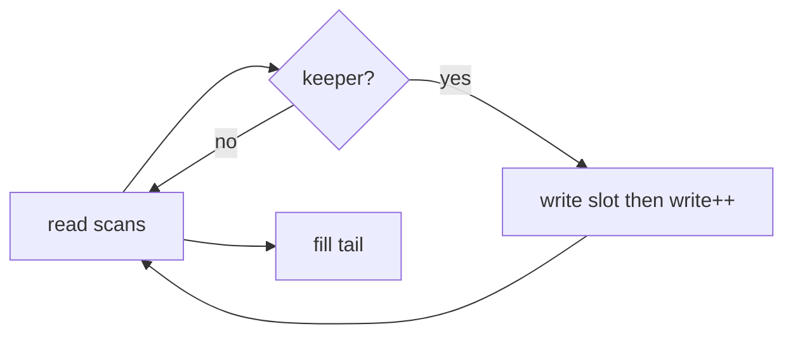
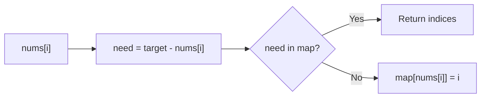
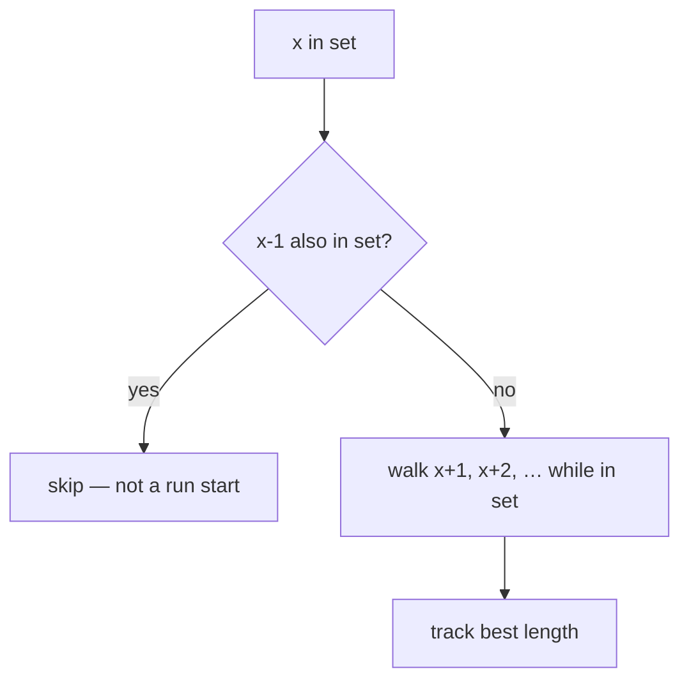

# Family 1 — Linear Traversal

Patterns in this file each follow `HANDBOOK_STYLE_GUIDE.md`: Purpose,
Recognition Clues, Mental Model, Visualization, Generic Template, Complexity,
Common Mistakes, Classic Interview Questions, Engineering Connections, Summary.

- [x] Arrays
- [x] Hash Maps _(golden chapter — quality bar for later patterns)_
- [x] Hash Sets
- [x] Prefix Sum

## Family Overview

These patterns help you stop doing the same slow scan over and over.

Instead of checking every pair of things (slow), you either:

- look something up instantly, or
- remember running totals ahead of time

**Who owns what**

| Pattern | Owns | Does not own |
| --- | --- | --- |
| Arrays | Numbered slots, rearrange in place | Counting with maps |
| Hash Maps | Name → value (counts, partners, groups) | Simple yes/no “have I seen it?” |
| Hash Sets | Yes/no membership | Counting or storing a partner index |
| Prefix Sum | Fast range totals | “Best window” problems (that’s Sliding Window) |

---

## Arrays

**Scope:** A row of numbered boxes. You move things between boxes using indexes.
Not for counting how often something appears (that’s Hash Maps).

### Purpose

An **array** is a row of numbered mailboxes: box `0`, box `1`, box `2`, …
You can open any box by its number right away. Interviews love arrays because
you can rearrange them **in place** (reuse the same row of boxes) when someone
says “don’t make a big new list.” The pattern is less about a fancy formula and
more about owning indexes: who writes, who reads, and what the leftover tail
means when you’re done packing.

### Recognition Clues

- "In-place," "without extra array," "modify the input"
- Rotate, reverse, move zeroes, product except self
- Walk a grid with spiral / rotate rules
- Fixed passes over indexes (not a growing/shrinking window)
- “Partition” or “compact” so keepers sit together

### Mental Model

**The problem.** Move Zeroes: push all `0`s to the end, keep other numbers in
order. Example: `[0, 1, 0, 3, 12]` → `[1, 3, 12, 0, 0]`.

**Naive idea.** Build a brand-new list of non-zeros, then glue zeros on. Works,
but uses a second full row of boxes.

**The bottleneck.** Copying everything into a new array costs extra memory and
extra write traffic. When the follow-up says “O(1) extra space,” that second
row is illegal.

**The better idea.** Use two fingers on the **same** array:

- a **read** finger finds the next number you want to keep
- a **write** finger places it at the front of the “done” part

When you’re done placing good numbers, fill the rest with zeros. Same trick
shows up in rotate (cycle of swaps), reverse (two ends walk inward), and
“product except self” (left-pass + right-pass into the output slots).

**Pattern name.** Arrays — index surgery / in-place transform.

**Kid analogy.** Sorting toys on a shelf: pull the keepers forward into a neat
line, then leave empty slots at the end. You do not buy a second shelf unless
you must.

**Second worked sketch — Rotate Array.** Suppose you must rotate right by `k`.
Naively pop the last item and insert at front `k` times — that reshuffles the
whole row every pop. Better: reverse the whole row, reverse the first `k`,
reverse the rest. Three reverse passes, each O(n), still in place. The insight
is the same Arrays habit: indexes are enough; you do not need a second shelf.

**When you reach for it.** The problem names a row of values, talks about
indexes or “without extra space,” and the hard part is *where each value should
land*, not “have I seen this value?” Product of Array Except Self is still
Arrays: left running product into slots, then multiply a right running product
on the way back — two linear index walks, no hash map required.

### Visualization

```text
Move Zeroes — read finds keepers, write places them:

  [0, 1, 0, 3, 12]     write=0
       ^r
  [1, 1, 0, 3, 12]     write=1 after placing 1
          ^r
  [1, 3, 0, 3, 12]     write=2 after placing 3
               ^r
  [1, 3, 12, 0, 0]     fill the rest with 0
```



The write spot is the edge of the finished left side. The read spot walks the
whole row once. No counting map — only indexes.

### Generic Template

```pseudo
# In-place compact / transform with a write frontier
write = 0
for read from 0 to n-1:
    if should_keep(arr[read]):
        arr[write] = transform(arr[read])
        write += 1
# optional: clear or fill arr[write .. n-1]

# Two-pass accumulate into answer slots (product-except-self style)
# left_pass: answer[i] = product of all left of i
# right_pass: multiply answer[i] by product of all right of i
```

In plain English: slide the keepers left, then clean up the leftover boxes. Or
walk left-to-right and right-to-left so each slot learns everything except
itself.

### Complexity

- **Time:** O(n) — you visit each box a fixed number of times
- **Space:** O(1) extra — just a few index variables (unless you must not change
  the input and the problem allows an output array)

### Common Mistakes

- Being off by one when filling the empty tail
- Assuming values are unique when they might not be
- Making a whole new array “for clarity” when the follow-up wants tiny space
- Mixing this up with Sliding Window (here there is no growing window rule)
- Forgetting rotation direction or `k % n` before cycling

> 💡 **Tip:** If the hard part is “where does this go?”, think Arrays. If the
> hard part is “have I seen this value before?”, think Hash Map / Set.

### Classic Interview Questions

**Easy:** Move Zeroes · Apply Operations to an Array · Find Numbers with Even Number of Digits

**Medium:** Rotate Array · Product of Array Except Self · Spiral Matrix

**Hard:** First Missing Positive · Max Value of Equation

> See also: Trapping Rain Water under Two Pointers. Dutch National Flag three-way partition is a short Arrays callout, not a separate family.

### Engineering Connections

Phone photos and game frames are big grids of numbers sitting in a row in
memory. Flipping or rotating a picture is the same “move numbers between
indexes” work — allocating a whole new frame every time would thrash cache and
burn RAM on mobile devices.

> 🏗️ **Engineering Connection:** Image codecs and game engines favor in-place
> or streaming transforms on contiguous buffers so the CPU’s nearby cache stays
> hot — same instinct as interview “compact in place.”

### Summary

- Arrays = numbered boxes you rearrange with indexes
- A write finger turns “build a new list” into one careful rewrite
- Watch the leftover suffix after compacting
- Need fast “have I seen this?” → Hash Map or Hash Set
- Contiguous “best stretch under a rule” → Sliding Window, not Arrays alone

---

## Hash Maps

**Scope:** Remember a label → stuff (count, index, list of mates). If you only
need yes/no “seen it?”, prefer a Hash Set.

### Purpose

A **Hash Map** (also called a dictionary) is a magic unlabeled locker wall:
you shout a **name** (the key), and it finds the right locker instantly. Inside
the locker you keep a **value** — a count, an index, a list of friends, whatever
you need.

The big win: instead of scanning the whole hallway again and again asking “have
I seen this?”, you ask the locker wall once. That turns a slow nested loop into
one walk.

### Recognition Clues

- "Two numbers that sum to target," "complement," "pair with"
- "Frequency," "count occurrences," "group by"
- "First unique," "isomorphic," "anagram" (letter → how many)
- "Where did I see this before?" while scanning once

> 🧠 **Pattern Recognition:** If your slow solution’s inner loop only asks
> “have I already seen value V (maybe with a count or index)?”, grab a map.

### Mental Model

**The problem.** Two Sum: numbers in a list, plus a target. Find two indexes
whose numbers add up to the target. Example: `[2, 7, 11, 15]`, target `9` →
indexes `0` and `1` because `2 + 7 = 9`.

**Naive idea.** For each number, check every other number. Correct, but if the
list has 100,000 items, that’s a ridiculous number of checks — like comparing
every kid in a stadium to every other kid.

**The stuck part.** The inner scan keeps asking the same question: “Is the
partner I need already somewhere?”

**The click.** The partner for `x` is `target - x` (the **complement** —
fancy word for “the other half that finishes the sum”). As you walk left to
right:

1. Ask the map: “Do I already have the partner?”
2. If yes → you’re done.
3. If no → store this number and its index for later.

**Pattern name.** Hash Map (locker wall for partners / counts / groups).

**Kid analogy.** Coat check: you don’t walk the whole rack for ticket 42. You
look at the cubby labeled 42. The map is that cubby board.

**Same locker, different payloads.** Anagrams: fingerprint (sorted letters or
26-count tuple) → list of words. Isomorphic strings: map each letter to its
partner and refuse remapping. Contiguous Array: after turning 0→−1, store first
index of each running sum so equal prefixes mark a balanced middle stretch.
Different stories; one habit — ask the wall before you re-scan.

**When maps are the wrong tool.** Pure membership without a stored value →
Hash Set. “Best contiguous stretch under a live rule” → Sliding Window. Top-K
winners after counting → count with a map, crowning with a Heap.

### Visualization



On `[2, 7, 11, 15]`, target `9`:

- at `2`, partner needed is `7` — not in map yet → store `{2: 0}`
- at `7`, partner needed is `2` — map has it → answer `[0, 1]`

One pass. No nested “check everyone again.”

### Generic Template

```pseudo
map = empty hash map          # key → value (index, count, list, …)

for each item x with index i in input:
    # 1) query what you need from past items
    if satisfies(map, x):
        return answer_from(map, x, i)
    # 2) then record x for future iterations
    map[key(x)] = update(map, x, i)

# optional: second pass over map entries (e.g. group anagrams)
```

In plain English: ask the wall for what you need **before** you hang up
today’s coat; then hang today’s coat for tomorrow’s questions.

Counting version: each time you see `x`, bump `map[x]` by one. Grouping
version: put items that share a fingerprint into the same locker list.

### Complexity

- **Time:** about O(n) — one walk; each lookup is usually instant
- **Space:** O(n) — up to one locker per different key

(In theory a hash can go weird and slow; interviews almost never care unless
they ask.)

### Common Mistakes

- Putting today’s number in the map **before** checking for its partner (Two
  Sum might pair a number with itself)
- Using a normal list’s “contains” (that still walks everything) and calling it
  a hash map
- For anagrams, using the raw word as the key — you need a shared fingerprint
  (sorted letters or letter counts)
- Returning the numbers when the problem asked for indexes (or the opposite)

> ⚠️ **Common Mistake:** Top K Frequent needs a map to **count**, but picking
> the top K winners is a Heap job (Family 7). Count here; crown winners there.

### Classic Interview Questions

**Easy:** Two Sum · Valid Anagram · Isomorphic Strings

**Medium:** Group Anagrams · Contiguous Array · 4Sum II

**Hard:** Insert Delete GetRandom O(1) — Duplicates allowed · All O(1) Data Structure

> See also: Longest Consecutive Sequence under Hash Sets; Subarray Sum Equals K under Prefix Sum (map is a helper). First Missing Positive under Arrays; Minimum Window Substring under Sliding Window.

### Engineering Connections

Login systems store `sessionId → user stuff` in something like Redis hashes —
same “name the locker, get the value” idea. App caches and feature flags work
the same way.

> 🏗️ **Engineering Connection:** Every time a server finds “user 42” without
> scanning all users, that’s a hash map (or a big distributed cousin with the
> same feel).

### Summary

- Hash map = magic lockers: name in, value out
- Trade a little memory to skip nested scans
- Ask for the partner **before** storing today’s item when pairs must be two
  different places
- Counts, groups, and partners are the same template with different locker
  contents
- Pure yes/no “seen?” → Hash Set; Top-K picking → Heap

---

## Hash Sets

**Scope:** Only “is it here?” — not “how many?” or “where was it?”

### Purpose

A **Hash Set** is a guest list with no sticky notes — just names. You ask “is
this person on the list?” and get yes or no in about one hop. That is enough
for duplicates, intersections, and “have I visited this URL?” style problems.

When you catch yourself storing `map[x] = true` and never reading a real value,
you wanted a set.

### Recognition Clues

- "Contains duplicate," "unique," "already seen"
- Intersection / difference of two lists without caring about counts
- Cycle detection via a seen set (also Fast & Slow — dual-home)
- Longest consecutive sequence using “only start a run at a left edge”
- Dedup before more expensive work

### Mental Model

**The problem.** Longest Consecutive Sequence: given unsorted numbers (with
duplicates possible), how long is the longest streak of consecutive integers?
Example: `[100, 4, 200, 1, 3, 2]` → `4` because `1,2,3,4`.

**Naive idea.** Sort, then scan streaks. Sorting costs time and mutates or
copies the list.

**The bottleneck.** Sorting does global order work you do not need. Nested
“is `x+1` somewhere?” scans are even worse — they rewalk the list per starter.

**The better idea.** Dump everything into a set for instant membership. For
each number `x`, only try to start a streak if `x - 1` is **not** in the set
(so you begin at the left edge of a run). Then walk `x+1`, `x+2`, … until the
set says no. Each number is entered into at most one growing run.

**Pattern name.** Hash Set (membership / “already seen”).

**Kid analogy.** A school “who’s already checked in?” clipboards — you only
mark names present, not jackets or lunch numbers. Longest consecutive = find
the start of a friendship chain (`x` with no `x-1`), then count friends that
follow.

**Why the left-edge rule matters.** If you start a walk at every number, a
streak of length L gets restarted L times and each restart rewalks most of the
same membership checks. Only starting when `x-1` is missing makes each value
the start of at most one growing walk — that’s the linear bound people mention
in interviews.

**Second sketch — Contains Duplicate.** Walk once; if `x` is already in the set,
stop with yes. If you finish, every value was new. Same guest-list idea without
streak logic. Intersection of two arrays: build a set from the shorter list,
then ask membership while walking the longer one — still no value payload.

### Visualization

```text
set = {100, 4, 200, 1, 3, 2}

start only if (x-1) missing:
  1 → grow 2,3,4  length 4   ✓
  2 → skip (1 exists)
  3 → skip
  4 → skip
  100 → length 1
  200 → length 1
```



You pay set lookups, not a full sort, and you avoid restarting mid-run.

### Generic Template

```pseudo
S = hash set of all values

# Seen-while-scan (duplicates)
seen = empty set
for x in arr:
    if x in seen: return true   # or collect
    seen.add(x)

# Longest consecutive
best = 0
for x in S:
    if (x - 1) not in S:        # only start at left edge
        y = x
        while (y + 1) in S:
            y += 1
        best = max(best, y - x + 1)
```

In plain English: put the names on the guest list; ask membership; for streaks,
only open chains at their true start.

### Complexity

- **Time:** O(n) average for insert-while-scan; longest consecutive is O(n)
  because each value roots or extends a run at most once
- **Space:** O(n) for the set of distinct values

### Common Mistakes

- Using a list’s “contains” and calling it a set (that is still O(n) per ask)
- Starting a consecutive walk from every `x` (restart mid-run → quadratic feel)
- Reaching for a map when you never store a useful value
- Forgetting duplicates when the problem allows them

> 💡 **Tip:** If you never store a useful “value” next to the key, you probably
> want a set, not a map.

**Interview phrasing trap.** “Longest consecutive sequence” sounds like a sort
problem. Sorting works, but the set + left-edge walk shows you saw that order
only needs membership, not a full sorted copy. Say that out loud — it signals
recognition, not memorization of a LeetCode number.

### Classic Interview Questions

**Easy:** Contains Duplicate · Intersection of Two Arrays · Happy Number

**Medium:** Longest Consecutive Sequence · Missing Number · Find All Numbers Disappeared in an Array

**Hard:** First Missing Positive · Similar String Groups

### Engineering Connections

Web crawlers keep a “URL already fetched” set (or a Bloom filter cousin) so
they don’t download the same page again. Same “already seen?” idea as Contains
Duplicate, but planet-sized. Spam filters and CDN edge caches ask the same
membership question billions of times a day.

> 🏗️ **Engineering Connection:** Dedup caches ask only “seen before?” — a set
> (or a fuzzy Bloom filter when memory is tight) is enough; they do not need a
> full map of page bodies keyed by URL for the membership check itself.

### Why Reach For This

Patterns exist so you stop reinventing the same bottleneck fix under interview
pressure. Name the wasted work first — nested pair scans, rebuilding range
sums, rescanning a grid, forgetting visited marks, sorting when membership was
enough. Then name the structure that removes that waste. Practice saying the
bottleneck in one sentence before you touch the keyboard; that sentence is how
interviewers score pattern recognition.

When the pattern is dual-homed, say the primary owner and the helper out loud.
When an Easy list is a warmup rather than a famous LeetCode Easy, label it as
prep for the Medium that carries the real idea. Prefer deriving the template
from the mental model over memorizing a number. If you can redraw the diagram
from memory and retell the naive-to-insight arc, you own the chapter.

Engineering systems reuse these habits daily: indexed lookups, rollups, layer
exploration, schedulers, prefix trees, and priority queues. Connecting the toy
example to a named production mechanism keeps the knowledge sticky beyond the
whiteboard.

Re-check complexity after you pick the pattern: time should match a single
pass, a log factor from sort or heap, or a bounded state space — not a hidden
quadratic walk disguised as a helper list scan. Space should match the map,
queue, recursion depth, or heap you actually allocated. If a follow-up forbids
extra memory, revisit in-place index surgery. If weights appear on edges,
upgrade from BFS to Dijkstra. If the answer is any feasible set of choices with
overlap, upgrade from greedy to DP. Those upgrades are pattern recognition too.

Finally, keep the voice simple: short sentences, one worked example, one
diagram, one template. That is the handbook bar that Hash Maps set — clarity
first, then implementation.

### Summary

- Set = yes/no guest list; map = guest list with notes
- Insert-while-scan catches duplicates
- Prefer set wording when you never need a stored value
- Longest Consecutive owns the “start only at left edge” set trick here
- Bloom filters are the huge-scale cousin of the same idea

---

## Prefix Sum

**Scope:** Remembers running totals so a chunk sum is a quick subtract. Not for
“best window under a rule” (Sliding Window).

### Purpose

A **prefix sum** is like odometer readings along a road. If mile marker A says
30 and mile marker B says 80, the distance between them is `80 - 30`. You don’t
re-drive every inch. Same idea for array chunks: precompute running totals,
then answer “sum from here to there” with two lookups. When many range questions
hit the same list, you pay once for the odometer and answer fast forever.

### Recognition Clues

- "Sum of subarray from i to j," "range sum query"
- "Subarray sum equals K," "pivot index," "equilibrium"
- Many queries on a list that doesn’t change
- Difference arrays / “add +1 on a range” as the reverse trick
- Contiguous array balanced with 0/1 flipped to ±1

### Mental Model

**The problem.** Subarray Sum Equals K: how many continuous chunks add up to
`K`?

**Naive idea.** For every start, stretch the end and keep adding. Lots of
repeated adding of the same left part.

**The stuck part.** You keep rebuilding overlapping totals — the same left
prefix is summed again and again inside nested loops.

**The click.** Let `prefix[i]` mean “sum of the first i numbers.” Then the sum
from L to R-1 is `prefix[R] - prefix[L]`. For equals-K, you want
`prefix[R] - prefix[L] = K`, so `prefix[L] = prefix[R] - K`. Walk once, keep a
map of how often each running total appeared, and count matches.

**Pattern name.** Prefix Sum (+ Hash Map for the equals-K version).

**Kid analogy.** Two trip odometer photos — subtract them; don’t re-ride the
whole road. The frequency map is a notebook of “how many times have I already
stood at this mile marker?”

**Why `freq[0] = 1`.** A chunk that starts at index 0 has no left marker before
it — its sum equals the current running total. Seeding the empty prefix (mile
0 once) makes those chunks count without a special case in the loop.

**Second sketch — Pivot Index.** Build prefix once. For each index `i`, left
sum is `prefix[i]` and right sum is `total - prefix[i+1]`. Equality means a
balance point. Same odometer; no sliding window. Contiguous Array flips 0/1 to
±1 and hunts longest stretch where running sum returns to a seen prefix — still
prefix + map, still owned here when the story is balanced counts.

### Visualization

```text
arr:     [1, 2, 3, 4]
prefix:  [0, 1, 3, 6, 10]   # prefix[0]=0 sentinel
sum(1..2) = 2+3 = 5 = prefix[3]-prefix[1] = 6-1
```

```mermaid
flowchart LR
  P["prefix[R]"] --> S["need = prefix[R] - K"]
  S --> H{"need in freq map?"}
  H -->|Yes| C[Add freq to answer]
  H --> U[Record prefix[R] in map]
```

The ASCII shows O(1) chunk math. The Mermaid shows the equals-K one-pass that
adds a count-map of prefixes.

### Generic Template

```pseudo
# Build
prefix[0] = 0
for i from 0 to n-1:
    prefix[i+1] = prefix[i] + arr[i]
# Query sum[L..R] inclusive:
#   prefix[R+1] - prefix[L]

# Subarray sum == K (one pass)
freq = {0: 1}      # empty prefix
running = 0
answer = 0
for x in arr:
    running += x
    answer += freq.get(running - K, 0)
    freq[running] = freq.get(running, 0) + 1
```

In plain English: remember every mile marker; to count chunks ending here that
sum to K, ask how often you already stood at mile `running - K`.

### Complexity

- **Time:** O(n) to build; O(1) per range query; O(n) for equals-K
- **Space:** O(n) for the prefix list or the frequency map

### Common Mistakes

- Off-by-one on inclusive vs exclusive ends
- Forgetting `freq[0] = 1` (chunks that start at the beginning)
- Using prefix sum for “longest chunk with at most K different letters” — that
  is Sliding Window
- Mutating the array between queries without rebuilding prefixes

> 🚀 **Interview Tip:** Say “I’ll use prefix[R] − prefix[L]” early — it shows
> you see the odometer trick.

**Difference arrays (the reverse trick).** If many updates say “add `v` on
range `[L,R]`,” you can mark `+v` at `L` and `−v` at `R+1`, then one prefix
pass materializes the final array. Same odometer family: think in running
totals so range work stays cheap.

### Classic Interview Questions

**Easy:** Running Sum of 1d Array · Find Pivot Index · Range Sum Query — Immutable

**Medium:** Subarray Sum Equals K · Contiguous Array · Subarray Sums Divisible by K

**Hard:** Count of Range Sum · Max Sum of Rectangle No Larger Than K

> **Ownership:** Subarray Sum Equals K lives here (prefix + frequency map). Hash Maps only mentions the map as a helper.

### Engineering Connections

Dashboards pre-add event counts into running totals so “errors from 2pm to 3pm”
is a subtract of two cumulative numbers, not a scan of every click — same idea
as Grafana-style time range queries. Game telemetry and ad-impression pipelines
use the same rollup tables.

> 🏗️ **Engineering Connection:** Rollup counters in analytics pipelines store
> cumulative metrics so a time-range dashboard query is two lookups and a
> subtract — prefix sums with a clock instead of an array index.

### Why Reach For This

Patterns exist so you stop reinventing the same bottleneck fix under interview
pressure. Name the wasted work first — nested pair scans, rebuilding range
sums, rescanning a grid, forgetting visited marks, sorting when membership was
enough. Then name the structure that removes that waste. Practice saying the
bottleneck in one sentence before you touch the keyboard; that sentence is how
interviewers score pattern recognition.

When the pattern is dual-homed, say the primary owner and the helper out loud.
When an Easy list is a warmup rather than a famous LeetCode Easy, label it as
prep for the Medium that carries the real idea. Prefer deriving the template
from the mental model over memorizing a number. If you can redraw the diagram
from memory and retell the naive-to-insight arc, you own the chapter.

Engineering systems reuse these habits daily: indexed lookups, rollups, layer
exploration, schedulers, prefix trees, and priority queues. Connecting the toy
example to a named production mechanism keeps the knowledge sticky beyond the
whiteboard.

Re-check complexity after you pick the pattern: time should match a single
pass, a log factor from sort or heap, or a bounded state space — not a hidden
quadratic walk disguised as a helper list scan. Space should match the map,
queue, recursion depth, or heap you actually allocated. If a follow-up forbids
extra memory, revisit in-place index surgery. If weights appear on edges,
upgrade from BFS to Dijkstra. If the answer is any feasible set of choices with
overlap, upgrade from greedy to DP. Those upgrades are pattern recognition too.

Finally, keep the voice simple: short sentences, one worked example, one
diagram, one template. That is the handbook bar that Hash Maps set — clarity
first, then implementation.

### Summary

- Prefix turns chunk sum into subtraction
- Equals-K needs prefix frequencies in a hash map
- Mind indexes and the zero-prefix seed
- Best contiguous window under a rule → Sliding Window, not prefix
- Immutable range queries → build once, answer many
- Difference arrays are the same family used backwards for range updates

---
