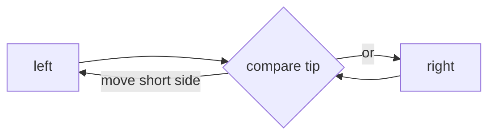
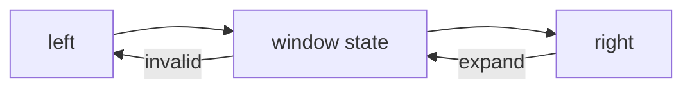
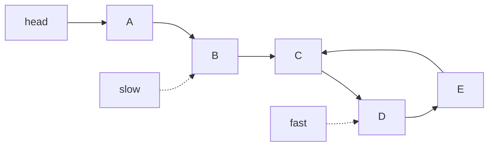
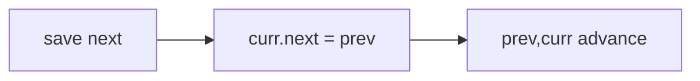

# Family 2 — Pointer Movement

Patterns follow `HANDBOOK_STYLE_GUIDE.md` (10 sections each).

- [x] Two Pointers
- [x] Sliding Window
- [x] Fast & Slow Pointers
- [x] Linked List Pointer Manipulation

## Family Overview

You put one or two “fingers” on the data and move them by a rule — so you don’t
keep rescanning everything from scratch.

| Pattern | Owns | Does not own |
| --- | --- | --- |
| Two Pointers | Two ends (or slow/write + fast/read) walking with a clear rule | “Best continuous window” |
| Sliding Window | A continuous stretch that grows/shrinks | Scattered (non-connected) picks |
| Fast & Slow | Different speeds → cycle / middle | Rewiring list links |
| Linked List Ops | Changing `next` pointers (reverse, merge, splice) | Cycle detection |

---

## Two Pointers

**Scope:** Two indexes that team up — often one at each end of a sorted row, or
a slow writer chasing a fast reader. Not sliding-window “best stretch” problems.

### Purpose

A **pointer** here just means a finger on an index (or on a list node). When a
nested loop only compares two spots that can only move one way, two fingers
turn a slow double walk into one smart walk (often after sorting). Interviews
love this because you can explain the discarded cases out loud — that is real
proof skill, not just coding speed.

You reach for two pointers when the answer depends on **two positions** that
only improve by marching inward (or by a write finger trailing a read finger),
and the data is already sorted or can be sorted cheaply relative to the gain.

### Recognition Clues

- Sorted array; pair sum; palindrome check from both ends
- "Remove duplicates in-place," "container with most water"
- 3Sum / 4Sum after fixing one number
- Partition around a value with two frontiers
- "Opposite ends," "left and right," "after sorting"

### Mental Model

**The problem.** Container With Most Water: vertical bars on a line. Pick two
bars; water height is the shorter bar; width is how far apart they are.
Maximize area.

**Naive idea.** Try every pair of bars. Correct, slow.

**The stuck part.** Most pairs can’t win. If the left bar is shorter, moving
the right one inward only makes width smaller while height is still capped by
that short left bar — so try moving the short side.

**The click.** Start at both ends. Always move the shorter side inward. That’s
Two Pointers squeezing the gap.

**Kid analogy.** Two friends walking toward each other on a ranked shelf —
each step follows the comparison they just made.

**Pattern name.** Two Pointers — squeeze or same-direction partner walk.

**Why moving the short side is safe.** Area is `min(height[L], height[R]) *
(R - L)`. If `height[L]` is shorter, every width you keep with that same left
bar can only get smaller or stay capped by that short height. Discarding that
left bar is the only move that can raise the min. The same “throw away a dead
end” argument powers 3Sum after sorting: fix one index, then squeeze left/right
for the pair sum.

**Second sketch — Valid Palindrome.** Left and right on characters (skip junk).
If letters match, both move in; if not, fail. No nested “try every substring”
scan. Same-direction cousins: remove duplicates from a sorted array with a
write finger and a read finger — Arrays’ compact trick with ordered data.

**When not this.** Continuous “best stretch under a live rule” → Sliding
Window. Partner without sorting → Hash Map. Cycle on a linked list → Fast &
Slow.

### Visualization

```text
height: 1 8 6 2 5 4 8 3 7
index:  0 1 2 3 4 5 6 7 8
        L               R     area = min(1,7)*8 = 8
          L             R     move L (shorter); area = min(8,7)*7 = 49
```

`L` and `R` only move inward. Each move throws away a pairing that can’t beat
the best you’ve seen.



The diagram is the decision each step: which finger can still improve the answer.

### Generic Template

```pseudo
left = 0
right = n - 1
best = init
while left < right:
    best = improve(best, left, right)
    if should_move_left(left, right):
        left += 1
    else:
        right -= 1
```

In plain English: start at the ends; after each check, slide the finger that
might still improve the answer.

Same-direction version: slow/write and fast/read for in-place cleanup after
sort.

### Complexity

- **Time:** O(n) after any needed O(n log n) sort
- **Space:** O(1) extra for the two fingers

### Common Mistakes

- Using two pointers for pair-sum on unsorted data without sorting or a map
- Moving the wrong finger (always justify which side can still win)
- Off-by-one when left and right must stay on different spots
- Forgetting to skip duplicates in 3Sum after a hit (same triplet thrice)
- Sorting when the problem required original indexes (then you need a map of value→index first)

> 💡 **Tip:** If the answer is about a continuous “best stretch,” jump to
> Sliding Window instead.

Trapping Rain Water is the hard exam of the same inward idea: at each step the
limiting height is the shorter side’s water ceiling, so you again advance the
weaker side while banking trapped units.

### Classic Interview Questions

**Easy:** Valid Palindrome · Remove Duplicates from Sorted Array · Reverse String

**Medium:** Two Sum II · Container With Most Water · 3Sum

**Hard:** Trapping Rain Water · 4Sum

### Engineering Connections

Databases merge two sorted files with a finger on each stream — same “two
cursors walk ordered lines” idea as external sort merge joins. Video editors
that scrub two synced timelines also keep ordered cursors that only advance.

> 🏗️ **Engineering Connection:** PostgreSQL-style merge joins walk two already
> sorted key streams with advancing cursors — exactly two pointers on ordered
> runs, not a nested loop join.

### Summary

- Two fingers replace nested pair loops when movement only goes one way
- Usually need sortedness or a clear split rule
- Always say why this finger moves
- Continuous best-range → Sliding Window

---

## Sliding Window

**Scope:** A continuous piece `[left, right]` with a running rule: grow right,
shrink left. Not scattered subsequences.

### Purpose

A **window** is a continuous stretch of the row (like a train of seats). Instead
of rebuilding what you know about seats L…R from scratch, you add the new right
seat and drop left seats when the rule breaks. Slow substring scans become one
pass.

The magic property: `left` and `right` only move forward, so each index pays
enter cost once and leave cost once — total linear time even with a nested
`while` shrink. If you find yourself resetting left to zero every outer loop,
you left the pattern.

### Recognition Clues

- "Longest substring," "shortest subarray," "at most K distinct"
- Fixed size K maximum sum; variable size with a rule
- Minimum window covering required characters
- Fruits into baskets / consecutive ones with flips
- "Smallest window containing," "no more than K"

### Mental Model

**The problem.** Longest Substring Without Repeating Characters. Example:
`"abcabcbb"` → `"abc"` length 3.

**Naive idea.** For every left start, push right until a duplicate. Rebuild a
set often. Slow.

**The stuck part.** When right moves, most of the old stretch is still fine —
you only need to nudge left when a repeat appears.

**The click.** Keep a map of what is inside the window. Grow `right`. While the
window is invalid, grow `left`. Track the best length. That’s Sliding Window.

**Kid analogy.** A toy train car that only holds certain rules: passengers board
at the front; when the rule breaks, someone exits from the back. You never
rebuild the passenger list from zero.

**Pattern name.** Sliding Window — expand right, shrink left, keep live state.

**Variable vs fixed size.** Variable: grow right until illegal, then `while`
shrink left (longest unique substring, at most K distinct). Fixed size `K`:
always keep exactly `K` seats — add `right`, drop `right - K`, update the best
sum or count. Same muscle; the shrink rule is “length exceeds K” instead of
“duplicate appeared.”

**Second sketch — Minimum Window Substring.** Grow right until every required
character is covered; then shrink left while still covered to hunt the shortest
valid stretch. State is a need-count map, not a simple set. Still one pass of
enters and exits.

**Trap.** Subarray Sum Equals K with negatives is **Prefix Sum**, not a window:
negative values break the “shrinking always helps” mono property.

### Visualization



The window only grows by moving `right` forward, and only shrinks by moving
`left` forward when the rule fails (for example, a duplicate letter).

```text
s = a b c a b c b b
    L   R          window "abc" len 3
      L   R        after duplicate a; keep tracking max
```

### Generic Template

```pseudo
left = 0
state = empty   # counts, sum, distinct, …
best = init
for right from 0 to n-1:
    add arr[right] into state
    while state is invalid:
        remove arr[left] from state
        left += 1
    best = improve(best, left, right, state)
```

In plain English: invite the next guest in; while the party is illegal, ask the
oldest guest to leave; then update your best party length.

Fixed size K: always keep exactly K seats (add right, drop `right-K`).

### Complexity

- **Time:** O(n) — each index enters and leaves at most once
- **Space:** O(alphabet size) for the little state map

### Common Mistakes

- Using `if` instead of `while` when several left moves are needed
- Using a window for non-connected subsequence problems
- Updating the answer in the wrong place (max vs min window differ)
- Shrinking before the window is valid on “minimum covering” problems
- Forgetting to decrement counts to zero carefully (ghost characters)

> 💡 **Intuition:** `left` and `right` only march forward — that’s why total
> work stays linear.

Sliding Window Maximum is owned at the boundary with Monotonic Deque: still a
window of length K, but the helper structure keeps candidates decreasing so the
front is always the max. Name the window first; add the deque second.

### Classic Interview Questions

**Easy:** Maximum Average Subarray I · Contains Duplicate II · Longest Nice Substring

**Medium:** Longest Substring Without Repeating Characters · Fruit Into Baskets · Permutation in String

**Hard:** Minimum Window Substring · Sliding Window Maximum

### Engineering Connections

API rate limits track “requests in the last 60 seconds”: add a new ping, drop
pings older than the window, update the count — same grow/expire idea. Chat
apps rate-limit bursty senders with the same timeline window.

> 🏗️ **Engineering Connection:** Redis / API gateways implement “N requests
> per minute” by expiring old timestamps from a windowed counter — sliding
> window on a clock, not an array.

### Summary

- Continuous + running rule ⇒ sliding window
- Grow right, shrink left, update state a little at a time
- Use `while` when one shrink isn’t enough
- Fixed-K is the same idea with a hard length

---

## Fast & Slow Pointers

**Scope:** Two fingers move at different speeds (or one jumps ahead) on a linked
chain or a “next” function — cycles and midpoints. Not for rewriting links.

### Purpose

A **linked list** is a treasure trail of boxes where each box only knows the
next box. **Fast & Slow** means one finger takes one step while the other takes
two. If there’s a loop in the trail, the fast one will lap the slow one — like
runners on a circular track.

You pick this when the only safe moves are “step once” and “step twice” (or
“jump to `nums[i]`”) and you need a property of the whole trail — cycle yes/no,
middle, or duplicate — with almost no extra memory.

### Recognition Clues

- "Linked list cycle," "find the middle," "happy number"
- Kth from end (fast starts K steps ahead)
- Duplicate number in `1..n` treated as a “follow the arrow” graph
- "Constant space," "without modifying the array" on arrow graphs

### Mental Model

**The problem.** Does this linked list contain a cycle (a loop)?

**Naive idea.** Remember every box you’ve seen in a set. Uses extra memory.

**The stuck part.** The interviewer wants almost no extra memory.

**The click.** Slow walks one step; fast walks two. If they ever land on the
same box, there’s a loop. To find where the loop starts: put one finger back at
the head; walk both one step at a time until they meet again.

**Kid analogy.** Two runners on a playground track — different speeds mean they
meet if the track loops. (This meetup idea is often called Floyd’s cycle
finding — two fingers, different paces, no “seen” set.)

**Pattern name.** Fast & Slow Pointers (tortoise and hare).

**Middle of the list for free.** When there is no cycle, stop when `fast` cannot
take two steps. `slow` then sits at the middle (or left-middle on even length).
Palindrome Linked List and Reorder List both need that middle cut before
reversing the second half.

**Loop entrance (second phase).** After they meet inside the cycle, put one
finger back at `head`. Advance both one step at a time. Their next meeting is
the entrance node — proved by equalizing the “steps into the loop” distance.

**Happy Number.** “Next” is sum of squared digits. A cycle of sad numbers means
you never hit 1. Same meetup test on a number trail, not a list object.

### Visualization



Slow and fast start together. If a loop exists, they meet inside it. The loop
in the drawing sits at `C`.

### Generic Template

```pseudo
slow = head
fast = head
while fast ≠ null and fast.next ≠ null:
    slow = slow.next
    fast = fast.next.next
    if slow == fast:
        return cycle_detected_or_entrance(slow, head)
# no cycle; slow may be middle if fast hit null
```

In plain English: one step vs two steps; a meeting means a loop; no meeting by
the end means a straight path (and slow is near the middle).

### Complexity

- **Time:** O(n) — linear in list length
- **Space:** O(1) — only two fingers

### Common Mistakes

- Not checking `fast` and `fast.next` before taking two steps (crash on the end)
- Mixing up “where they met” with “where the loop begins” (needs the second
  phase)
- Using Fast/Slow when the task is reverse/merge (that’s Linked List Ops)
- Claiming “no cycle” after one null check without walking both pointers
- For Find the Duplicate Number: treating it as sort+scan when the follow-up
  bans modifying the array and wants O(1) extra space — the arrow graph is the
  point

> ⚠️ **Common Mistake:** Happy Number is the same idea on numbers (“next” is the
> sum of squared digits), not only on lists.

### Classic Interview Questions

**Easy:** Linked List Cycle · Middle of the Linked List · Happy Number

**Medium:** Linked List Cycle II · Palindrome Linked List · Reorder List

**Hard:** Find the Duplicate Number · Circular Array Loop

### Engineering Connections

Memory managers check free-lists for broken loops with tortoise/hare walks —
same meet-up test without building a giant “seen” set on the failure path.

> 🏗️ **Engineering Connection:** Kernel allocators detect a corrupted circular
> free list with tortoise/hare — O(1) extra memory on the failure path.

### Summary

- Different speeds detect loops with tiny memory
- Middle falls out when fast hits the end
- Loop entrance needs a second linear walk
- Rewiring nodes → Linked List Manipulation

---

## Linked List Pointer Manipulation

**Scope:** Locally rewrite `next` (and sometimes `prev`) — reverse, merge, swap
pairs, reverse in groups of k. Cycle detection stays Fast/Slow.

### Purpose

Sometimes you don’t just look at the treasure trail — you **rewire** it: make
arrows point the other way, zip two sorted trails together, or flip every k
boxes. Each change is a careful three-finger swap so you don’t lose the rest of
the trail.

If the interviewer watches for panics, they are watching whether you save
`next` before you overwrite it. That one habit separates “I reverse lists” from
“I segfault on node two.”

### Recognition Clues

- Reverse linked list; merge two sorted lists
- Swap nodes in pairs; reverse nodes in k-group
- Remove nth from end (often with a lead pointer)
- "Rewire," "splice," "in-place list edit"
- Dummy head / sentinel node mentioned in hints

### Mental Model

**The problem.** Reverse Linked List: flip all arrows. `1 → 2 → 3` becomes
`1 ← 2 ← 3` (new head `3`).

**Naive idea.** Copy values into an array, reverse the array, rebuild. Extra
space / not the point.

**The stuck part.** If you swing an arrow too early, you lose the rest of the
chain forever.

**The click.** Keep three names: `prev`, `curr`, `nextTemp`. Save the next box,
point current back to prev, scoot everyone forward. That’s pointer
manipulation.

**Kid analogy.** Undoing a paper-clip chain: hold the previous clip, redirect
the current clip, then move on — never drop the unfinished chain on the floor.

**Pattern name.** Linked List Pointer Manipulation — local rewires.

**Merge Two Sorted Lists.** Dummy head + tail finger. Always attach the smaller
current head of A or B, advance that list, move tail. When one list empties,
attach the rest. Same “two ordered cursors” spirit as Two Pointers, but the
payload is nodes, not array indexes.

**k-Group reverse.** Count k nodes ahead; if enough, reverse that slice with
the three-finger reverse; reconnect the previous group’s tail to the new head.
Losing the bridge between groups is the classic bug — draw it.

**Remove Nth from End.** Dummy + fast lead of n+1 steps, then walk slow/fast
together; slow sits before the doomed node. No second length pass required.

### Visualization

```text
prev  curr  next
 null  1 →  2 → 3

step: curr.next = prev
      advance prev, curr

 null ← 1    2 → 3
       prev curr
```

Each step flips one arrow and slides the trio forward.



Save → flip → advance is the safety mantra for every rewire.

### Generic Template

```pseudo
# Reverse
prev = null
curr = head
while curr ≠ null:
    nextTemp = curr.next
    curr.next = prev
    prev = curr
    curr = nextTemp
return prev

# Merge two sorted lists
dummy = node()
tail = dummy
while a and b:
    if a.val <= b.val: tail.next = a; a = a.next
    else:              tail.next = b; b = b.next
    tail = tail.next
tail.next = a or b
return dummy.next
```

In plain English: save the future, rewrite the present arrow, then walk forward.
For merge: always attach the smaller current head.

### Complexity

- **Time:** O(n) (or O(n+m) for merging two lists)
- **Space:** O(1) for classic reverse/merge (ignore recursion stack if you
  recurse)

### Common Mistakes

- Losing `next` before you save it
- Forgetting a dummy head on merge/remove problems (edge cases get messy)
- Using this chapter for cycle detection (Fast/Slow owns that)
- Returning `head` after reverse instead of new `prev`
- For k-group: reversing when fewer than k nodes remain (spec usually says leave the tail)

> 🚀 **Interview Tip:** Draw three boxes and arrows on paper before coding —
> most bugs are “I lost the rest of the list.”

Merge k Sorted Lists dual-homes with Heap: the heap owns “always take the
smallest head among k lists”; this chapter owns the local splice of that
chosen node onto the answer. Say both owners if asked.

### Classic Interview Questions

**Easy:** Reverse Linked List · Merge Two Sorted Lists · Remove Linked List Elements

**Medium:** Remove Nth Node From End · Swap Nodes in Pairs · Rotate List

**Hard:** Reverse Nodes in k-Group · Merge k Sorted Lists

### Engineering Connections

Operating systems keep task lists as linked structures you splice and reverse
with local pointer writes — same rewiring as interview reverse/merge. LRU cache
implementations often splice a node out of a doubly linked list and move it to
the front on every hit.

> 🏗️ **Engineering Connection:** Linux kernel intrusive lists rewrite `next` /
> `prev` locally under locks — reverse/splice bugs here crash the machine the
> same way losing `nextTemp` fails an interview reverse.

### Summary

- Save next → rewrite arrow → advance
- Dummy heads calm down edge cases
- Cycle detection is Fast/Slow, not this section
- Multi-list “always take the smallest head” may also use a Heap

---
