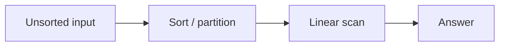
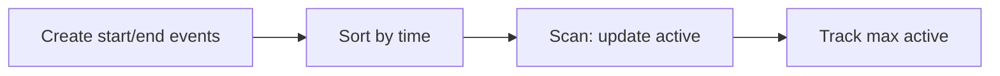

# Family 3 — Ordering & Search

- [x] Sorting
- [x] Binary Search
- [x] Intervals
- [x] Sweep Line

## Family Overview

First put things in order (or put events in order). Then either walk once or
guess in the middle again and again.

| Pattern | Owns | Does not own |
| --- | --- | --- |
| Sorting | Sort, then one easy pass | Binary search on “smallest speed that works” |
| Binary Search | Halve a sorted row or a yes/no answer range | Merging calendar blocks |
| Intervals | Merge / insert / overlap of time ranges | Peak concurrency event scans |
| Sweep Line | Sort start/end events + walk with a counter | Pure merge-after-sort |

---

## Sorting

**Scope:** Make order your friend, then one left-to-right pass. Not “binary
search the minimum feasible value” (Binary Search chapter).

### Purpose

**Sorting** means lining toys from smallest to biggest (or by a custom rule).
Many hard-looking problems melt once neighbors are next to each other:
duplicates huddle, greedy left-to-right choices become obvious, and one scan
finishes the job.

### Recognition Clues

- "Sort colors," "rearrange," "largest number by concatenation"
- After sorting, a linear two-pointer or stack finishes
- Meeting conflict checks after sorting by start
- "Custom comparator" ordering

### Mental Model

**The problem.** Merge Intervals: intervals like `[1,3], [2,6], [8,10], [15,18]`
should become `[1,6], [8,10], [15,18]`.

**Naive idea.** Compare every interval to every other interval and merge when
they overlap. Correct, but the pair checks explode: 10 intervals means 45
pairs, 10,000 intervals means roughly 50 million pairs — quadratic growth for
work that mostly finds "these two never touch."

**The stuck part.** Most pairs can never overlap once the list is ordered by
start time — you only need to watch neighbors.

**The click.** **Sort, then scan.** Sort by start. Keep an answer list; if the
next interval starts before the last end, extend that end; else push a new
block. Same “pay for order once” habit powers anagram grouping via a sorted
key, meeting-conflict checks, and 3Sum after sorting. (Sort Colors’ three-way
partition is a niche Arrays callout when values are only `{0,1,2}` — not this
pattern’s identity.)

**Kid analogy.** Sort laundry by color before folding — the fold pass becomes
boring and linear because neighbors already match.

Same habit reused elsewhere: anagrams group by a sorted-letter key, and closest
pair sum on a line becomes sort-then-two-pointers. Pay for order once, then
reuse it across very different-sounding problems.

### Visualization



Almost every “Sorting pattern” interview question is this pipeline.

Worked idea: sort meeting starts, then check if any meeting starts before the
previous one ends — one pass after order.

### Generic Template

```pseudo
sort(arr, by key or comparator)
# then one pass:
for i in 0..n-1:
    use order to update answer / merge / compare neighbors
```

In plain English: line them up, then walk the line once.

### Complexity

- **Time:** usually O(n log n) sort + O(n) scan; sometimes O(n) for special
  partitions
- **Space:** O(1)–O(n) depending on how you sort

### Common Mistakes

- Sorting when a hash map already solves it in one walk (unsorted Two Sum)
- Assuming stable order when relative order matters
- Broken custom comparators that aren’t a real total order (Largest Number) —
  a comparator that says `a < b` and `b < a` at the same time will make most
  sort implementations silently produce a wrong, inconsistent order
- Reaching for a hand-rolled quicksort to prove the point — library sort is
  fine; the insight is ordering as a move, not sorting-algorithm trivia
- Forgetting that sorting changes original indexes — if the answer needs the
  input’s original positions, capture `(value, index)` pairs before sorting

> 💡 **Tip:** If the question is “minimum capacity such that …”, that’s Binary
> Search on the answer — not this chapter.

### Classic Interview Questions

**Easy:** Sorted Array / Majority Element Lite · Heights Checker · Can Make Arithmetic Progression

**Medium:** Merge Intervals · Sort Colors · Largest Number

**Hard:** Russian Doll Envelopes · Count of Smaller Numbers After Self
_(sort, then LIS / DP)_

### Engineering Connections

Databases sort chunks before merging (`ORDER BY`, LSM flush). Ordering once
lets later work skim a sorted stream — same sort-then-scan idea.

> 🏗️ **Engineering Connection:** A sorted mailbox dump makes “find nearby
> keys” cheap.

Data warehouses sort fact tables by the join key before a merge-join step —
same “pay for order once” trade as Merge Intervals, just at a much bigger
scale, and the same reason compilers sort symbol tables before a linear
resolve pass.

### Summary

- Sort to unlock a linear finish
- Prefer O(n) partition when there are tiny key domains
- Don’t sort away a clean O(n) hash solution without a reason
- Monotone answer search → Binary Search

---

## Binary Search

**Scope:** Keep cutting a sorted row (or a yes/no answer range) in half. Not
interval geometry.

### Purpose

**Binary search** is the “higher or lower?” number-guessing game. If the line
is sorted — or if “does speed k work?” flips from no→yes only once — each guess
throws away half the remaining options.

### Recognition Clues

- Sorted array search; rotated sorted search
- "First bad version," "peak element"
- Minimize max load / eating speed / split sum — search on the answer
- Huge value range but cheap yes/no checks

### Mental Model

**The problem.** Koko Eating Bananas: what’s the slowest eating speed that
still finishes by hour `h`?

**Naive idea.** Try speed 1, then 2, then 3… forever if piles are huge. If the
biggest pile has a billion bananas, that's up to a billion feasibility checks
— each one itself an O(piles) scan — before you ever find the answer.

**The stuck part.** Checking every speed from 1 upward. But if speed `k` works,
every faster speed also works (the yes/no staircase only rises once).

**The click.** Guess a middle speed. If it works, try slower; if not, try
faster. That’s **binary search on the answer** — the “array” is imaginary
speeds.

**Kid analogy.** Guessing a secret number with “too low / too high” — each ask
halves the possible range.

Binary search comes in two interview flavors: **index search** on a sorted row
(classic left/right until you hit the target or the insertion spot), and
**answer-space search** like Koko, where the row is imaginary but a yes/no
predicate is monotone across it.

**Second sketch — Search in Rotated Sorted Array.** A rotated sorted array
still has one half properly ordered around any `mid` — either the left half
or the right half. Check which half is sorted first; if the target's value
falls inside that sorted half's range, search there, otherwise search the
other half. Same halve-and-discard habit, one extra check up front.

### Visualization

```text
lo                mid                 hi
|----false----|----false----|----true----|----true----|
                         raise lo → mid+1 when mid fails
```

When `feasible(mid)` is true for a minimize problem, keep `hi = mid`; when
false, set `lo = mid + 1`.

### Generic Template

```pseudo
# On sorted index space
lo, hi = 0, n-1
while lo <= hi:
    mid = lo + (hi - lo) // 2
    if arr[mid] == target: return mid
    if arr[mid] < target: lo = mid + 1
    else: hi = mid - 1

# On answer space
lo, hi = min_ans, max_ans
while lo < hi:
    mid = lo + (hi - lo) // 2
    if feasible(mid): hi = mid
    else: lo = mid + 1
return lo
```

In plain English: peek at the middle; throw away the half that can’t hold the
answer; repeat.

### Complexity

- **Time:** O(log n) probes; answer-space: O(check cost × log R)
- **Space:** O(1)

### Common Mistakes

- Off-by-one (`lo < hi` vs `lo <= hi`) so mid never moves — for example,
  writing `hi = mid` in an index search where the target could still be at
  `mid` itself silently drops that candidate from the range
- Using binary search when the yes/no rule is not monotone
- Searching an unsorted array without a monotone rule
- Computing `mid = (lo + hi) / 2` in a language where that can overflow on
  huge bounds — prefer `lo + (hi - lo) / 2`

> ⚠️ **Common Mistake:** Binary search on a shuffled list is just guessing —
> halves mean nothing without order or a staircase rule.

### Classic Interview Questions

**Easy:** Binary Search · Search Insert Position · First Bad Version

**Medium:** Search in Rotated Sorted Array · Find Peak Element · Koko Eating Bananas

**Hard:** Median of Two Sorted Arrays · Split Array Largest Sum

### Engineering Connections

Phone contacts and database indexes jump into the middle of ordered keys again
and again — same “cut the remaining key space in half” feel as B-tree probes.

> 🏗️ **Engineering Connection:** Sorted indexes are binary-search cousins in
> production.

Rate limiters and autoscalers use the same answer-space trick: binary search
the smallest instance count where projected load stays under a threshold,
instead of provisioning one instance at a time and re-measuring.

### Summary

- Sorted data **or** a one-way yes/no staircase unlocks binary search
- Answer-space search is still binary search — the array is imaginary
- Nail what `lo`/`hi` mean before coding
- Rotated arrays need an extra “which half is sorted?” check

---

## Intervals

**Scope:** Ranges like `[start, end)` — merge, insert, conflict — usually after
sorting by start. Peak “how many at once?” scans are Sweep Line.

### Purpose

An **interval** is a block on a timeline (a playdate from 3 to 4). Scheduling
questions ask whether blocks overlap or how to glue them. Sorting by start time
lets one walk merge or spot fights.

### Recognition Clues

- Merge intervals; insert interval
- Meeting rooms (can one person attend all?)
- Non-overlapping removals; balloons arrows
- Employee free time

### Mental Model

**The problem.** Merge Intervals: glue overlapping blocks. Example:
`[1,3],[2,6],[8,10]` → `[1,6],[8,10]`.

**Naive idea.** For each block, scan all others to merge. Messy and slow: with
n intervals that's up to n² overlap checks, and merging one pair can change
which other pairs now overlap, forcing you to re-scan.

**The stuck part.** Unordered blocks hide who can touch whom.

**The click.** Sort by start. Keep one “open” merged block. If the next start
is after the open end, push a new block; else stretch the open end with `max`.
That’s Intervals.

**Kid analogy.** Combining marker pens on a schedule strip — sort by start,
then fuse anything that overlaps as you go left to right.

**Second sketch — Insert Interval.** Copy every interval that ends before the
new interval starts, merge the new interval through every overlap you meet,
then copy whatever is left. Three zones — left, overlap, right — no re-scan of
the whole list.

**Third sketch — Non-overlapping Intervals.** Sort by *end* time instead of
start. Walk left to right and keep an interval only if it starts at or after
the last kept interval's end; every rejected interval counts toward the
minimum removals. Same sort-then-scan habit, different sort key — this one
dual-homes with Greedy (Family 5).

**Fourth sketch — Employee Free Time.** Flatten every employee's schedule into
one big list of intervals, sort by start, and merge exactly like Merge
Intervals. The free time is just the gaps between consecutive merged blocks —
the merge step is identical, the "answer" is what merging leaves out instead
of what it produces.

### Visualization

```text
[1,3] [2,6] [8,10] [15,18]
  └merge┘
[1,6]     [8,10] [15,18]
```

After sorting, only the last merged block can overlap the next candidate — so
one running “open” interval is enough.

### Generic Template

```pseudo
sort intervals by start
merged = []
for intv in intervals:
    if merged empty or intv.start > merged[-1].end:
        merged.append(intv)
    else:
        merged[-1].end = max(merged[-1].end, intv.end)
```

In plain English: line up by start; either start a new sticky note or stretch
the last sticky note.

### Complexity

- **Time:** O(n log n) sort + O(n) merge
- **Space:** O(n) for the output (or little extra if you overwrite carefully)

### Common Mistakes

- Forgetting to sort first
- Mixing up `<` vs `<=` for touching endpoints — a meeting `[9,10]` followed
  by `[10,11]` touches but doesn't overlap under a half-open convention;
  ask which convention the problem means before comparing
- Solving Meeting Rooms II with only merge logic — peak concurrency needs
  Sweep or a heap of end times

> 🧠 **Pattern Recognition:** Merge/conflict after sort → Intervals. “Minimum
> rooms so nobody double-books” → Sweep Line.

### Classic Interview Questions

**Easy:** Meeting Rooms · Non-overlapping Intervals Warmup · Interval List Intersections Lite

**Medium:** Merge Intervals · Insert Interval · Non-overlapping Intervals

**Hard:** Minimum Interval to Include Each Query · Data Stream as Disjoint Intervals

> See also: Meeting Rooms II under Sweep Line.

### Engineering Connections

Calendar apps merge and conflict-check busy ranges when you add an event —
sort by start, scan for overlap, same as Insert/Merge Intervals.

> 🏗️ **Engineering Connection:** “Can I book this room?” is interval conflict
> checking.

Version-control merge tools apply the same sort-by-start-then-scan trick to
line ranges when combining non-conflicting edits from two branches, and CDN
cache-invalidation systems merge overlapping "purge this URL range" requests
the same way before executing them.

### Summary

- Sort by start, merge with one open interval
- Clarify closed vs half-open endpoints
- Max concurrent meetings → Sweep or end-time heap
- Insert Interval = drop into the sorted place, then merge neighbors

---

## Sweep Line

**Scope:** Turn ranges into sorted start/end **events**, walk left→right, keep
a running “how many are active?” counter. Meeting Rooms II lives here.

### Purpose

When the answer is “how many intervals cover this moment?” or “what’s the peak
crowd?”, a **sweep line** is a magic vertical ruler sliding across time. You
only stop at starts and ends. Bumping a counter beats checking every pair.

### Recognition Clues

- Minimum meeting rooms; max planes in the sky
- Skyline silhouette
- "Points as events," timeline processing
- Overlap counts along a line

### Mental Model

**The problem.** Meeting Rooms II: fewest rooms so no two overlapping meetings
share a room.

**Naive idea.** For each meeting, count how many others overlap. Slow — n²
pairwise checks — and it still doesn't directly tell you the peak, since the
busiest moment might not be any single meeting's start time.

**The stuck part.** Pairwise overlap tests.

**The click.** At each start, +1 active. At each end, −1 active (if a room
frees instantly at time t, process ends before starts at time t). Sort events;
walk; track the max active. That’s Sweep Line.

**Kid analogy.** A hallway guard walks the timeline, noting when kids enter
and leave — the biggest pile of kids is the rooms you need.

**Second sketch — Car Pooling.** Events don't have to be ±1: each pickup event
adds that trip's passenger count, each drop-off subtracts it. Same
sort-events-and-track-a-running-total habit, just with variable deltas instead
of a fixed +1/−1.

**Third sketch — The Skyline Problem.** Each building becomes a "height turns
on" event at its left edge and a "height turns off" event at its right edge.
Sweep left to right keeping a multiset of active heights; whenever the current
maximum height changes after processing an event, that x-coordinate and new
height is one point of the skyline. Same event-sweep skeleton, tracking a
running max instead of a running count.

### Visualization



Events turn 2D interval overlap into a 1D walk with a counter.

Worked: meetings `[0,30]` and `[5,10]` — active goes 1 → 2 → 1; need 2 rooms.

### Generic Template

```pseudo
events = []
for each interval [s, e):
    events.append(s, +1)
    events.append(e, -1)
sort events by (time asc, end before start if tie)
cur = best = 0
for time, delta in events:
    cur += delta
    best = max(best, cur)
return best
```

In plain English: make enter/leave tickets, sort them, walk the day, remember
the busiest moment.

### Complexity

- **Time:** O(n log n) to sort events
- **Space:** O(n) for the event list

### Common Mistakes

- Wrong tie-break when one meeting ends at t and another starts at t — for
  meetings `[0,10]` and `[10,20]` sharing a room at t=10, processing the `+1`
  before the `-1` overcounts a room that was actually free by then
- Using merge-intervals when you need **peak concurrency**
- Forgetting to sort events

> 🚀 **Interview Tip:** Say “I’ll sweep start/end events” — that names peak
> load cleanly.

### Classic Interview Questions

**Easy:** Number of Points Covered Lite · Meeting Rooms · Car Pooling Warmup

**Medium:** Meeting Rooms II · Car Pooling · My Calendar II

**Hard:** The Skyline Problem · Number of Airplanes in the Sky

### Engineering Connections

Simple collision and map engines sort edge events and scan with an active set
of segments — same skeleton as Meeting Rooms II.

> 🏗️ **Engineering Connection:** “How many open shapes cover this x?” is a
> sweep with a counter (or a richer active tree).

Capacity planners sweep reservation start/end events to find the peak
concurrent bookings a shared resource pool needs to support, and physical CPU
schedulers sweep task start/deadline events the same way to size a thread
pool for worst-case concurrency instead of guessing a fixed number of workers.

### Summary

- Events + sort + active counter = sweep
- Tie-break ends before starts when reuse at the boundary is allowed
- Max active ⇒ rooms / peak load
- Richer actives use trees/heaps with the same walk idea

---
