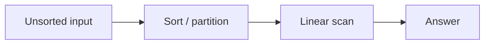
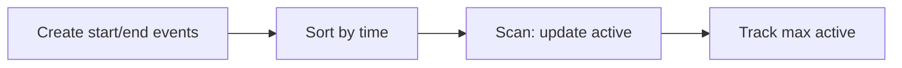

# Family 3 — Ordering & Search

- [x] Sorting
- [x] Binary Search
- [x] Intervals
- [x] Sweep Line

## Family Overview

First put things in order (or put events in order). Then either walk once or
guess in the middle again and again.

| Pattern | Owns | Does not own |
| --- | --- | --- |
| Sorting | Sort, then one easy pass | Binary search on “smallest speed that works” |
| Binary Search | Halve a sorted row or a yes/no answer range | Merging calendar blocks |
| Intervals | Merge / insert / overlap of time ranges | Peak concurrency event scans |
| Sweep Line | Sort start/end events + walk with a counter | Pure merge-after-sort |

---

## Sorting

**Scope:** Make order your friend, then one left-to-right pass. Not “binary
search the minimum feasible value” (Binary Search chapter).

### Purpose

**Sorting** means lining toys from smallest to biggest (or by a custom rule).
Many hard-looking problems melt once neighbors are next to each other:
duplicates huddle, greedy left-to-right choices become obvious, and one scan
finishes the job.

### Recognition Clues

- "Sort colors," "rearrange," "largest number by concatenation"
- After sorting, a linear two-pointer or stack finishes
- Meeting conflict checks after sorting by start
- "Custom comparator" ordering

### Mental Model

**The problem.** Merge Intervals: intervals like `[1,3], [2,6], [8,10], [15,18]`
should become `[1,6], [8,10], [15,18]`.

**Naive idea.** Compare every interval to every other interval and merge when
they overlap. Correct, but the pair checks explode.

**The stuck part.** Most pairs can never overlap once the list is ordered by
start time — you only need to watch neighbors.

**The click.** **Sort, then scan.** Sort by start. Keep an answer list; if the
next interval starts before the last end, extend that end; else push a new
block. Same “pay for order once” habit powers anagram grouping via a sorted
key, meeting-conflict checks, and 3Sum after sorting. (Sort Colors’ three-way
partition is a niche Arrays callout when values are only `{0,1,2}` — not this
pattern’s identity.)

**Kid analogy.** Sort laundry by color before folding — the fold pass becomes
boring and linear because neighbors already match.

### Visualization



Almost every “Sorting pattern” interview question is this pipeline.

Worked idea: sort meeting starts, then check if any meeting starts before the
previous one ends — one pass after order.

### Generic Template

```pseudo
sort(arr, by key or comparator)
# then one pass:
for i in 0..n-1:
    use order to update answer / merge / compare neighbors
```

In plain English: line them up, then walk the line once.

### Complexity

- **Time:** usually O(n log n) sort + O(n) scan; sometimes O(n) for special
  partitions
- **Space:** O(1)–O(n) depending on how you sort

### Common Mistakes

- Sorting when a hash map already solves it in one walk (unsorted Two Sum)
- Assuming stable order when relative order matters
- Broken custom comparators that aren’t a real total order (Largest Number)

> 💡 **Tip:** If the question is “minimum capacity such that …”, that’s Binary
> Search on the answer — not this chapter.

### Classic Interview Questions

**Easy:** Sorted Array / Majority Element Lite · Heights Checker · Can Make Arithmetic Progression

**Medium:** Merge Intervals · Sort Colors · Largest Number

**Hard:** Russian Doll Envelopes · Count of Smaller Numbers After Self
_(sort, then LIS / DP)_

### Engineering Connections

Databases sort chunks before merging (`ORDER BY`, LSM flush). Ordering once
lets later work skim a sorted stream — same sort-then-scan idea.

> 🏗️ **Engineering Connection:** A sorted mailbox dump makes “find nearby
> keys” cheap.

### Depth Note — Ordering as a Move

Sorting is not “implement quicksort.” Interviews mean: **pay once to create
order**, then finish with a simple walk. Anagrams become sorted-key grouping.
Meeting conflicts become “sort by start, check overlaps.” Closest pair sum on
a row becomes sort then two pointers. The Dutch National Flag three-way
partition is a niche in-place Arrays callout when values are only `{0,1,2}` —
it is **not** the identity of this pattern.

Worked sketch — Merge Intervals after ordering. Sort intervals by start. Keep
an answer stack; if the next interval starts before the last ends, extend the
end; else push a new block. The bottleneck you killed is “compare every pair
of intervals.” Order made neighbors the only candidates that matter.

Reach for Sorting when a nested pair scan only needed local order. Reach for
Binary Search answer-space when you are guessing a numeric threshold. Reach for
Sweep Line when concurrency events (starts and ends) need a counter, not just
merge-after-sort.

### Worked Recognition

Interview prompt: "Given an array of intervals, merge all overlapping." You
sort by start, then walk once. That is Sorting-as-a-move, not a sorting-algorithm
contest. "Largest Number" custom comparator is the same idea with a weirder
order key. "Sort Colors" may use counting or three-way partition — mention the
Arrays callout, then still name the broader habit: create order, then scan.

Engineering echo: ETL pipelines sort events by timestamp once so later joins
and window aggregations become single passes — warehouse sorting paid so
analytics scans stay linear.

### Interview Dialogue

Interviewer: “Merge these intervals.” You: “I’ll sort by start so neighbors are
the only intervals that can overlap, then one scan merges.” That sentence is
the whole pattern. If they ask whether you must write quicksort, say no —
library sort is fine; the insight is ordering as a move. Contrast: binary
searching the minimum shipping capacity is Answer-Space Binary Search, not this
chapter. Contrast: peak concurrent meetings needs start/end events — Sweep
Line. Keep Sorting for “order once, walk once” stories with duplicate
clustering, greedy-after-sort, and neighbor comparisons.

### Why Reach For This

Patterns exist so you stop reinventing the same bottleneck fix under interview
pressure. Name the wasted work first — nested pair scans, rebuilding range
sums, rescanning a grid, forgetting visited marks, sorting when membership was
enough. Then name the structure that removes that waste. Practice saying the
bottleneck in one sentence before you touch the keyboard; that sentence is how
interviewers score pattern recognition.

When the pattern is dual-homed, say the primary owner and the helper out loud.
When an Easy list is a warmup rather than a famous LeetCode Easy, label it as
prep for the Medium that carries the real idea. Prefer deriving the template
from the mental model over memorizing a number. If you can redraw the diagram
from memory and retell the naive-to-insight arc, you own the chapter.

Engineering systems reuse these habits daily: indexed lookups, rollups, layer
exploration, schedulers, prefix trees, and priority queues. Connecting the toy
example to a named production mechanism keeps the knowledge sticky beyond the
whiteboard.

Re-check complexity after you pick the pattern: time should match a single
pass, a log factor from sort or heap, or a bounded state space — not a hidden
quadratic walk disguised as a helper list scan. Space should match the map,
queue, recursion depth, or heap you actually allocated. If a follow-up forbids
extra memory, revisit in-place index surgery. If weights appear on edges,
upgrade from BFS to Dijkstra. If the answer is any feasible set of choices with
overlap, upgrade from greedy to DP. Those upgrades are pattern recognition too.

Finally, keep the voice simple: short sentences, one worked example, one
diagram, one template. That is the handbook bar that Hash Maps set — clarity
first, then implementation.

### Summary

- Sort to unlock a linear finish
- Prefer O(n) partition when there are tiny key domains
- Don’t sort away a clean O(n) hash solution without a reason
- Monotone answer search → Binary Search

---

## Binary Search

**Scope:** Keep cutting a sorted row (or a yes/no answer range) in half. Not
interval geometry.

### Purpose

**Binary search** is the “higher or lower?” number-guessing game. If the line
is sorted — or if “does speed k work?” flips from no→yes only once — each guess
throws away half the remaining options.

### Recognition Clues

- Sorted array search; rotated sorted search
- "First bad version," "peak element"
- Minimize max load / eating speed / split sum — search on the answer
- Huge value range but cheap yes/no checks

### Mental Model

**The problem.** Koko Eating Bananas: what’s the slowest eating speed that
still finishes by hour `h`?

**Naive idea.** Try speed 1, then 2, then 3… forever if piles are huge.

**The stuck part.** Checking every speed from 1 upward. But if speed `k` works,
every faster speed also works (the yes/no staircase only rises once).

**The click.** Guess a middle speed. If it works, try slower; if not, try
faster. That’s **binary search on the answer** — the “array” is imaginary
speeds.

**Kid analogy.** Guessing a secret number with “too low / too high” — each ask
halves the possible range.

### Visualization

```text
lo                mid                 hi
|----false----|----false----|----true----|----true----|
                         raise lo → mid+1 when mid fails
```

When `feasible(mid)` is true for a minimize problem, keep `hi = mid`; when
false, set `lo = mid + 1`.

### Generic Template

```pseudo
# On sorted index space
lo, hi = 0, n-1
while lo <= hi:
    mid = lo + (hi - lo) // 2
    if arr[mid] == target: return mid
    if arr[mid] < target: lo = mid + 1
    else: hi = mid - 1

# On answer space
lo, hi = min_ans, max_ans
while lo < hi:
    mid = lo + (hi - lo) // 2
    if feasible(mid): hi = mid
    else: lo = mid + 1
return lo
```

In plain English: peek at the middle; throw away the half that can’t hold the
answer; repeat.

### Complexity

- **Time:** O(log n) probes; answer-space: O(check cost × log R)
- **Space:** O(1)

### Common Mistakes

- Off-by-one (`lo < hi` vs `lo <= hi`) so mid never moves
- Using binary search when the yes/no rule is not monotone
- Searching an unsorted array without a monotone rule

> ⚠️ **Common Mistake:** Binary search on a shuffled list is just guessing —
> halves mean nothing without order or a staircase rule.

### Classic Interview Questions

**Easy:** Binary Search · Search Insert Position · First Bad Version

**Medium:** Search in Rotated Sorted Array · Find Peak Element · Koko Eating Bananas

**Hard:** Median of Two Sorted Arrays · Split Array Largest Sum

### Engineering Connections

Phone contacts and database indexes jump into the middle of ordered keys again
and again — same “cut the remaining key space in half” feel as B-tree probes.

> 🏗️ **Engineering Connection:** Sorted indexes are binary-search cousins in
> production.

### Depth Note — Index Search and Answer Space

Binary search is “guess the middle, throw away half.” Two interview flavors:

1. **Index search** on a sorted row — classic left/right until you find the
   target or the insertion spot.
2. **Answer-space search** — the row is not sorted, but a yes/no predicate is
   monotonic on a numeric range (Koko eating bananas, minimize max page load).

Koko sketch: bananas piles, hours `h`. Guess speed `mid`. If Koko finishes in
`≤ h` hours with that speed, try slower; else go faster. The bottleneck of
trying every speed from 1 to max(pile) dies because the feasibility check is
monotone.

Common trap: off-by-one on inclusive bounds, or searching indexes when you
should search the answer. Say which space you search before coding.

### Worked Recognition

Search Insert Position and First Bad Version train index / boundary search.
Koko and Minimum Time to Ship train answer-space. Always state: "I search the
space of answers from lo to hi; mid is feasible if …” The bottleneck you kill
is linear trying every candidate when the feasibility check is monotonic.

Engineering echo: load balancers pick the lowest server id that still has
capacity with a binary search on sorted capacity arrays; databases probe B-tree
pages by the same halve-the-range idea.

### Interview Dialogue

Interviewer: “Koko eats bananas.” You: “I binary search the eating speed. Mid
is feasible if total hours ≤ h; feasibility is monotone so I can discard half
the speeds.” For rotated array search, say which half is sorted before you
discard. Off-by-one is the usual bug — write inclusive bounds and prove the
loop shrinks. Never claim binary search on unsorted pair-sum data without an
ordering story.

### Why Reach For This

Patterns exist so you stop reinventing the same bottleneck fix under interview
pressure. Name the wasted work first — nested pair scans, rebuilding range
sums, rescanning a grid, forgetting visited marks, sorting when membership was
enough. Then name the structure that removes that waste. Practice saying the
bottleneck in one sentence before you touch the keyboard; that sentence is how
interviewers score pattern recognition.

When the pattern is dual-homed, say the primary owner and the helper out loud.
When an Easy list is a warmup rather than a famous LeetCode Easy, label it as
prep for the Medium that carries the real idea. Prefer deriving the template
from the mental model over memorizing a number. If you can redraw the diagram
from memory and retell the naive-to-insight arc, you own the chapter.

Engineering systems reuse these habits daily: indexed lookups, rollups, layer
exploration, schedulers, prefix trees, and priority queues. Connecting the toy
example to a named production mechanism keeps the knowledge sticky beyond the
whiteboard.

Re-check complexity after you pick the pattern: time should match a single
pass, a log factor from sort or heap, or a bounded state space — not a hidden
quadratic walk disguised as a helper list scan. Space should match the map,
queue, recursion depth, or heap you actually allocated. If a follow-up forbids
extra memory, revisit in-place index surgery. If weights appear on edges,
upgrade from BFS to Dijkstra. If the answer is any feasible set of choices with
overlap, upgrade from greedy to DP. Those upgrades are pattern recognition too.

Finally, keep the voice simple: short sentences, one worked example, one
diagram, one template. That is the handbook bar that Hash Maps set — clarity
first, then implementation.

### Summary

- Sorted data **or** a one-way yes/no staircase unlocks binary search
- Answer-space search is still binary search — the array is imaginary
- Nail what `lo`/`hi` mean before coding
- Rotated arrays need an extra “which half is sorted?” check

---

## Intervals

**Scope:** Ranges like `[start, end)` — merge, insert, conflict — usually after
sorting by start. Peak “how many at once?” scans are Sweep Line.

### Purpose

An **interval** is a block on a timeline (a playdate from 3 to 4). Scheduling
questions ask whether blocks overlap or how to glue them. Sorting by start time
lets one walk merge or spot fights.

### Recognition Clues

- Merge intervals; insert interval
- Meeting rooms (can one person attend all?)
- Non-overlapping removals; balloons arrows
- Employee free time

### Mental Model

**The problem.** Merge Intervals: glue overlapping blocks. Example:
`[1,3],[2,6],[8,10]` → `[1,6],[8,10]`.

**Naive idea.** For each block, scan all others to merge. Messy and slow.

**The stuck part.** Unordered blocks hide who can touch whom.

**The click.** Sort by start. Keep one “open” merged block. If the next start
is after the open end, push a new block; else stretch the open end with `max`.
That’s Intervals.

**Kid analogy.** Combining marker pens on a schedule strip — sort by start,
then fuse anything that overlaps as you go left to right.

### Visualization

```text
[1,3] [2,6] [8,10] [15,18]
  └merge┘
[1,6]     [8,10] [15,18]
```

After sorting, only the last merged block can overlap the next candidate — so
one running “open” interval is enough.

### Generic Template

```pseudo
sort intervals by start
merged = []
for intv in intervals:
    if merged empty or intv.start > merged[-1].end:
        merged.append(intv)
    else:
        merged[-1].end = max(merged[-1].end, intv.end)
```

In plain English: line up by start; either start a new sticky note or stretch
the last sticky note.

### Complexity

- **Time:** O(n log n) sort + O(n) merge
- **Space:** O(n) for the output (or little extra if you overwrite carefully)

### Common Mistakes

- Forgetting to sort first
- Mixing up `<` vs `<=` for touching endpoints (ask if times are half-open)
- Solving Meeting Rooms II with only merge logic — peak concurrency needs
  Sweep or a heap of end times

> 🧠 **Pattern Recognition:** Merge/conflict after sort → Intervals. “Minimum
> rooms so nobody double-books” → Sweep Line.

### Classic Interview Questions

**Easy:** Meeting Rooms · Non-overlapping Intervals Warmup · Interval List Intersections Lite

**Medium:** Merge Intervals · Insert Interval · Non-overlapping Intervals

**Hard:** Minimum Interval to Include Each Query · Data Stream as Disjoint Intervals

> See also: Meeting Rooms II under Sweep Line.

### Engineering Connections

Calendar apps merge and conflict-check busy ranges when you add an event —
sort by start, scan for overlap, same as Insert/Merge Intervals.

> 🏗️ **Engineering Connection:** “Can I book this room?” is interval conflict
> checking.

### Depth Note — Merge, Insert, Overlap

Intervals are calendar blocks. Naive “every block vs every other block” is the
bottleneck. After sorting by start, one scan merges overlaps. Insert Interval:
merge the new block into the sorted stream while copying non-overlapping left
and right sides.

Non-overlapping intervals / erase overlaps: sort by end, greedily keep the next
compatible block — that drill dual-homes with Greedy, but the data shape is
still intervals.

Kid analogy: stack sticky notes on a timeline; if the next note overlaps the
top note, stretch the top instead of adding a new sticker.

### Worked Recognition

Insert Interval: copy every interval ending before the new start; merge through
overlaps; copy the rest. The naive “re-check the whole list after each insert”
is the bottleneck. Meeting Rooms (can you attend all?) is sort-by-start then
check adjacent overlaps — still Intervals; peak room count is Sweep Line.

Engineering echo: calendar UIs merge free/busy blocks after sorting by start so
a day view is one pass, not O(n²) pairwise clash tests.

### Interview Dialogue

Interviewer: “Insert a new interval into a sorted list.” You: “Copy left
non-overlapping, merge through the overlap pocket, copy the right.” Draw three
zones on the board. If they change the question to “how many rooms,” switch
explicitly to Sweep Line. If they ask erase overlaps for max keep, sort by end
and greedily take — mention Greedy dual-home. Intervals own the geometry of
ranges; Sweep owns the event counter.

### Why Reach For This

Patterns exist so you stop reinventing the same bottleneck fix under interview
pressure. Name the wasted work first — nested pair scans, rebuilding range
sums, rescanning a grid, forgetting visited marks, sorting when membership was
enough. Then name the structure that removes that waste. Practice saying the
bottleneck in one sentence before you touch the keyboard; that sentence is how
interviewers score pattern recognition.

When the pattern is dual-homed, say the primary owner and the helper out loud.
When an Easy list is a warmup rather than a famous LeetCode Easy, label it as
prep for the Medium that carries the real idea. Prefer deriving the template
from the mental model over memorizing a number. If you can redraw the diagram
from memory and retell the naive-to-insight arc, you own the chapter.

Engineering systems reuse these habits daily: indexed lookups, rollups, layer
exploration, schedulers, prefix trees, and priority queues. Connecting the toy
example to a named production mechanism keeps the knowledge sticky beyond the
whiteboard.

Re-check complexity after you pick the pattern: time should match a single
pass, a log factor from sort or heap, or a bounded state space — not a hidden
quadratic walk disguised as a helper list scan. Space should match the map,
queue, recursion depth, or heap you actually allocated. If a follow-up forbids
extra memory, revisit in-place index surgery. If weights appear on edges,
upgrade from BFS to Dijkstra. If the answer is any feasible set of choices with
overlap, upgrade from greedy to DP. Those upgrades are pattern recognition too.

Finally, keep the voice simple: short sentences, one worked example, one
diagram, one template. That is the handbook bar that Hash Maps set — clarity
first, then implementation.

### Summary

- Sort by start, merge with one open interval
- Clarify closed vs half-open endpoints
- Max concurrent meetings → Sweep or end-time heap
- Insert Interval = drop into the sorted place, then merge neighbors

---

## Sweep Line

**Scope:** Turn ranges into sorted start/end **events**, walk left→right, keep
a running “how many are active?” counter. Meeting Rooms II lives here.

### Purpose

When the answer is “how many intervals cover this moment?” or “what’s the peak
crowd?”, a **sweep line** is a magic vertical ruler sliding across time. You
only stop at starts and ends. Bumping a counter beats checking every pair.

### Recognition Clues

- Minimum meeting rooms; max planes in the sky
- Skyline silhouette
- "Points as events," timeline processing
- Overlap counts along a line

### Mental Model

**The problem.** Meeting Rooms II: fewest rooms so no two overlapping meetings
share a room.

**Naive idea.** For each meeting, count how many others overlap. Slow.

**The stuck part.** Pairwise overlap tests.

**The click.** At each start, +1 active. At each end, −1 active (if a room
frees instantly at time t, process ends before starts at time t). Sort events;
walk; track the max active. That’s Sweep Line.

**Kid analogy.** A hallway guard walks the timeline, noting when kids enter
and leave — the biggest pile of kids is the rooms you need.

### Visualization



Events turn 2D interval overlap into a 1D walk with a counter.

Worked: meetings `[0,30]` and `[5,10]` — active goes 1 → 2 → 1; need 2 rooms.

### Generic Template

```pseudo
events = []
for each interval [s, e):
    events.append(s, +1)
    events.append(e, -1)
sort events by (time asc, end before start if tie)
cur = best = 0
for time, delta in events:
    cur += delta
    best = max(best, cur)
return best
```

In plain English: make enter/leave tickets, sort them, walk the day, remember
the busiest moment.

### Complexity

- **Time:** O(n log n) to sort events
- **Space:** O(n) for the event list

### Common Mistakes

- Wrong tie-break when one meeting ends at t and another starts at t
- Using merge-intervals when you need **peak concurrency**
- Forgetting to sort events

> 🚀 **Interview Tip:** Say “I’ll sweep start/end events” — that names peak
> load cleanly.

### Classic Interview Questions

**Easy:** Number of Points Covered Lite · Meeting Rooms · Car Pooling Warmup

**Medium:** Meeting Rooms II · Car Pooling · My Calendar II

**Hard:** The Skyline Problem · Number of Airplanes in the Sky

### Engineering Connections

Simple collision and map engines sort edge events and scan with an active set
of segments — same skeleton as Meeting Rooms II.

> 🏗️ **Engineering Connection:** “How many open shapes cover this x?” is a
> sweep with a counter (or a richer active tree).

### Depth Note — Events and a Counter

Sweep line turns ranges into start/end events on a line. Sort events; walk left
to right; maintain an active-count. Meeting Rooms II: start = +1, end = −1
(process ends before starts at the same time if rooms free instantly). Peak
count = rooms needed.

This is not “merge intervals.” Merge collapses blocks; sweep measures peak
concurrency or coverage. Graphics and calendars both “walk the line” with an
active set.

Easy warmup honesty: you can practice with counting overlapping segments on a
number line after sorting events — same muscle as Meeting Rooms II.

### Worked Recognition

Car Pooling and Meeting Rooms II are the same event sort: open = +delta, close
= −delta, track peak. Process closes before opens at equal time when resources
free at that instant. Skyline problems emit height changes the same way.

Engineering echo: cloud schedulers compute peak concurrent jobs by sweeping
start/end events — same counter walk as the interview template.

### Interview Dialogue

Interviewer: “Minimum meeting rooms.” You: “I’ll turn each meeting into a start
event (+1) and end event (−1), sort, and track the running active count. Peak
active is the answer.” Clarify end-before-start tie-breaking. This is not
merge intervals — you are measuring concurrency, not collapsing blocks.
Skyline and carpooling reuse the same event tape.

### Why Reach For This

Patterns exist so you stop reinventing the same bottleneck fix under interview
pressure. Name the wasted work first — nested pair scans, rebuilding range
sums, rescanning a grid, forgetting visited marks, sorting when membership was
enough. Then name the structure that removes that waste. Practice saying the
bottleneck in one sentence before you touch the keyboard; that sentence is how
interviewers score pattern recognition.

When the pattern is dual-homed, say the primary owner and the helper out loud.
When an Easy list is a warmup rather than a famous LeetCode Easy, label it as
prep for the Medium that carries the real idea. Prefer deriving the template
from the mental model over memorizing a number. If you can redraw the diagram
from memory and retell the naive-to-insight arc, you own the chapter.

Engineering systems reuse these habits daily: indexed lookups, rollups, layer
exploration, schedulers, prefix trees, and priority queues. Connecting the toy
example to a named production mechanism keeps the knowledge sticky beyond the
whiteboard.

Re-check complexity after you pick the pattern: time should match a single
pass, a log factor from sort or heap, or a bounded state space — not a hidden
quadratic walk disguised as a helper list scan. Space should match the map,
queue, recursion depth, or heap you actually allocated. If a follow-up forbids
extra memory, revisit in-place index surgery. If weights appear on edges,
upgrade from BFS to Dijkstra. If the answer is any feasible set of choices with
overlap, upgrade from greedy to DP. Those upgrades are pattern recognition too.

Finally, keep the voice simple: short sentences, one worked example, one
diagram, one template. That is the handbook bar that Hash Maps set — clarity
first, then implementation.

### Summary

- Events + sort + active counter = sweep
- Tie-break ends before starts when reuse at the boundary is allowed
- Max active ⇒ rooms / peak load
- Richer actives use trees/heaps with the same walk idea

---
