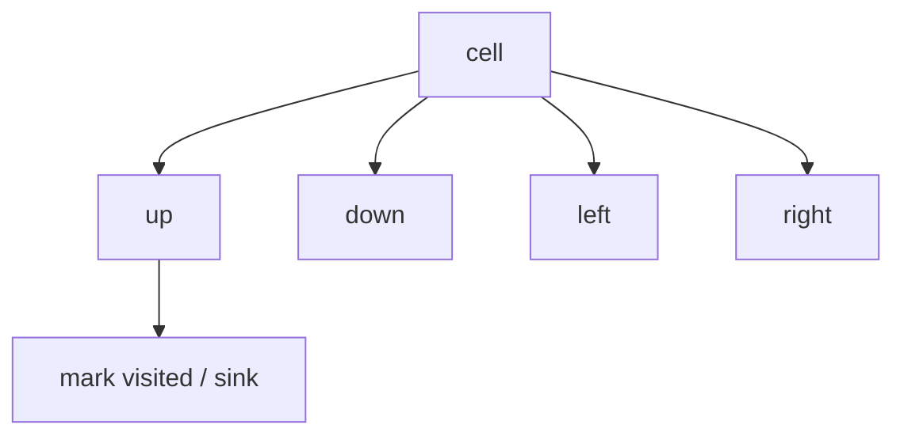
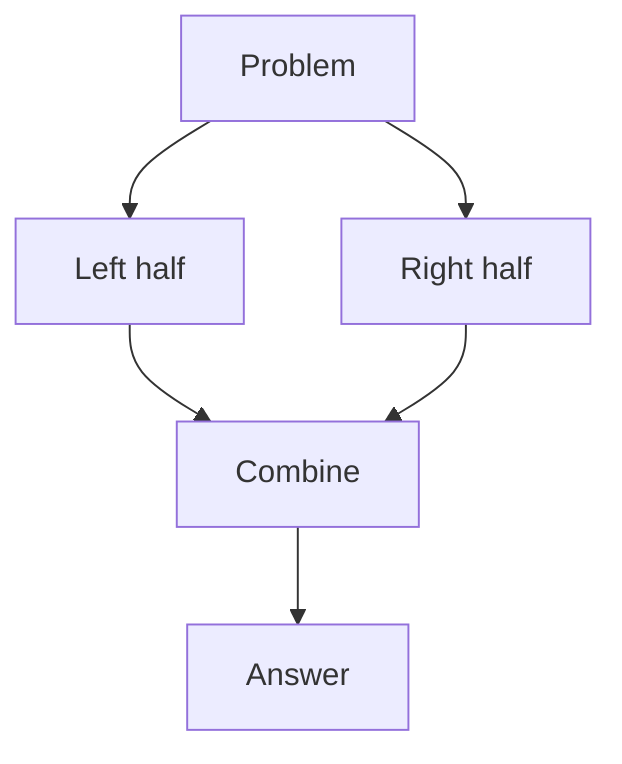
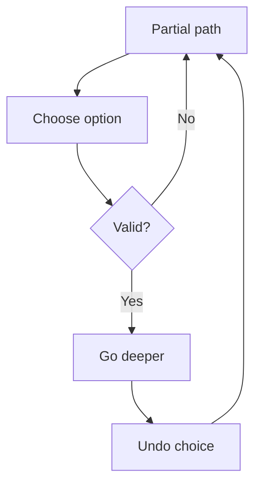

# Family 4 — Recursive Exploration

- [x] DFS
- [x] Tree Traversals
- [x] Divide and Conquer
- [x] Backtracking

## Family Overview

You explore by going deep (or splitting the toy into halves), then combining
answers or undoing a try. Stack frames (or a hand-made stack) remember the path.

| Pattern | Owns | Does not own |
| --- | --- | --- |
| DFS | Deep walks, paint whole components | Shortest hop count (BFS) |
| Tree Traversals | Pre/in/post order on trees | General graph visited tricks |
| Divide and Conquer | Split → solve → combine | Try-all-undo search |
| Backtracking | Build a candidate; undo on fail | Memoized overlapping DP |

---

## DFS

**Scope:** Go as deep as you can along a path; mark places you’ve visited so
you don’t loop forever. Grids and neighbor lists. Shortest unweighted paths →
BFS (Family 6).

### Purpose

**DFS** means Depth-First Search: walk deep into a cave before you try the next
tunnel. You leave chalk marks (**visited**) so you don’t re-enter the same
room. Great for “how many separate islands?” and “can I reach everything from
here?”

### Recognition Clues

- Number of islands / flood fill / surrounded regions
- Clone graph; path sum
- Connected components without needing shortest length
- "Visit all rooms," reachability

> 🧠 **Pattern Recognition:** Paint a whole blob / go deep ⇒ DFS. Fewest steps
> ⇒ BFS. Generate every valid outfit with undo ⇒ Backtracking.

### Mental Model

**The problem.** Number of Islands: count groups of land (`'1'`) touching up /
down / left / right.

**Naive idea.** No visit plan → double-count or loop.

**The stuck part.** The same land cell can be reached many ways.

**The click.** Every time you find unvisited land, DFS-paint the whole island,
then add 1 to the count. Marks make each cell count once.

**Kid analogy.** Exploring a cave with chalk on the walls so you never re-enter
a chamber.

### Visualization



From each cell, recurse to unlabeled neighbors and mark them so the island is
eaten exactly once.

Worked: one row `1 1 0` — DFS from the first `1` paints both lands; count = 1.

### Generic Template

```pseudo
function dfs(node):
    mark node visited
    for each neighbor v of node:
        if not visited(v) and allowed(v):
            dfs(v)

# Islands driver
count = 0
for each cell:
    if land and not visited:
        dfs(cell); count += 1
```

In plain English: leave a chalk mark, then explore every unmarked open
neighbor; each fresh land start is a new island.

### Complexity

- **Time:** O(cells) or O(nodes + edges)
- **Space:** O(cells) for marks + call stack (use an explicit stack if depth is
  scary)

### Common Mistakes

- Marking visited too late → infinite loops
- Using DFS when the question wants fewest steps (use BFS)
- Stack overflow on deep recursion — switch to a loop + stack
- Word Search needs undo marks (Backtracking), not permanent paint only

> ⚠️ **Common Mistake:** Surrounded Regions is still DFS/BFS paint — the clever
> bit is which cells you seed from (the border).

### Classic Interview Questions

**Easy:** Maximum Depth of Binary Tree · Leaf-Similar Trees · Flood Fill

**Medium:** Number of Islands · Clone Graph · Path Sum II

**Hard:** Longest Increasing Path in a Matrix · Critical Connections in a Network
Longest Increasing Path in a Matrix

### Engineering Connections

Package managers walk “what does this depend on?” depth-first with a visited
set — same chalk-mark walk as islands/clone.

> 🏗️ **Engineering Connection:** “Show everything this package pulls in” is
> DFS from a root.

### Depth Note — Recurse Into Neighbors

DFS (depth-first search) means: explore one path as far as it goes before
backtracking to the next branch. On a grid, flood-fill an island by recursing
to four neighbors and marking visited. On a graph, recurse through the
adjacency list.

Bottleneck of nested “scan whole grid for each land cell”: you re-walk water.
DFS (or BFS) marks visited once so each cell pays work once.

Path problems (unique paths with obstacles, path sum in trees) are DFS with a
running state. Graph representation lives in Graph Traversal; this chapter owns
the recursive walk template: `visit → for neighbor: if not seen: dfs(neighbor)`.

### Worked Recognition

Number of Islands / Max Area of Island: for each land cell, DFS floods and
marks water; count how many floods you started. Clone Graph is DFS/BFS with a
map from old node to new node. Path Sum wanders with a running total.

Always mark visited (or sink the island to water) when you enter a cell so you
do not thrash. Graph Traversal owns adj-list construction; you own the recurse
template.

### Interview Dialogue

Interviewer: “Count islands.” You: “Scan the grid; when I see land, DFS flood
to mark the whole component, then bump the count.” Mention visited (or sink to
water). For Clone Graph, show the old→new map. For path problems, carry state
down and return up. Point to Graph Traversal for adj-list construction, but
still walk a tiny example here so the chapter is not a stub.

### Why Reach For This

Patterns exist so you stop reinventing the same bottleneck fix under interview
pressure. Name the wasted work first — nested pair scans, rebuilding range
sums, rescanning a grid, forgetting visited marks, sorting when membership was
enough. Then name the structure that removes that waste. Practice saying the
bottleneck in one sentence before you touch the keyboard; that sentence is how
interviewers score pattern recognition.

When the pattern is dual-homed, say the primary owner and the helper out loud.
When an Easy list is a warmup rather than a famous LeetCode Easy, label it as
prep for the Medium that carries the real idea. Prefer deriving the template
from the mental model over memorizing a number. If you can redraw the diagram
from memory and retell the naive-to-insight arc, you own the chapter.

Engineering systems reuse these habits daily: indexed lookups, rollups, layer
exploration, schedulers, prefix trees, and priority queues. Connecting the toy
example to a named production mechanism keeps the knowledge sticky beyond the
whiteboard.

Re-check complexity after you pick the pattern: time should match a single
pass, a log factor from sort or heap, or a bounded state space — not a hidden
quadratic walk disguised as a helper list scan. Space should match the map,
queue, recursion depth, or heap you actually allocated. If a follow-up forbids
extra memory, revisit in-place index surgery. If weights appear on edges,
upgrade from BFS to Dijkstra. If the answer is any feasible set of choices with
overlap, upgrade from greedy to DP. Those upgrades are pattern recognition too.

Finally, keep the voice simple: short sentences, one worked example, one
diagram, one template. That is the handbook bar that Hash Maps set — clarity
first, then implementation.

### Summary

- DFS owns deep exploration and blob painting
- Visited marks stop infinite walks
- Fewest hops → BFS
- Grid DFS is graph DFS with four neighbors

---

## Tree Traversals

**Scope:** Visit every node of a tree in a chosen order: before kids, between
kids, or after kids. Level-by-level uses a queue (BFS family).

### Purpose

A **tree** is a family chart: one root, kids, grandkids — no loops. Traversal
means “in what order do I say hello?” 

- **Preorder:** me, then left, then right (copy structure)
- **Inorder:** left, me, right (sorted order in a BST)
- **Postorder:** left, right, me (need kids’ answers first — height, delete)

### Recognition Clues

- Diameter, balanced, LCA, max path sum
- Serialize / deserialize
- BST validation (inorder increasing)
- "Mirror," "invert," subtree checks

### Mental Model

**The problem.** Diameter of Binary Tree: longest path between any two nodes
(count edges).

**Naive idea.** For every node, measure all pairs — lots of repeated height
work.

**The stuck part.** Heights overlap.

**The click.** One postorder walk: each node returns its height; while there,
update `diameter = max(diameter, leftHeight + rightHeight)`.

**Kid analogy.** Family reunion walking rules:

- preorder: announce yourself, then tour left cousins, then right
- inorder: finish left cousins, announce yourself, then right
- postorder: settle the kids’ stories before you speak

### Visualization

```text
      1
     / \
    2   3
   / \
  4   5

preorder:  1 2 4 5 3
inorder:   4 2 5 1 3
postorder: 4 5 2 3 1
```

Same tree, three hello-orders — pick the one that matches when you need parent
vs child info.

### Generic Template

```pseudo
function walk(node):
    if node is null: return base
    # preorder work here if needed
    left = walk(node.left)
    # inorder work here if needed
    right = walk(node.right)
    # postorder: combine left, right, node.val
    return combine(left, right, node)
```

In plain English: empty tree → base case; otherwise visit left and right, and
do your combine step when kids’ answers exist.

### Complexity

- **Time:** O(n) — each node once
- **Space:** O(height) of the call stack (worst: a skinny stick tree)

### Common Mistakes

- Using preorder when you still need child results first (height / diameter)
- Forgetting the null base case
- Treating every binary tree like a BST (inorder sorted only for BSTs)
- Coding level-order with recursion and no queue (that’s BFS)

> 💡 **Insight:** Diameter and Max Path Sum are both “postorder combine”
> problems — only the math in `combine` changes.

### Classic Interview Questions

**Easy:** Binary Tree Inorder Traversal · Binary Tree Preorder Traversal · Binary Tree Postorder Traversal

**Medium:** Validate Binary Search Tree · Construct Binary Tree from Preorder and Inorder · Binary Tree Zigzag Level Order

**Hard:** Serialize and Deserialize Binary Tree · Binary Tree Maximum Path Sum

### Engineering Connections

Browsers walk the DOM (page tree); compilers walk ASTs (code trees) — same
pre/in/post choices (attributes vs children vs cleanup).

> 🏗️ **Engineering Connection:** Postorder feels like “free the kids, then
> free the parent” in an ownership tree.

### Depth Note — Preorder, Inorder, Postorder

Trees are graphs without cycles and with a root. Traversal order is the ticket:

- **Preorder** — node, then left, then right (serialize / copy shape)
- **Inorder** — left, node, right (BST yields sorted values)
- **Postorder** — left, right, node (delete children before parent)

Naive “I forgot which order” is the bottleneck behind wrong BST validations.
Level-order is BFS with a queue — see Family 6 / Queue — not a recursive
preorder cousin.

Worked BST: inorder walk proves sortedness; a violate means not a BST.

### Worked Recognition

Validate BST is inorder (or bounded DFS). Construct tree from preorder+inorder
uses preorder’s root + inorder’s split. Serialize/deserialize often uses
preorder with null markers. Postorder fits “process children before parent”
deletion order in compilers.

Level order is BFS — send readers to the BFS/Queue chapters for the queue
loop; keep recursive orders here.

### Interview Dialogue

Interviewer: “Validate BST.” You: “Inorder should be strictly increasing,” or
“I’ll DFS with low/high bounds.” Name which traversal fits before coding.
Serialize often wants preorder with nulls; free/delete shape wants postorder.
Level averages want a queue — say Level Order / BFS out loud so you don’t force
recursion.

### Why Reach For This

Patterns exist so you stop reinventing the same bottleneck fix under interview
pressure. Name the wasted work first — nested pair scans, rebuilding range
sums, rescanning a grid, forgetting visited marks, sorting when membership was
enough. Then name the structure that removes that waste. Practice saying the
bottleneck in one sentence before you touch the keyboard; that sentence is how
interviewers score pattern recognition.

When the pattern is dual-homed, say the primary owner and the helper out loud.
When an Easy list is a warmup rather than a famous LeetCode Easy, label it as
prep for the Medium that carries the real idea. Prefer deriving the template
from the mental model over memorizing a number. If you can redraw the diagram
from memory and retell the naive-to-insight arc, you own the chapter.

Engineering systems reuse these habits daily: indexed lookups, rollups, layer
exploration, schedulers, prefix trees, and priority queues. Connecting the toy
example to a named production mechanism keeps the knowledge sticky beyond the
whiteboard.

Re-check complexity after you pick the pattern: time should match a single
pass, a log factor from sort or heap, or a bounded state space — not a hidden
quadratic walk disguised as a helper list scan. Space should match the map,
queue, recursion depth, or heap you actually allocated. If a follow-up forbids
extra memory, revisit in-place index surgery. If weights appear on edges,
upgrade from BFS to Dijkstra. If the answer is any feasible set of choices with
overlap, upgrade from greedy to DP. Those upgrades are pattern recognition too.

Finally, keep the voice simple: short sentences, one worked example, one
diagram, one template. That is the handbook bar that Hash Maps set — clarity
first, then implementation.

### Summary

- Choose order by when you need kids’ answers
- One DFS pass can compute height + diameter together
- BST ⇒ inorder is sorted
- Level-order is BFS, not this section

---

## Divide and Conquer

**Scope:** Split the input, solve the pieces on their own, **combine** the
answers. Backtracking also branches, but it undoes choices; D&C returns merged
results.

### Purpose

**Divide and conquer** means: break the toy into halves, solve each half, then
glue the answers — including the tricky “across the middle” case. Merge sort
and MapReduce are famous cousins.

### Recognition Clues

- Merge sort / quicksort style tasks
- Maximum subarray D&C teaching version; majority via halves
- "Different ways to add parentheses"
- Answer = best(left, right, cross)

> 🧠 **Pattern Recognition:** If the solution is `best(left, right, cross)` and
> halves don’t undo each other, you’re in Divide & Conquer.

### Mental Model

**The problem.** Maximum Subarray (D&C teaching version): biggest continuous
sum.

**Naive idea.** Try every subarray — slow.

**The stuck part.** Overlap. (Kadane’s DP is faster in practice — D&C still
teaches the shape.)

**The click.** The answer sits wholly left, wholly right, or **crosses** the
middle (best right-end of left + best left-end of right). Compute three
candidates; take the max.

**Kid analogy.** Two scout teams search half a building each; a third check
covers the doorway between them — then pick the best of three reports.

### Visualization



Independent halves can even run in parallel; combine must handle the doorway.

### Generic Template

```pseudo
function solve(lo, hi):
    if lo == hi: return base(lo)
    mid = (lo + hi) // 2
    leftAns = solve(lo, mid)
    rightAns = solve(mid+1, hi)
    crossAns = combine_across(lo, mid, hi)
    return best(leftAns, rightAns, crossAns)
```

In plain English: tiny piece → easy answer; else solve both halves, compute the
cross case, return the winner.

### Complexity

- **Time:** often O(n log n) — log layers × about O(n) combine work
- **Space:** O(log n) stack, plus merge buffers if needed

### Common Mistakes

- Forgetting the cross-mid case
- Using D&C when a simple linear scan/DP is clearer (still fine to discuss)
- Halves that secretly share mutable state (not clean D&C)
- Mixing up with Backtracking (D&C returns answers; it doesn’t undo)

> 🚀 **Interview Tip:** Name the three candidates (left, right, cross) before
> you code.

### Classic Interview Questions

**Easy:** Merge Two Sorted Lists · Maximum Subarray Warmup · Convert Sorted Array to BST

**Medium:** Sort List · Different Ways to Add Parentheses · Majority Element

**Hard:** Count of Range Sum · Reverse Pairs

### Engineering Connections

MapReduce: map = solve shards; reduce = combine. Same mental model as merge
sort’s merge step.

> 🏗️ **Engineering Connection:** Cluster “split the data, merge the answers”
> is interview D&C at warehouse scale.

### Depth Note — Split, Solve, Merge

Divide and Conquer splits a problem into independent halves, solves each, then
merges answers. Merge Sort: split array, sort halves, merge two sorted runs.
Maximum subarray (Kadane is DP; classic D&C also splits mid and tracks best
crossing sum).

Bottleneck: solving the whole at once when halves share almost no dependency
except a cheap merge. Different from DP (overlapping subproblems). Different
from pure DFS (no “merge step” of two solved halves).

Kid analogy: two teams sort their half of the toys; one adult zips the two
sorted piles into one — merge step.

### Worked Recognition

Merge sort interview: write `merge(left,right)` carefully. Count of Range Sum /
reverse pairs use modified merge (Hard). Different from Quickselect (partition
for kth) though both “split.” Say the merge step out loud — without merge you
only have recursion, not D&C.

### Interview Dialogue

Interviewer: “Explain merge sort.” You: “Split until one element, then merge
two sorted runs with two fingers.” Emphasize the merge is where order is
reconstructed. If the problem only needs kth largest, pivot to Quickselect /
Heap instead of full sort merge. D&C shines when halves are independent and
merge is cheap relative to n log n.

### Why Reach For This

Patterns exist so you stop reinventing the same bottleneck fix under interview
pressure. Name the wasted work first — nested pair scans, rebuilding range
sums, rescanning a grid, forgetting visited marks, sorting when membership was
enough. Then name the structure that removes that waste. Practice saying the
bottleneck in one sentence before you touch the keyboard; that sentence is how
interviewers score pattern recognition.

When the pattern is dual-homed, say the primary owner and the helper out loud.
When an Easy list is a warmup rather than a famous LeetCode Easy, label it as
prep for the Medium that carries the real idea. Prefer deriving the template
from the mental model over memorizing a number. If you can redraw the diagram
from memory and retell the naive-to-insight arc, you own the chapter.

Engineering systems reuse these habits daily: indexed lookups, rollups, layer
exploration, schedulers, prefix trees, and priority queues. Connecting the toy
example to a named production mechanism keeps the knowledge sticky beyond the
whiteboard.

Re-check complexity after you pick the pattern: time should match a single
pass, a log factor from sort or heap, or a bounded state space — not a hidden
quadratic walk disguised as a helper list scan. Space should match the map,
queue, recursion depth, or heap you actually allocated. If a follow-up forbids
extra memory, revisit in-place index surgery. If weights appear on edges,
upgrade from BFS to Dijkstra. If the answer is any feasible set of choices with
overlap, upgrade from greedy to DP. Those upgrades are pattern recognition too.

Finally, keep the voice simple: short sentences, one worked example, one
diagram, one template. That is the handbook bar that Hash Maps set — clarity
first, then implementation.

### Summary

- Split, solve alone, combine (include the doorway)
- Recurrence explains O(n log n)
- Not every recursive tree problem is D&C
- Prefer simpler linear algorithms when they exist; still know D&C

---

## Backtracking

**Scope:** Build an answer one choice at a time; **undo** when stuck. Word
Search deep treatment lives here.

### Purpose

**Backtracking** is trying on outfits: put on a hat, see if it fits the rules,
try the next piece; if you get stuck, take the hat off and try another. Used
for permutations, subsets, N-Queens, Sudoku, and grid word search.

### Recognition Clues

- Permutations / subsets / combination sum
- N-Queens, Sudoku solver
- Word search on a grid
- "Generate all," "restore IP," palindrome partition

### Mental Model

**The problem.** Word Search: does the word snake through adjacent cells
without reusing a cell?

**Naive idea.** Try every start and every path — explode without undo.

**The stuck part.** Exponential paths; need prune + restore.

**The click.** Choose a step → recurse → **unchoose** (put the letter back).
Same skeleton as Permutations with a path list and a used[] flag.

**Kid analogy.** Maze with breadcrumbs you pick up when you retreat so another
path can reuse the hallway.

### Visualization



The undo arrow is what separates backtracking from “permanent chalk” DFS for
islands.

Worked subsets of `[1,2]`: choose/skip each number, undo after exploring →
`[]`, `[1]`, `[1,2]`, `[2]`.

### Generic Template

```pseudo
function bt(path, choices):
    if is_goal(path):
        record(path); return
    for c in choices:
        if not valid(path, c): continue
        apply(path, c)          # choose
        bt(path, next_choices)
        revoke(path, c)         # undo
```

In plain English: if you’re done, save a copy; else try each legal move, go
deeper, then take the move back.

### Complexity

- **Time:** often O(n!) or O(2ⁿ) with pruning — say the branching out loud
- **Space:** O(depth) for the path / recursion

### Common Mistakes

- Forgetting to undo (cell stays blocked; list not popped)
- Saving the live mutable path without copying
- Using backtracking when DP/memo can share overlapping states for a count
- Forgetting sort + skip for Combination Sum duplicates

> 💡 **Intuition:** Pruning is speed; undo is correctness.

### Classic Interview Questions

**Easy:** Subsets · Letter Case Permutation · Binary Watch

**Medium:** Permutations · Combination Sum · Word Search

**Hard:** N-Queens · Sudoku Solver

> See also: Palindrome Partitioning (Medium); Word Search II under Trie.

### Engineering Connections

Configurators and puzzle solvers try an assignment, check rules, and revert on
conflict — production backtracking with smarter “what to try next” heuristics.

> 🏗️ **Engineering Connection:** Mentally map apply/revoke to “flip a trial
> setting, run checks, flip it back.”

### Depth Note — Choose, Explore, Undo

Backtracking builds candidates one choice at a time. When a choice fails
constraints, **undo** and try the next. Permutations, subsets, N-Queens, Word
Search: the template is identical — choose → recurse → un-choose.

Bottleneck: generating every full arrangement into a giant list when pruning
could have stopped early. Also missing the undo step so later branches see
stale state.

Easy warmups that are truly Easy: subsets of a short distinct array; letter
case permutations. Sudoku / N-Queens are Hard because the constraint board is
dense.

Kid analogy: packing a backpack for a trip — try an item, see if the rest
still fits; if not, take it out (undo) and try another.

### Worked Recognition

Subsets: for each index, choose take/skip then undo. Permutations: swap-in /
swap-back. Combination Sum: choose a coin, recurse with remaining target, pop.
Word Search: mark board cell '#', recurse 4-way, unmark. Prune when remaining
target goes negative or prefix cannot match.

That choose/undo pair is the whole pattern — memorize the habit, not one
problem’s AST.

### Interview Dialogue

Interviewer: “Generate permutations.” You: “I’ll choose an unused index, mark
it used, recurse, then unmark — choose / explore / undo.” For Word Search,
mark the cell, recurse four ways, unmark. Call out pruning: stop when the
remaining target is negative or the prefix cannot match any word. Without undo,
later branches inherit ghost state.

### Why Reach For This

Patterns exist so you stop reinventing the same bottleneck fix under interview
pressure. Name the wasted work first — nested pair scans, rebuilding range
sums, rescanning a grid, forgetting visited marks, sorting when membership was
enough. Then name the structure that removes that waste. Practice saying the
bottleneck in one sentence before you touch the keyboard; that sentence is how
interviewers score pattern recognition.

When the pattern is dual-homed, say the primary owner and the helper out loud.
When an Easy list is a warmup rather than a famous LeetCode Easy, label it as
prep for the Medium that carries the real idea. Prefer deriving the template
from the mental model over memorizing a number. If you can redraw the diagram
from memory and retell the naive-to-insight arc, you own the chapter.

Engineering systems reuse these habits daily: indexed lookups, rollups, layer
exploration, schedulers, prefix trees, and priority queues. Connecting the toy
example to a named production mechanism keeps the knowledge sticky beyond the
whiteboard.

Re-check complexity after you pick the pattern: time should match a single
pass, a log factor from sort or heap, or a bounded state space — not a hidden
quadratic walk disguised as a helper list scan. Space should match the map,
queue, recursion depth, or heap you actually allocated. If a follow-up forbids
extra memory, revisit in-place index surgery. If weights appear on edges,
upgrade from BFS to Dijkstra. If the answer is any feasible set of choices with
overlap, upgrade from greedy to DP. Those upgrades are pattern recognition too.

Finally, keep the voice simple: short sentences, one worked example, one
diagram, one template. That is the handbook bar that Hash Maps set — clarity
first, then implementation.

### Summary

- Choose → explore → undo
- Prune early with validity checks
- Word Search = DFS shape + undo marks
- Heavy overlapping numeric optima → consider DP/memo

---
