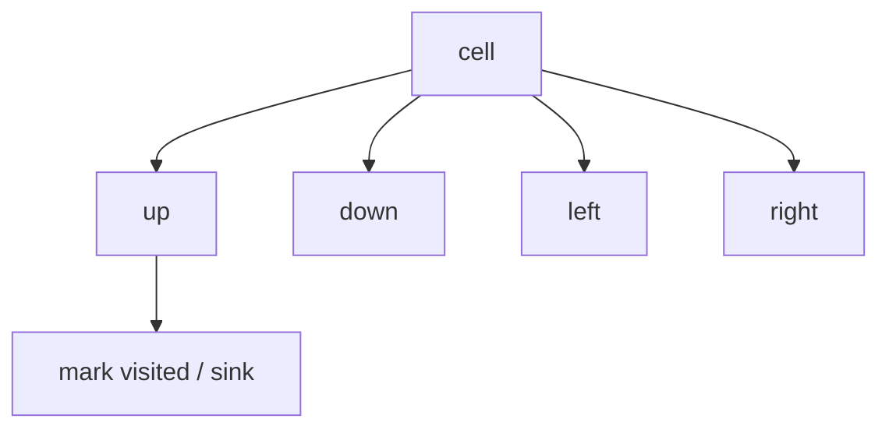
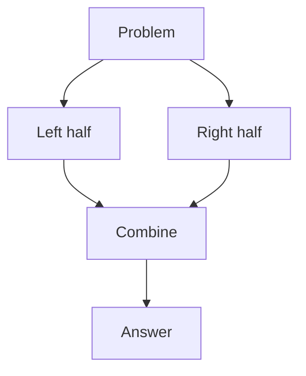
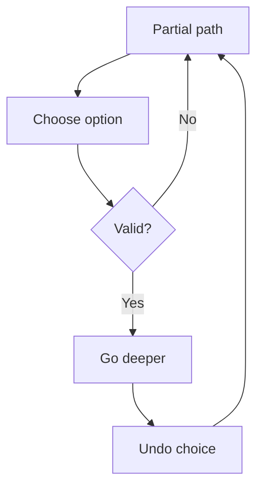

# Family 4 — Recursive Exploration

- [x] DFS
- [x] Tree Traversals
- [x] Divide and Conquer
- [x] Backtracking

## Family Overview

You explore by going deep (or splitting the toy into halves), then combining
answers or undoing a try. Stack frames (or a hand-made stack) remember the path.

| Pattern | Owns | Does not own |
| --- | --- | --- |
| DFS | Deep walks, paint whole components | Shortest hop count (BFS) |
| Tree Traversals | Pre/in/post order on trees | General graph visited tricks |
| Divide and Conquer | Split → solve → combine | Try-all-undo search |
| Backtracking | Build a candidate; undo on fail | Memoized overlapping DP |

---

## DFS

**Scope:** Go as deep as you can along a path; mark places you’ve visited so
you don’t loop forever. Grids and neighbor lists. Shortest unweighted paths →
BFS (Family 6).

### Purpose

**DFS** means Depth-First Search: walk deep into a cave before you try the next
tunnel. You leave chalk marks (**visited**) so you don’t re-enter the same
room. Great for “how many separate islands?” and “can I reach everything from
here?”

### Recognition Clues

- Number of islands / flood fill / surrounded regions
- Clone graph; path sum
- Connected components without needing shortest length
- "Visit all rooms," reachability

> 🧠 **Pattern Recognition:** Paint a whole blob / go deep ⇒ DFS. Fewest steps
> ⇒ BFS. Generate every valid outfit with undo ⇒ Backtracking.

### Mental Model

**The problem.** Number of Islands: count groups of land (`'1'`) touching up /
down / left / right.

**Naive idea.** No visit plan → double-count or loop: a 3×3 grid of all land
would get counted as up to 9 separate islands (or infinitely recurse) if you
never remember which cells you already painted.

**The stuck part.** The same land cell can be reached many ways.

**The click.** Every time you find unvisited land, DFS-paint the whole island,
then add 1 to the count. Marks make each cell count once.

**Kid analogy.** Exploring a cave with chalk on the walls so you never re-enter
a chamber.

**Second sketch — Max Area of Island.** Same flood, but each `dfs` call now
*returns* the size of the island instead of just marking it: `1 + dfs(up) +
dfs(down) + dfs(left) + dfs(right)` after marking the cell visited. Track the
running max across every flood you start.

**Third sketch — Clone Graph.** DFS (or BFS) the original graph while keeping
a map from old node → new node. The first time you meet a node, create its
clone and store the mapping *before* recursing into its neighbors — that stops
infinite loops on cycles and reuses clones instead of duplicating them.

### Visualization



From each cell, recurse to unlabeled neighbors and mark them so the island is
eaten exactly once.

Worked: one row `1 1 0` — DFS from the first `1` paints both lands; count = 1.

### Generic Template

```pseudo
function dfs(node):
    mark node visited
    for each neighbor v of node:
        if not visited(v) and allowed(v):
            dfs(v)

# Islands driver
count = 0
for each cell:
    if land and not visited:
        dfs(cell); count += 1
```

In plain English: leave a chalk mark, then explore every unmarked open
neighbor; each fresh land start is a new island.

### Complexity

- **Time:** O(cells) or O(nodes + edges)
- **Space:** O(cells) for marks + call stack (use an explicit stack if depth is
  scary)

### Common Mistakes

- Marking visited too late → infinite loops
- Using DFS when the question wants fewest steps (use BFS)
- Stack overflow on deep recursion — switch to a loop + stack
- Word Search needs undo marks (Backtracking), not permanent paint only
- Recursing into diagonal neighbors when the problem only allows
  up/down/left/right adjacency (or the reverse — check the grid's own
  definition of "touching")

> ⚠️ **Common Mistake:** Surrounded Regions is still DFS/BFS paint — the clever
> bit is which cells you seed from (the border).

### Classic Interview Questions

**Easy:** Maximum Depth of Binary Tree · Leaf-Similar Trees · Flood Fill

**Medium:** Number of Islands · Clone Graph · Path Sum II

**Hard:** Longest Increasing Path in a Matrix · Critical Connections in a Network

### Engineering Connections

Package managers walk “what does this depend on?” depth-first with a visited
set — same chalk-mark walk as islands/clone.

> 🏗️ **Engineering Connection:** “Show everything this package pulls in” is
> DFS from a root.

File-system tools like `du` recurse into every subdirectory depth-first to add
up disk usage, and static site generators crawl a page's linked pages the same
way to build a full site map before rendering.

### Summary

- DFS owns deep exploration and blob painting
- Visited marks stop infinite walks
- Fewest hops → BFS
- Grid DFS is graph DFS with four neighbors

---

## Tree Traversals

**Scope:** Visit every node of a tree in a chosen order: before kids, between
kids, or after kids. Level-by-level uses a queue (BFS family).

### Purpose

A **tree** is a family chart: one root, kids, grandkids — no loops. Traversal
means “in what order do I say hello?” 

- **Preorder:** me, then left, then right (copy structure)
- **Inorder:** left, me, right (sorted order in a BST)
- **Postorder:** left, right, me (need kids’ answers first — height, delete)

### Recognition Clues

- Diameter, balanced, LCA, max path sum
- Serialize / deserialize
- BST validation (inorder increasing)
- "Mirror," "invert," subtree checks

### Mental Model

**The problem.** Diameter of Binary Tree: longest path between any two nodes
(count edges).

**Naive idea.** For every node, measure all pairs — lots of repeated height
work: computing height from scratch at every node costs O(n) per node, so
O(n²) total, and most of that height math is recomputed identically for
overlapping subtrees.

**The stuck part.** Heights overlap.

**The click.** One postorder walk: each node returns its height; while there,
update `diameter = max(diameter, leftHeight + rightHeight)`.

**Kid analogy.** Family reunion walking rules:

- preorder: announce yourself, then tour left cousins, then right
- inorder: finish left cousins, announce yourself, then right
- postorder: settle the kids’ stories before you speak

**Second sketch — Validate BST.** Either walk inorder and check the values are
strictly increasing, or DFS each node with a running `(low, high)` bound — a
left child tightens the high bound to the parent’s value, a right child
tightens the low bound. Both catch the classic bug of comparing a node only
to its direct children instead of the whole allowed range.

**Third sketch — Construct Binary Tree from Preorder and Inorder.** Preorder’s
first value is always the current root. Find that value inside the matching
inorder slice — everything left of it is the left subtree, everything right
is the right subtree. Recurse on both slices with the next preorder values.

### Visualization

```text
      1
     / \
    2   3
   / \
  4   5

preorder:  1 2 4 5 3
inorder:   4 2 5 1 3
postorder: 4 5 2 3 1
```

Same tree, three hello-orders — pick the one that matches when you need parent
vs child info.

### Generic Template

```pseudo
function walk(node):
    if node is null: return base
    # preorder work here if needed
    left = walk(node.left)
    # inorder work here if needed
    right = walk(node.right)
    # postorder: combine left, right, node.val
    return combine(left, right, node)
```

In plain English: empty tree → base case; otherwise visit left and right, and
do your combine step when kids’ answers exist.

### Complexity

- **Time:** O(n) — each node once
- **Space:** O(height) of the call stack (worst: a skinny stick tree)

### Common Mistakes

- Using preorder when you still need child results first (height / diameter)
- Forgetting the null base case
- Treating every binary tree like a BST (inorder sorted only for BSTs)
- Coding level-order with recursion and no queue (that’s BFS)
- Returning a negative subtree sum unclamped in Max Path Sum — a node should
  only add a child’s contribution if that contribution actually helps

> 💡 **Insight:** Diameter and Max Path Sum are both “postorder combine”
> problems — only the math in `combine` changes.

### Classic Interview Questions

**Easy:** Binary Tree Inorder Traversal · Binary Tree Preorder Traversal · Binary Tree Postorder Traversal

**Medium:** Validate Binary Search Tree · Construct Binary Tree from Preorder and Inorder · Binary Tree Zigzag Level Order

**Hard:** Serialize and Deserialize Binary Tree · Binary Tree Maximum Path Sum

### Engineering Connections

Browsers walk the DOM (page tree); compilers walk ASTs (code trees) — same
pre/in/post choices (attributes vs children vs cleanup).

> 🏗️ **Engineering Connection:** Postorder feels like “free the kids, then
> free the parent” in an ownership tree.

File-system deletion walks a directory tree postorder — every file inside a
folder must be freed before the folder itself can be removed — and dependency
graphs in build tools resolve in the same child-before-parent order when
cleaning up generated artifacts.

### Summary

- Choose order by when you need kids’ answers
- One DFS pass can compute height + diameter together
- BST ⇒ inorder is sorted
- Level-order is BFS, not this section

---

## Divide and Conquer

**Scope:** Split the input, solve the pieces on their own, **combine** the
answers. Backtracking also branches, but it undoes choices; D&C returns merged
results.

### Purpose

**Divide and conquer** means: break the toy into halves, solve each half, then
glue the answers — including the tricky “across the middle” case. Merge sort
and MapReduce are famous cousins.

### Recognition Clues

- Merge sort / quicksort style tasks
- Maximum subarray D&C teaching version; majority via halves
- "Different ways to add parentheses"
- Answer = best(left, right, cross)

> 🧠 **Pattern Recognition:** If the solution is `best(left, right, cross)` and
> halves don’t undo each other, you’re in Divide & Conquer.

### Mental Model

**The problem.** Maximum Subarray (D&C teaching version): biggest continuous
sum.

**Naive idea.** Try every subarray — slow: n starting points times n ending
points means O(n²) candidate sums, and summing each one from scratch pushes
that to O(n³) unless you're careful.

**The stuck part.** Overlap. (Kadane’s DP is faster in practice — D&C still
teaches the shape.)

**The click.** The answer sits wholly left, wholly right, or **crosses** the
middle (best right-end of left + best left-end of right). Compute three
candidates; take the max.

**Kid analogy.** Two scout teams search half a building each; a third check
covers the doorway between them — then pick the best of three reports.

**Second sketch — Count of Range Sum.** A modified merge step counts, for each
right-half value, how many left-half values land in the needed range — since
both halves are already sorted by merge time, that counting rides for free on
top of the merge you were doing anyway.

**Contrast — Quickselect.** Finding the kth largest value also partitions
around a pivot, but only recurses into the *one* side that holds the answer
and never merges anything back together — that's Quickselect (a Heap-family
cousin), not Divide and Conquer.

### Visualization



Independent halves can even run in parallel; combine must handle the doorway.

### Generic Template

```pseudo
function solve(lo, hi):
    if lo == hi: return base(lo)
    mid = (lo + hi) // 2
    leftAns = solve(lo, mid)
    rightAns = solve(mid+1, hi)
    crossAns = combine_across(lo, mid, hi)
    return best(leftAns, rightAns, crossAns)
```

In plain English: tiny piece → easy answer; else solve both halves, compute the
cross case, return the winner.

### Complexity

- **Time:** often O(n log n) — log layers × about O(n) combine work
- **Space:** O(log n) stack, plus merge buffers if needed

### Common Mistakes

- Forgetting the cross-mid case
- Using D&C when a simple linear scan/DP is clearer (still fine to discuss)
- Halves that secretly share mutable state (not clean D&C)
- Mixing up with Backtracking (D&C returns answers; it doesn’t undo)
- Recomputing the cross-mid case from scratch instead of reusing the left and
  right halves’ own running sums, which quietly turns an O(n log n) solution
  back into O(n²)

> 🚀 **Interview Tip:** Name the three candidates (left, right, cross) before
> you code.

### Classic Interview Questions

**Easy:** Merge Two Sorted Lists · Maximum Subarray Warmup · Convert Sorted Array to BST

**Medium:** Sort List · Different Ways to Add Parentheses · Majority Element

**Hard:** Count of Range Sum · Reverse Pairs

### Engineering Connections

MapReduce: map = solve shards; reduce = combine. Same mental model as merge
sort’s merge step.

> 🏗️ **Engineering Connection:** Cluster “split the data, merge the answers”
> is interview D&C at warehouse scale.

Multi-threaded rendering engines split a frame into independent tiles, render
each tile on its own core, then composite (merge) the tiles back into one
image — the same split/solve/combine shape, minus any tricky "crosses the
middle" case since pixels don't interact across tile boundaries.

### Summary

- Split, solve alone, combine (include the doorway)
- Recurrence explains O(n log n)
- Not every recursive tree problem is D&C
- Prefer simpler linear algorithms when they exist; still know D&C

---

## Backtracking

**Scope:** Build an answer one choice at a time; **undo** when stuck. Word
Search deep treatment lives here.

### Purpose

**Backtracking** is trying on outfits: put on a hat, see if it fits the rules,
try the next piece; if you get stuck, take the hat off and try another. Used
for permutations, subsets, N-Queens, Sudoku, and grid word search.

### Recognition Clues

- Permutations / subsets / combination sum
- N-Queens, Sudoku solver
- Word search on a grid
- "Generate all," "restore IP," palindrome partition

### Mental Model

**The problem.** Word Search: does the word snake through adjacent cells
without reusing a cell?

**Naive idea.** Try every start and every path — explode without undo: a board
with even modest branching (4 directions, a handful of steps) produces
thousands of candidate paths, and without pruning you'd explore every one of
them to the end before checking whether the word even still matches.

**The stuck part.** Exponential paths; need prune + restore.

**The click.** Choose a step → recurse → **unchoose** (put the letter back).
Same skeleton as Permutations with a path list and a used[] flag.

**Kid analogy.** Maze with breadcrumbs you pick up when you retreat so another
path can reuse the hallway.

**Second sketch — Permutations.** Instead of a `used[]` flag, swap the current
index into place, recurse on the rest of the array, then swap back before
trying the next candidate — same choose/undo habit, done in place.

**Third sketch — Combination Sum.** Choose a coin, recurse with the remaining
target reduced by that coin's value, then pop the coin back off before trying
the next one. Prune as soon as the remaining target goes negative.

### Visualization



The undo arrow is what separates backtracking from “permanent chalk” DFS for
islands.

Worked subsets of `[1,2]`: choose/skip each number, undo after exploring →
`[]`, `[1]`, `[1,2]`, `[2]`.

### Generic Template

```pseudo
function bt(path, choices):
    if is_goal(path):
        record(path); return
    for c in choices:
        if not valid(path, c): continue
        apply(path, c)          # choose
        bt(path, next_choices)
        revoke(path, c)         # undo
```

In plain English: if you’re done, save a copy; else try each legal move, go
deeper, then take the move back.

### Complexity

- **Time:** often O(n!) or O(2ⁿ) with pruning — say the branching out loud
- **Space:** O(depth) for the path / recursion

### Common Mistakes

- Forgetting to undo (cell stays blocked; list not popped)
- Saving the live mutable path without copying
- Using backtracking when DP/memo can share overlapping states for a count
- Forgetting sort + skip for Combination Sum duplicates
- Checking the goal condition only at the very end of the recursion instead of
  pruning as soon as a partial path is already invalid — that's the difference
  between exploring a handful of branches and exploring all of them

> 💡 **Intuition:** Pruning is speed; undo is correctness.

### Classic Interview Questions

**Easy:** Subsets · Letter Case Permutation · Binary Watch

**Medium:** Permutations · Combination Sum · Word Search

**Hard:** N-Queens · Sudoku Solver

> See also: Palindrome Partitioning (Medium); Word Search II under Trie.

### Engineering Connections

Configurators and puzzle solvers try an assignment, check rules, and revert on
conflict — production backtracking with smarter “what to try next” heuristics.

> 🏗️ **Engineering Connection:** Mentally map apply/revoke to “flip a trial
> setting, run checks, flip it back.”

Regex engines with backtracking (as opposed to compiled NFA engines) try one
matching path, undo and try the next alternative on failure, and dependency
resolvers try a candidate package version, undo it if it conflicts with
another constraint, and try the next version — the same choose/explore/undo
loop as N-Queens, just over versions instead of board squares.

### Summary

- Choose → explore → undo
- Prune early with validity checks
- Word Search = DFS shape + undo marks
- Heavy overlapping numeric optima → consider DP/memo

---
