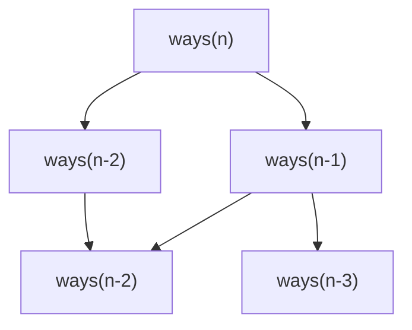
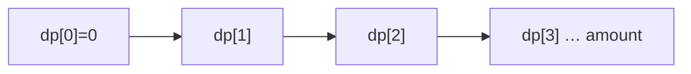
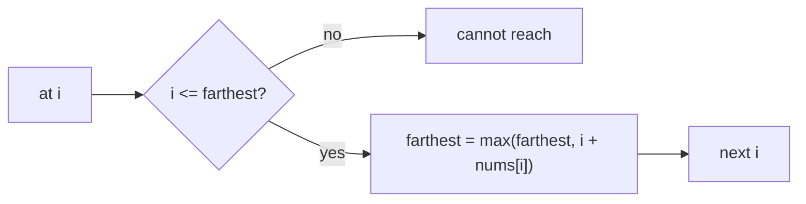

# Family 5 — State Transition

- [x] Memoization
- [x] Dynamic Programming
- [x] Greedy

## Family Overview

Big answers grow from smaller leftovers. **Memoization** is recursion with a
notebook: ask a smaller twin, write the answer, never redo it. **Dynamic
Programming (DP)** fills the same notebook in table order — baby cells first,
then bigger ones that depend on them. **Greedy** skips the notebook when a
local “best bite now” rule is already safe for the whole meal.

| Pattern | Owns | Does not own |
| --- | --- | --- |
| Memoization | Top-down recursion + cache by state | Blind “pick local best” with no overlap |
| Dynamic Programming | Bottom-up table / rolling arrays | Pure greedy with a stay-ahead proof |
| Greedy | Local choice with a clear proof | Counting ways / min cost that needs sub-answers |

When leftovers **overlap**, reach for memo or DP. When a short proof says the
local pick never hurts the global answer, reach for greedy. If you cannot sketch
that proof in two sentences, do not force greedy — try DP (or another family).

---

## Memoization

**Scope:** Recursion (a function that calls itself) plus a cheat sheet of
answers already computed. Same math as DP; you fill the notebook on demand
instead of in a fixed table order.

### Purpose

**Recursion** means asking a smaller twin of the same question. Without a
notebook, twins re-ask the same tiny questions again and again until the call
tree explodes. **Memoization** means: the first time you finish a state, write
the answer down; the next time someone asks, just read it. Web caches and
“computed property” caches do the same store-once, reuse-later trick for pages
and pure functions.

### Recognition Clues

- Naive recursion times out on Climbing Stairs, Fibonacci, or Unique Paths
- Phrases like “number of ways,” “can you reach,” overlapping smaller inputs
- The same function arguments show up from many branches of the call tree
- You can name a small **state** (index, leftover money, grid cell) that repeats
- Natural bridge from “I wrote a recursive solution” to table DP later

> 🧠 **Pattern Recognition:** If you can name a frozen fingerprint of “where I
> am” that repeats, memoize before inventing a full bottom-up table.

### Mental Model

**The problem.** Climbing Stairs: you face `n` steps and may take 1 or 2 at a
time. Count the ways. Tiny example: `n = 3` → three ways (`1+1+1`, `1+2`,
`2+1`).

**Naive idea.** Write `ways(n) = ways(n-1) + ways(n-2)` and recurse with no
memory. Correct on paper. On a large `n`, the call tree fans out like a family
tree where cousins keep asking the same grandparent the same homework question.

**Why it is too slow.** The bottleneck is not “addition is hard.” It is
**redundant recomputation**: `ways(k)` is fully recomputed from every path that
needs it. The tree size grows like Fibonacci — roughly exponential — even though
there are only about `n` different `k` values that matter.

**The better idea.** Keep a map (or array) from `k` to `ways(k)`. First visit:
compute, store, return. Later visits: return the stored value instantly. Time
becomes “how many different states exist,” not “how bushy the tree looks.”

**Pattern name.** Memoization — recursion plus a notebook keyed by state.

**Kid analogy.** A homework formula sheet. Once you solved problem #7, you do
not erase it and redo it every time a later problem needs #7. You glance at the
sheet.

### Visualization



Without a cache, the two arrows into `ways(n-2)` each run the whole subtree.
With memo, the second arrow hits the notebook and returns in one step. The
diamond shape is the clue: overlapping leftovers.

Worked idea for `n = 4`: once `ways(2) = 2` is stored, every later ask for 2 is
instant. You still walk the recursion once per distinct height, then the
notebook does the rest.

### Generic Template

```pseudo
memo = {}
function f(state):
    if state in memo:
        return memo[state]
    if is_base(state):
        return base_value
    ans = combine(f(next1), f(next2), …)
    memo[state] = ans
    return ans
```

In plain English: if the notebook has it, return it; if it is a baby case,
answer without recursing further; else compute from smaller states, write the
full answer down, then return. Always store **after** you finish combining
options — never stash a half-baked number.

Multi-argument states (row, col), (index, remaining), or (i, mask) become a
tuple key or a multi-dimensional array. The template does not change; only the
fingerprint does.

### Complexity

- **Time:** O(#distinct states × work per state) — each state computed once;
  work is usually the cost of trying a few transitions
- **Space:** O(#states) for the notebook, plus O(depth) for the recursion stack
  (or convert to bottom-up DP later to drop the stack)

### Common Mistakes

- Putting mutable junk inside the key (lists you keep editing). Keys must be
  frozen fingerprints: numbers, tuples, strings — not live objects that change
- Saving a partial answer before trying all options, then returning that partial
  on a later hit
- Missing base cases so recursion never bottoms out
- Memoizing a value that secretly depends on globals or outer variables not in
  the key (the notebook lies on the next call)
- Using memo when subproblems do **not** overlap — you pay map overhead for no
  reuse (still fine for clarity; just know it will not magically speed up)

> ⚠️ **Common Mistake:** Compute `ans` fully, **then** `memo[state] = ans`.
> Writing the cell early is how you cache a wrong “in progress” value.

### Classic Interview Questions

**Easy:** Climbing Stairs · Fibonacci Number · N-th Tribonacci Number

**Medium:** House Robber · Unique Paths · Decode Ways

**Hard:** Regular Expression Matching · Interleaving String

> Strong Medium neighbor: Word Break (memo on start index). Edit Distance deep
> work lives under Dynamic Programming as a table problem.

### Engineering Connections

HTTP caches and CDNs store a response body keyed by a URL-ish fingerprint —
same inputs, same stored answer, skip the expensive work. Frontend “computed
property” caches and build systems that skip unchanged compile units follow the
same store-once idea: pure function of inputs → reusable result.

> 🏗️ **Engineering Connection:** Mentally map `memo[state]` to a CDN cache key.
> Same URL-ish inputs ⇒ same stored body. If the key misses a dimension (like
> auth), you serve the wrong page — just like a bad memo key.

### Summary

- Memo = recursion + notebook of states
- Time becomes unique states, not call-tree size
- Natural warm-up before bottom-up DP
- Bad keys and missing bases are the usual bugs
- Overlap is required; without it, memo is just bookkeeping

---

## Dynamic Programming

**Scope:** Name the states and how they change; fill a table bottom-up (or via
memo). Needs overlapping leftovers plus “best small answer builds best big
answer” (optimal substructure). Contiguous-only max subarray tricks often sit
with Sliding Window / Kadane, not here.

### Purpose

**Dynamic Programming (DP)** means: do not try every full story from scratch;
try every **useful leftover state** once. Count ways, min coins, longest chains —
when the best answer for size `i` reuses best answers for smaller sizes. Diff
tools (edit distance) and route / logistics cost tables fill the same kind of
grid in production under friendlier names.

### Recognition Clues

- "Number of ways," "minimum coins," "longest increasing," "edit distance"
- Maximize or minimize with overlapping choices and reusable leftovers
- Grid paths; knapsack yes/no; string alignment / LCS cousins
- Limits allow O(n), O(n²), or O(nW) on the number of states
- Greedy “take biggest coin” fails on weird coin systems — need a table

> 🧠 **Pattern Recognition:** If the slow solution re-solves the same leftover
> (amount, index, pair of positions), name `dp[state]` and fill dependencies
> first.

### Mental Model

**The problem.** Coin Change: fewest coins to make `amount`. Example: coins
`[1, 2, 5]`, amount `11` → three coins (`5 + 5 + 1`).

**Naive idea.** Try every combination of coins. Correct in theory. Explodes in
practice because many different orders and branches share the same leftover
money.

**Why it is too slow.** The bottleneck is **repeated work on the same leftover
amount**. Combination trees fan out, but the real question “what is the best for
`x` dollars left?” appears over and over with no shared memory.

**The better idea.** Let `dp[x]` = fewest coins to make amount `x`. Base:
`dp[0] = 0`. Transition: for each coin, `dp[x] = min(dp[x], dp[x - coin] + 1)`
when `x >= coin`. Fill from small `x` up to `amount`. Every cell uses only
smaller amounts that are already finished.

**Pattern name.** Dynamic Programming — states, transitions, safe fill order.

**Kid analogy.** A sticker chart on the wall. You only put a sticker on square
10 after squares that feed into it are done. Later squares never peek at blank
future squares.

Memoization is the same chart filled top-down (ask hard questions first, fill
cells when needed). Classic interview DP often fills bottom-up so you see the
order clearly and avoid deep recursion.

### Visualization



Each cell uses only smaller amounts already done — bottom-up order matches the
dependency arrows. If you fill out of order, you read garbage (unfinished)
cells and the whole chart lies.

Worked amount `3`, coins `[1, 2]`:

```text
x:     0  1  2  3
dp:    0  1  1  2
```

`dp[3]` becomes 2 via `1 + dp[2]` or `1 + dp[1]` after trying coin 2 then coin
1 — never by inventing a new recipe that ignores smaller cells.

### Generic Template

```pseudo
# Example: unbounded knapsack / coin change (min coins)
dp = array of size amount+1 filled with INF
dp[0] = 0
for x from 1 to amount:
    for coin in coins:
        if x >= coin:
            dp[x] = min(dp[x], dp[x - coin] + 1)
return dp[amount]   # or “impossible” sentinel if still INF
```

In plain English: start with “0 money needs 0 coins”; for each total, try every
coin and keep the cheapest recipe that lands on that total.

General recipe for any DP:

1. Name the state (what leftover fully describes progress?).
2. Write the transition (how does one state become another?).
3. Choose an order where every dependency is ready.
4. Read the goal cell (or min/max over goal states).

Rolling arrays: if `dp[i]` only needs `dp[i-1]` (or a small window), keep one or
two rows instead of the whole rectangle — same math, less memory.

### Complexity

- **Time:** O(#states × #transitions per state) — e.g. coin change is
  O(amount × #coins) because each amount tries each coin once
- **Space:** O(#states) for the table; often shrinkable with rolling arrays to
  O(one layer) when older layers are never needed again

### Common Mistakes

- Wrong state (missing a dimension — e.g. only index when capacity still
  matters in knapsack)
- Filling in an order that reads unfinished cells
- Mixing subsequence vs substring: contiguous problems often want Window /
  Kadane, not a full DP table
- Calling coin change “greedy” on arbitrary denominations without a proof
- Off-by-one on base cases (`dp[0]`, empty string row/column) that poison every
  later cell
- Confusing “count ways” (add transitions) with “min cost” (take min) — same
  skeleton, different combine step

> ⚠️ **Common Mistake:** Greedy coins without a proof. On some systems the
> biggest coin first loses; DP still finds the true minimum.

### Classic Interview Questions

**Easy:** Climbing Stairs · Min Cost Climbing Stairs · Pascal's Triangle

**Medium:** House Robber · Coin Change · Longest Increasing Subsequence

**Hard:** Edit Distance · Burst Balloons

> Extra Medium practice: Longest Common Subsequence · Partition Equal Subset
> Sum. Climbing Stairs also appears under Memoization as the top-down twin.

### Engineering Connections

Version-control and diff tools score how to turn one string into another with
insert / delete / replace — that scoring table is edit-distance DP. Logistics
and map routing often keep “best cost to reach this leftover state” tables
(cousin of knapsack / path DP). Compilers and sequence aligners in biology use
the same fill-small-then-large idea.

> 🏗️ **Engineering Connection:** Mentally map `dp[state]` to “best known cost
> for this leftover” on a route board. Dispatchers do not re-enumerate every
> full path; they reuse best prefixes.

### Summary

- DP = states + transitions + safe fill order
- Memoization is top-down DP; tables are bottom-up
- Name complexity from #states × work per state
- Wrong state or wrong order breaks everything downstream
- Greedy needs a proof — it is not a default swap for DP

---

## Greedy

**Scope:** Make the locally best legal choice, commit, never rewind — **only**
when a short proof says that local rule stays globally safe. If future options
must stay open in tricky overlapping ways, use DP (or another family) instead.

### Purpose

**Greedy** means: take the bite that looks best right now and do not rethink it.
That is safe only when you can explain why the local best never ruins the global
answer (exchange argument, stay-ahead, or a clear invariant). Interview classics
include jump reachability, gas-station circuits, and interval scheduling.
Production cousins show up in scheduling, packing heuristics, and one-pass
trading rules when the math has already been proven.

### Recognition Clues

- "Can you reach the last index?" / jump games with a running farthest
- Gas station circular tour; assign cookies / lemonade change
- Activity selection; non-overlapping intervals; arrows to burst balloons
- Sort by a key, then one commit-or-skip pass finishes
- A two-sentence proof exists; counting all ways usually does **not** fit here

> 🧠 **Pattern Recognition:** If you cannot sketch why the local pick stays
> optimal in two sentences, do not force greedy — try DP or a safer scan.

### Mental Model

**The problem.** Jump Game: each index holds a jump length. Can you reach the
last index? Example: `[2, 3, 1, 1, 4]` → yes; `[3, 2, 1, 0, 4]` → no (stuck at
the zero).

**Naive idea.** DFS or BFS every jump choice, or DP `can[i]` from every prior
`j`. Works, but heavier than needed when a single running maximum already
answers reachability.

**Why the heavy approach is often overkill.** Exploring every path rechecks the
same “how far can I get from here?” question. The real bottleneck for this
flavor is not missing a fancy table — it is failing to notice that **only the
farthest reachable index so far** matters.

**The better idea.** Walk left to right. Track `farthest`. At index `i`, if
`i > farthest` you are stuck. Else update `farthest = max(farthest, i + nums[i])`.
If `farthest` ever covers the end, you win. You always “spend” your reach as far
as possible; there is no benefit to pretending you could jump less when the
question is only yes/no reachability.

**Pattern name.** Greedy — commit to the locally best safe update (here, the
farthest cover) because a stay-ahead argument says you never need a shorter
cover.

**Kid analogy.** Collecting coins on a sidewalk with a rule: always take the
next coin you can legally grab under the posted rule (earliest finish, farthest
jump, smallest cookie that works). You do not put coins back — so the rule must
be fair for the whole walk, not just the next step.

Contrast with DP: when the question is “minimum jumps” with richer costs, or
“number of ways,” or coin systems without a greedy proof, the notebook comes
back.

### Visualization



You only move the “coverage umbrella” forward. If the umbrella ever stops short
of your feet, the level is impossible. No table of every index’s full history is
required for the yes/no version.

```text
index:     0  1  2  3  4
nums:      2  3  1  1  4
farthest:  2 → 4  (covers end → true)
```

### Generic Template

```pseudo
# Only when local choice is provably safe (exchange / stay-ahead)
sort or scan in the justified order
state = empty running summary   # farthest, tank, last_end, …
for each candidate in order:
    if not locally_safe(candidate, state):
        skip or fail per problem rules
    else:
        commit(candidate)
        update state
return answer from state
```

In plain English: line candidates up the way the proof requires; keep a tiny
running summary; accept a candidate only when the rule says it is safe; never
rewind.

Jump Game flavor: no sort — one scan updating `farthest`. Interval selection:
sort by end time, always take the next job that starts after the last chosen
end. Gas station: track tank; if tank goes negative, restart the candidate
start after the failure point (classic circular greedy).

### Complexity

- **Time:** often O(n) for one scan, or O(n log n) when a sort defines the safe
  order (intervals, assign cookies)
- **Space:** usually O(1) extra beyond input/output, or O(n) if you must store
  the chosen set — still no full DP table of overlapping states

### Common Mistakes

- Picking greedy because it “looks optimal” without a two-sentence proof
- Using greedy for coin change on arbitrary denominations (needs DP)
- Sorting by the wrong key (e.g. sorting intervals by start when the proof needs
  earliest end)
- Forgetting the stuck check in Jump Game (`i > farthest`)
- Mixing Jump Game (reachable?) with Jump Game II (minimum jumps) — both can be
  greedy, but the running state differs
- Treating greedy as “never use DP” instead of “use when the proof holds”

> ⚠️ **Common Mistake:** If counting ways or min cost reuses overlapping
> leftovers, greedy is the wrong default. Prove local safety or open a DP table.

### Classic Interview Questions

**Easy:** Assign Cookies · Lemonade Change · Best Time to Buy and Sell Stock

**Medium:** Jump Game · Gas Station · Non-overlapping Intervals

**Hard:** Candy · Create Maximum Number

> Neighbors: Jump Game II (Medium, greedy windows) · Minimum Number of Arrows to
> Burst Balloons (Medium, interval greedy). Activity Selection is the textbook
> twin of Non-overlapping Intervals.

### Engineering Connections

CPU and job schedulers often run “earliest deadline first” or “shortest job
next” style rules when theory says those local picks maximize throughput or meet
deadlines under stated assumptions. CDN and cache eviction heuristics
(approximation algorithms) also commit locally when an exact DP over all futures
would be too slow — with an explicit proof or approximation bound, not vibes.

> 🏗️ **Engineering Connection:** “Always schedule the meeting that finishes
> soonest among those that fit” is activity selection in a calendar product —
> greedy with a classic exchange proof.

### Summary

- Greedy = local commit with a proof, not a vibe
- Prefer greedy when sort + one pass (or a running extremum) finishes
- Prefer DP when overlapping leftovers need a notebook of best sub-answers
- Jump farthest / earliest finish / tank restart are common fingerprints
- If you cannot sketch the proof, do not ship the greedy
