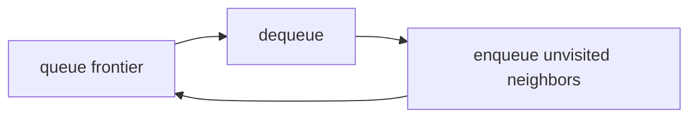
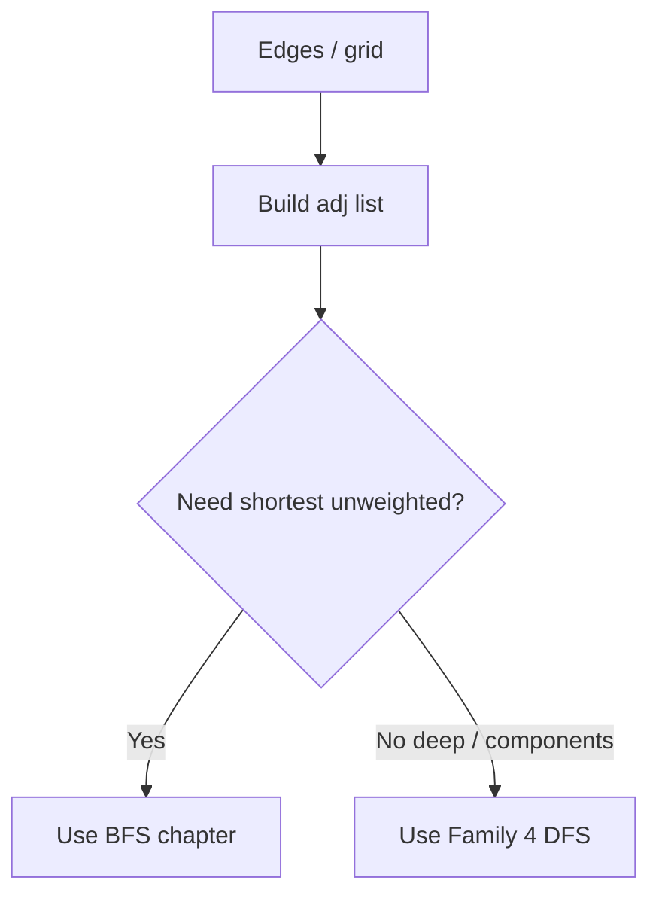
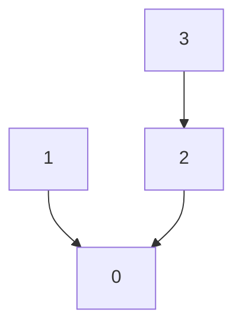
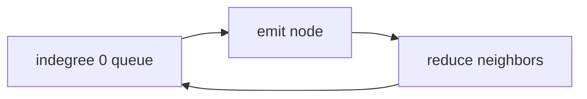
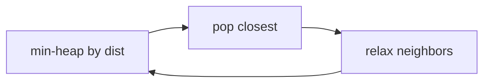
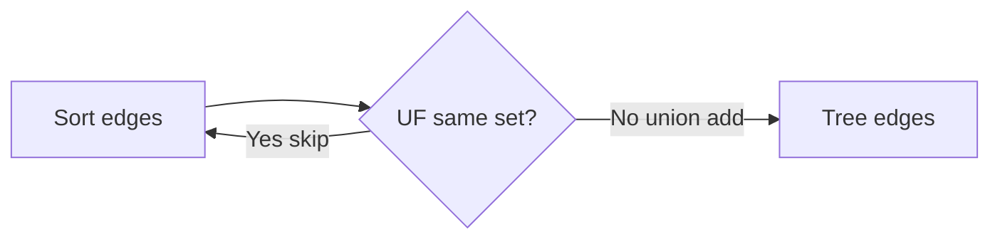

# Family 6 — Relationships

- [x] BFS
- [x] Graph Traversal
- [x] Union Find (Disjoint Set)
- [x] Topological Sort
- [x] Dijkstra
- [x] Minimum Spanning Tree

## Family Overview

Data is dots (nodes) and lines (edges). Pick a walk style (BFS/DFS), glue
groups (Union Find), order homework with prerequisites (Topo), or handle
weighted roads (Dijkstra / MST).

| Pattern | Owns | Does not own |
| --- | --- | --- |
| BFS | Level by level; fewest hops | Weighted shortest paths |
| Graph Traversal | How to store graphs + visited hygiene | Full BFS/DFS templates |
| Union Find | Merge/query groups online | Printing actual paths |
| Topological Sort | Order with prerequisites | Undirected blobs |
| Dijkstra | Shortest path, weights ≥ 0 | Negative weights |
| MST | Cheapest wire to connect everyone | One-source shortest path |

---

## BFS

**Scope:** Explore with a line (queue): finish neighbors before going deeper.
Fewest steps when every hop costs 1.

### Purpose

**BFS** means Breadth-First Search: explore like ripples in a pond — ring 1,
then ring 2, then ring 3. A **queue** is a fair school lunch line: first in,
first out. On an unweighted map, the first time you reach a room is the
shortest path in number of doors.

### Recognition Clues

- Level order; "minimum steps"
- Rotting oranges; word ladder; open the lock
- Shortest path in a binary matrix
- Flood from many starts at once

> 🧠 **Pattern Recognition:** Fewest hops / level-by-level ⇒ BFS. Weighted
> roads ⇒ Dijkstra. Deep paint ⇒ DFS.

### Mental Model

**The problem.** Rotting oranges: each minute, rotten oranges infect 4-neighbors.
How many minutes until all fresh oranges rot?

**Naive idea.** Rescan the whole fridge every minute: on a 10×10 grid that's
100 cells checked every single minute, for as many minutes as it takes,
re-deriving the same "is this cell now rotten?" fact you could have gotten in
one pass.

**The stuck part.** Fuzzy frontier; wasted scans.

**The click.** Multi-source BFS: put **all** rotten oranges in the lunch line
first. Each layer of the line is one minute. Mark when you enqueue so you don’t
double-line kids.

**Kid analogy.** Pond ripples — each ring is one step farther from the starts.

**Second sketch — Open the Lock.** The graph doesn't have to be physical: each
4-digit combination is a node, and turning one wheel one click is an edge to a
neighboring combination. BFS from the start combination, skipping deadends,
finds the fewest turns to the target — same ring-by-ring idea on an implicit
state graph instead of a grid.

### Visualization



The queue holds the current distance ring; a neighbor joins the next ring exactly
once when first found.

```text
2 1 1      minute 0: queue has the rotten 2
1 1 0  →   minute 1: infect neighbors
0 1 1
```

### Generic Template

```pseudo
queue = all sources
dist[source] = 0
mark sources visited
while queue not empty:
    u = dequeue()
    for v in neighbors(u):
        if not visited(v):
            visited(v) = true
            dist[v] = dist[u] + 1
            enqueue(v)
```

In plain English: start the lunch line with all sources; pull the front kid;
line up their unseen neighbors behind everyone already waiting.

### Complexity

- **Time:** O(nodes + edges) or O(rows × cols) on grids
- **Space:** O(nodes) for queue + visited

### Common Mistakes

- Using DFS for fewest hops (DFS finds *a* path, not always the shortest)
- Rotting oranges: forgetting to enqueue **all** rotten at minute 0
- Marking visited only on dequeue → queue blowup
- Using BFS on positively weighted edges (Dijkstra)
- Recomputing whether every fresh orange is adjacent to a rotten one each
  minute instead of letting newly-rotten oranges enqueue themselves once

> ⚠️ **Common Mistake:** Word Ladder is BFS on a hidden graph: words that differ
> by one letter are neighbors.

### Classic Interview Questions

**Easy:** Minimum Depth of Binary Tree · Average of Levels in Binary Tree · Binary Tree Level Order Traversal II

**Medium:** Rotting Oranges · Shortest Path in Binary Matrix · Open the Lock

**Hard:** Word Ladder · Bus Routes

### Engineering Connections

“Friends within 3 hops” and “minimum moves on a game grid” are BFS distance
rings on an unweighted graph.

> 🏗️ **Engineering Connection:** Degrees of separation in a social graph is
> BFS layering.

Network protocols like OSPF flood link-state updates ring by ring across
routers, and build systems that need "rebuild everything within 2 hops of this
changed file" walk the dependency graph the same layer-by-layer way instead of
rebuilding the whole project.

### Summary

- Queue + visited = BFS
- First reach = shortest when every hop costs 1
- Multi-source is allowed and powerful
- Weighted edges → Dijkstra

---

## Graph Traversal

**Scope (short):** How to store a graph and keep visited marks honest; when to
pick DFS vs BFS. Full templates live in BFS (above) and Family 4 DFS.

### Purpose

A **graph** is dots connected by lines (friendship map, subway, coursework).
Interviews often hand you an edge list. Most bugs are “wrong neighbor list” or
“forgot visited,” not a fancy algorithm. Service meshes walk the same idea.

### Recognition Clues

- "Graph," "neighbors," "connected components"
- Clone graph; bipartite; rooms and keys; find if path exists
- Need to choose DFS vs BFS out loud

### Mental Model

**The problem.** Is Graph Bipartite?: can you color dots with two colors so
every line joins opposite colors?

**Naive idea.** Random coloring without a walk plan: you can color a node
correctly relative to one neighbor and still contradict a different neighbor
three hops away, because nothing forced the coloring to follow the graph's
actual connections in order.

**The stuck part.** Must explore each blob and catch odd loops.

**The click.** Build an **adjacency list** (for each dot, a list of friends).
BFS or DFS color with two colors. Representation and visited/color hygiene
matter more than the buzzword.

**Kid analogy.** First draw who is friends with whom, then choose a walking
game (deep alleys vs ring-by-ring).

**Second sketch — Rooms and Keys.** Each room is a node; a key found inside a
room is an edge to the room it opens. DFS or BFS from room 0, collecting keys
as you enter and only walking through doors you can currently unlock —
reachability on a graph you discover as you go, not one handed to you upfront.

### Visualization



This section stops at the fork.

Worked undirected edges `[[0,1],[0,2]]`:

```text
0: [1, 2]
1: [0]
2: [0]
```

Forget the reverse entries and you’ve accidentally made one-way streets.

### Generic Template

```pseudo
# Build adjacency list
adj = map node → list
for (u, v) in edges:
    adj[u].append(v)
    # if undirected: adj[v].append(u)

# Visited hygiene
visited = set()
for node in all_nodes:
    if node not in visited:
        explore(node, visited)  # DFS or BFS
```

In plain English: write each friendship both ways if undirected; then explore
every unmarked starter.

### Complexity

- **Time:** O(nodes + edges)
- **Space:** O(nodes + edges)

### Common Mistakes

- Undirected edges stored one way only
- Giant matrix for a skinny friend map
- Wrong visited clearing between components
- Infinite loops from missing visited
- Rebuilding the adjacency list from scratch inside a loop that calls the walk
  repeatedly, instead of building it once up front

> 💡 **Insight:** TLE / stack overflow on graphs is often missing visited.

### Classic Interview Questions

**Easy:** Find the Town Judge · Find Center of Star Graph · Flood Fill

**Medium:** Clone Graph · Number of Connected Components · Is Graph Bipartite?

**Hard:** Critical Connections in a Network · Reconstruct Itinerary

### Engineering Connections

Call-graph tools store adjacency, then walk with visited flags to ask
“reachable?” — representation first, fancy later.

> 🏗️ **Engineering Connection:** “Who can this service still reach?” is adj +
> visited.

Social networks store the friend/follow graph as adjacency lists (a matrix
would waste memory on billions of "not connected" pairs), and infrastructure
tools that answer "which services would an outage in this one affect?" walk
the same kind of dependency adjacency with a visited set.

### Summary

- Build adj carefully; undirected ≠ directed
- Visited stops infinite walks
- BFS for layers/shortest; DFS for deep/components
- Full templates: BFS chapter & Family 4 DFS

---

## Union Find (Disjoint Set)

**Scope:** Glue groups together and ask “same team?” almost instantly. Kruskal
and Accounts Merge style.

### Purpose

**Union Find** is a club-merger book: each kid points to a club captain
(**parent**). `find` walks to the captain. `union` hangs one captain under the
other. Asking “same club?” beats restarting a whole DFS every time.

### Recognition Clues

- Number of provinces; redundant connection
- Accounts merge; graph valid tree
- Kruskal MST edge acceptance
- Equality constraints (“a == b”)

### Mental Model

**The problem.** Redundant Connection: a tree plus one extra edge; which edge
creates a loop?

**Naive idea.** After each edge, DFS for cycles — slow: with m edges, that's
up to m separate O(n) traversals just to answer "did this one edge close a
loop?", when most of the graph hasn't changed between edges.

**The stuck part.** Repeat whole-graph connectivity checks.

**The click.** For each edge, if both ends already share a captain, that edge
is the redundant one; else union them.

**Kid analogy.** Company mergers — follow managers to the CEO; merge by hanging
one CEO under the other.

**Second sketch — Accounts Merge.** Union every pair of emails that appear
together in one account. Once every email points to its group's root, walk
all the emails again and bucket them by root — each bucket is one merged,
deduplicated account. The union step is identical; regrouping by root
afterward is the only new part.

### Visualization



**Path compression:** on find, point straight at the captain so future finds
are short. **Union by rank:** hang the short tree under the tall one.

### Generic Template

```pseudo
parent = [i for i in 0..n-1]
rank = [0]*n

function find(x):
    if parent[x] ≠ x:
        parent[x] = find(parent[x])
    return parent[x]

function union(a, b):
    ra, rb = find(a), find(b)
    if ra == rb: return false   # already connected
    if rank[ra] < rank[rb]: swap
    parent[rb] = ra
    if rank[ra] == rank[rb]: rank[ra] += 1
    return true
```

In plain English: find the captains; if same captain, already teammates; else
merge clubs and keep trees shallow.

### Complexity

- **Time:** nearly O(1) per op with compression + rank (crazy-slow-growing α)
- **Space:** O(n)

### Common Mistakes

- Skipping compression/rank on big n
- 0- vs 1-based index bugs
- Using UF when you need the actual path or BFS layers
- Ignoring that `union` returning false **is** the cycle signal
- Forgetting path compression entirely and letting `find` walk a long chain
  every call, which degrades toward O(n) per operation on a skewed tree

> 🚀 **Interview Tip:** Say “Union Find with path compression and union by
> rank.”

### Classic Interview Questions

**Easy:** Find Center of Star Graph · Find the Town Judge · Island Perimeter

**Medium:** Number of Provinces · Redundant Connection · Accounts Merge

**Hard:** Similar String Groups · Number of Islands II
_(UF on sorted edges; also Dijkstra)_

### Engineering Connections

Kruskal’s MST and “merge these user accounts” identity graphs use the same
find/union API.

> 🏗️ **Engineering Connection:** `union(a,b)` ≈ “these two emails are one
> person.”

Distributed systems use union-find-like structures to track which nodes have
merged into the same cluster during gossip protocols, and image-processing
libraries use it to label connected regions of pixels in one pass instead of
flood-filling each region separately.

### Summary

- find/union with compression + rank
- Same captain on union ⇒ cycle / redundant edge
- Great for online grouping; not for paths
- Feeds Kruskal in the MST section

---

## Topological Sort

**Scope:** Line up dots in a one-way recipe graph so every arrow means “do me
before that.”

### Purpose

**Topological sort** is homework order with prerequisites: socks before shoes.
If the rules loop (“shoes before socks and socks before shoes”), no order
exists — that’s cycle detection too. Build systems (Make/Bazel) live on this.

### Recognition Clues

- Course schedule / order; alien dictionary
- "Prerequisites," "dependencies"
- Detect directed cycles via “couldn’t finish ordering”
- Parallel courses / finish times

### Mental Model

**The problem.** Course Schedule: can you finish all courses given prereq
pairs?

**Naive idea.** Try every order — factorial boom: 10 courses have over 3.6
million possible orderings to check by brute force, and almost all of them
violate some prerequisite immediately.

**The stuck part.** Need one valid order — or proof of a loop.

**The click (Kahn).** Count incoming arrows (**indegree**). Put all “ready”
nodes (indegree 0) in a queue. Emit them; reduce neighbors; enqueue when they
hit 0. If you emit fewer than `n` nodes → cycle.

**Kid analogy.** Getting dressed — a cycle is an impossible wardrobe rule.

**Second sketch — Alien Dictionary.** Compare each pair of adjacent words in
the given order; the first letter where they differ gives one edge,
`earlierLetter → laterLetter`. Kahn's algorithm on those letter edges emits a
valid alphabet order — or, if it can't peel every letter, proves the order is
impossible.

### Visualization



Only nodes whose homework is done enter the ready line.

Worked: edges “1 before 0” and “2 before 0” — emit 1 and 2 first, then 0.

### Generic Template

```pseudo
indegree = counts from edges
q = all nodes with indegree 0
order = []
while q not empty:
    u = dequeue(); order.append(u)
    for v in adj[u]:
        indegree[v] -= 1
        if indegree[v] == 0: enqueue(v)
if len(order) < n: return cycle / impossible
return order
```

In plain English: always take a class with no unfinished prereqs; if you stall
before finishing the catalog, there’s a loop.

### Complexity

- **Time:** O(nodes + edges)
- **Space:** O(nodes + edges)

### Common Mistakes

- Arrow direction backwards (`b` prereq of `a` ⇒ edge `b → a` for Kahn)
- Claiming success without `len(order) == n`
- Topo on undirected graphs
- Alien Dictionary: bad edge building from word pairs
- Forgetting that a word which is a prefix of an earlier word in the given
  order (like `"abc"` appearing after `"ab"`) makes the order invalid — no
  letter edge captures that case, it needs its own explicit check

> ⚠️ **Common Mistake:** Minimum Height Trees is a leaf-stripping cousin — not
> a drop-in Kahn template.

### Classic Interview Questions

**Easy:** Find if Path Exists in Graph · Deduce Indegrees Drill · Emit Ready Queue Drill

**Medium:** Course Schedule · Course Schedule II · Minimum Height Trees

**Hard:** Alien Dictionary · Parallel Courses III

### Engineering Connections

Bazel/Make topologically order build targets from dependency edges — Kahn in
your build tool.

> 🏗️ **Engineering Connection:** “Compile A before linking B” is a DAG edge;
> a cycle is a broken BUILD file.

Spreadsheet formula engines topologically sort cell dependencies so `=A1+B1`
recalculates only after both `A1` and `B1` are settled, and package managers
resolve install order the same way — a circular dependency in either system
is exactly the "cycle detected" failure this pattern names.

### Summary

- DAG + prerequisites ⇒ topological sort
- Emit count `< n` means cycle
- Kahn (indegree + queue) or DFS postorder
- Edge orientation is the silent bug

---

## Dijkstra

**Scope:** Shortest paths when road lengths are ≥ 0, using a “always expand the
closest unfinished city” heap.

### Purpose

When roads have lengths, BFS hop-count is wrong: a longer hop-path can be
cheaper. **Dijkstra** always settles the unfinished city with the smallest
known distance next. GPS routing lives here. A **heap** (priority queue) is a
trophy shelf that always hands you the current best/smallest.

### Recognition Clues

- Network delay time; path with minimum effort
- Weighted grid shortest path; max probability path
- "Non-negative weights"
- Cheapest flights within K stops _(variant / DP hybrid)_

### Mental Model

**The problem.** Network Delay Time: signal from node `k`; when does everyone
hear it? (max distance), or −1. Times on edges are non-negative.

**Naive idea.** Explore every path while adding travel times, or repeatedly
rescan every edge looking for any improve — no priority order: exploring every
path is exponential, and rescanning all edges every round (Bellman-Ford's
approach) costs O(V·E) when a priority queue could settle each node once.

**The stuck part.** You need a smart order of expanding cities so you do not
reprocess worse leftovers forever.

**The click.** Keep `dist[node]` = best time so far. Min-heap of
`(distance, node)`. **Settle:** pop the closest unsettled node — with
non-negative weights that distance is final. **Relax:** for each neighbor,
if `dist[u] + w(u,v) < dist[v]`, update and push. That’s Dijkstra.

**Kid analogy.** Always visit the closest unvisited city on a map with
non-negative road lengths — no shorter unsettlable city can still hide.

**Second sketch — Cheapest Flights Within K Stops.** Plain Dijkstra settles a
node once and never revisits it — but here a pricier path with more remaining
stops might still beat a cheaper path that already used up its stop budget.
Track `(cost, node, stops_used)` and allow relaxing a node again while stops
remain; a Bellman-Ford-style relax capped at K+1 rounds is the safer mental
model than plain Dijkstra here.

### Visualization



Successful pops finalize a distance when weights are ≥ 0. Ignore stale bigger
heap leftovers.

### Generic Template

```pseudo
dist = ∞ for all; dist[src] = 0
heap.push(0, src)
while heap:
    d, u = heap.pop()
    if d > dist[u]: continue
    for v, w in adj[u]:
        if dist[u] + w < dist[v]:
            dist[v] = dist[u] + w
            heap.push(dist[v], v)
```

In plain English: always process the closest unfinished city; if a road offers
a better total, update and re-queue.

### Complexity

- **Time:** about O((V + E) log V) with a binary heap
- **Space:** O(V + E)

### Common Mistakes

- Dijkstra with **negative** weights (unsafe)
- Forgetting the stale check `d > dist[u]`
- Using plain BFS for weighted graphs
- Early exit without trusting the popped distance
- Assuming the first time you *see* a node (push it) is its final distance —
  only the first time you *pop* it is final, since a cheaper path may still be
  sitting in the heap

> 💡 **Insight:** Duplicate heap entries are normal — ignore stale pops.

### Classic Interview Questions

**Easy:** Find if Path Exists in Graph · Path Cost on a Tree Drill · Single-Source Distances Drill

**Medium:** Network Delay Time · Path With Minimum Effort · Cheapest Flights Within K Stops

**Hard:** Swim in Rising Water · Reachable Nodes in Subdivided Graph

> Dual-home: Swim also works with Union Find on sorted edges.

### Engineering Connections

GPS and link-state routing compute non-negative weighted shortest paths —
Dijkstra’s family on real maps.

> 🏗️ **Engineering Connection:** “Fastest drive with road times” is Dijkstra
> when times aren’t negative.

Network routers running OSPF/link-state protocols compute lowest-latency
paths to every other router with the same relax-and-settle loop, and
airline-fare search engines model layovers as edge weights to find the
cheapest itinerary the same way.

### Summary

- Weights ≥ 0 + min-heap + relax
- Stale heap entries are normal — guard them
- Negatives → Bellman-Ford; unweighted → BFS
- Effort / probability variants change the relax math

---

## Minimum Spanning Tree

**Scope:** Connect every city with the cheapest total cable (undirected).
Kruskal (sort + UF) or Prim (grow with a heap).

### Purpose

A **Minimum Spanning Tree (MST)** is the cheapest set of cables so every town
is connected and there are no loops. It’s about total wire cost, not “fastest
drive from A to B” (that’s Dijkstra).

### Recognition Clues

- Min cost to connect all points
- Connecting cities with minimum cost; optimize water distribution
- "Cable all cities," undirected weighted connect-all
- Kruskal vs Prim discussion

### Mental Model

**The problem.** Min Cost to Connect All Points: points on a plane; cost =
Manhattan distance; return MST total.

**Naive idea.** Try every spanning tree — impossible: even a modest 10-node
complete graph has thousands of distinct spanning trees, and that count
explodes combinatorially as nodes are added.

**The stuck part.** Need a structured growth rule.

**The click (Kruskal).** Sort edges cheap→pricey. Add an edge if Union Find
says different clubs; stop at `n-1` edges. Prim grows from one town with a
heap of outgoing cables.

**Kid analogy.** Rural broadband: always lay the cheapest cable that links two
still-separate towns; never pay for a loop.

**Second sketch — Prim's Algorithm.** Start from any node and keep a min-heap
of edges leaving the tree built so far. Repeatedly pop the cheapest edge that
reaches a *new* node, add that node to the tree, and push its outgoing edges.
Same "always take the cheapest safe edge" idea as Kruskal, just grown outward
from one seed instead of scanning a global sorted edge list.

### Visualization



Skipping same-set edges is exactly “no loops while growing a forest into a
tree.”

### Generic Template

```pseudo
# Kruskal
edges.sort by weight
uf = UnionFind(n)
cost = 0; taken = 0
for w, u, v in edges:
    if uf.union(u, v):
        cost += w; taken += 1
        if taken == n-1: break
return cost  # or impossible if taken < n-1
```

In plain English: try cheap cables first; take one only if it connects two
separate clubs; stop when you have `n-1` cables.

### Complexity

- **Time:** O(E log E) sort + nearly O(E) UF for Kruskal
- **Space:** O(V) for UF (+ edge list)

### Common Mistakes

- Treating it as Dijkstra to one target (wrong goal)
- Stopping without one component (`taken == n-1`)
- MST templates on directed graphs without remodeling
- Prim without tracking who’s already in the tree set, which lets you pop an
  edge to a node that’s already been added and waste a heap slot on it

> ⚠️ **Common Mistake:** Optimize Water Distribution adds a virtual “well” node —
> model first, then MST.

### Classic Interview Questions

**Easy:** Find Center of Star Graph · Connect Components Drill · Sort Edges by Weight Drill

**Medium:** Min Cost to Connect All Points · Optimize Water Distribution in a Village · Connecting Cities With Minimum Cost

**Hard:** Find Critical and Pseudo-Critical Edges in Minimum Spanning Tree · Critical Connections in a Network

### Engineering Connections

Network cabling and cluster interconnect planning pick minimum-cost spanning
links — Kruskal/Prim in infrastructure budgeting.

> 🏗️ **Engineering Connection:** Cheapest fiber so every rack is reachable =
> MST; fastest path rack A→B = Dijkstra.

Circuit board design tools compute a minimum spanning tree of pins that must
share a net to minimize total trace length, and clustering algorithms in
machine learning cut the most expensive edges out of an MST to split data
into naturally separated groups.

### Summary

- MST connects all, min total weight, undirected
- Kruskal = sort + UF; Prim = grow with a heap
- Not single-source shortest path
- Need `n-1` edges and one component

---
