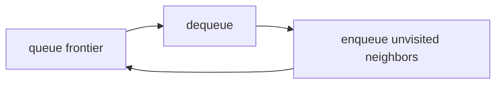
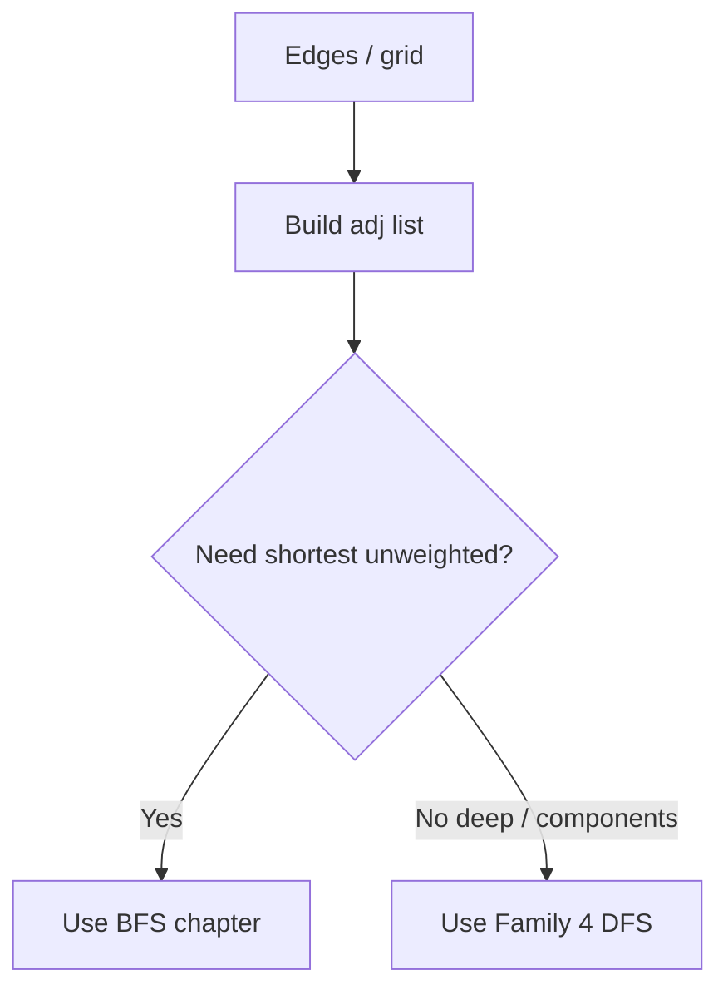
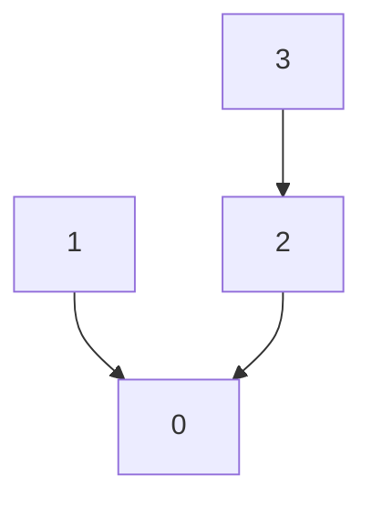
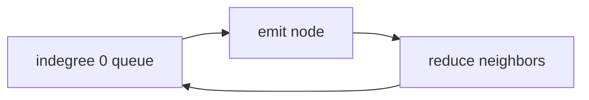
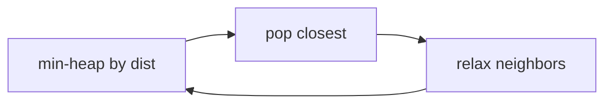
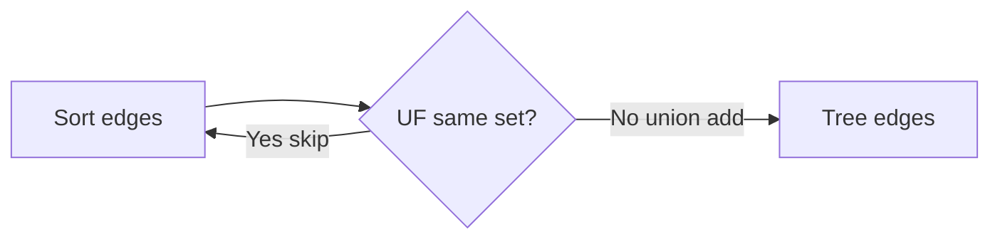

# Family 6 — Relationships

- [x] BFS
- [x] Graph Traversal
- [x] Union Find (Disjoint Set)
- [x] Topological Sort
- [x] Dijkstra
- [x] Minimum Spanning Tree

## Family Overview

Data is dots (nodes) and lines (edges). Pick a walk style (BFS/DFS), glue
groups (Union Find), order homework with prerequisites (Topo), or handle
weighted roads (Dijkstra / MST).

| Pattern | Owns | Does not own |
| --- | --- | --- |
| BFS | Level by level; fewest hops | Weighted shortest paths |
| Graph Traversal | How to store graphs + visited hygiene | Full BFS/DFS templates |
| Union Find | Merge/query groups online | Printing actual paths |
| Topological Sort | Order with prerequisites | Undirected blobs |
| Dijkstra | Shortest path, weights ≥ 0 | Negative weights |
| MST | Cheapest wire to connect everyone | One-source shortest path |

---

## BFS

**Scope:** Explore with a line (queue): finish neighbors before going deeper.
Fewest steps when every hop costs 1.

### Purpose

**BFS** means Breadth-First Search: explore like ripples in a pond — ring 1,
then ring 2, then ring 3. A **queue** is a fair school lunch line: first in,
first out. On an unweighted map, the first time you reach a room is the
shortest path in number of doors.

### Recognition Clues

- Level order; "minimum steps"
- Rotting oranges; word ladder; open the lock
- Shortest path in a binary matrix
- Flood from many starts at once

> 🧠 **Pattern Recognition:** Fewest hops / level-by-level ⇒ BFS. Weighted
> roads ⇒ Dijkstra. Deep paint ⇒ DFS.

### Mental Model

**The problem.** Rotting oranges: each minute, rotten oranges infect 4-neighbors.
How many minutes until all fresh oranges rot?

**Naive idea.** Rescan the whole fridge every minute.

**The stuck part.** Fuzzy frontier; wasted scans.

**The click.** Multi-source BFS: put **all** rotten oranges in the lunch line
first. Each layer of the line is one minute. Mark when you enqueue so you don’t
double-line kids.

**Kid analogy.** Pond ripples — each ring is one step farther from the starts.

### Visualization



The queue holds the current distance ring; a neighbor joins the next ring exactly
once when first found.

```text
2 1 1      minute 0: queue has the rotten 2
1 1 0  →   minute 1: infect neighbors
0 1 1
```

### Generic Template

```pseudo
queue = all sources
dist[source] = 0
mark sources visited
while queue not empty:
    u = dequeue()
    for v in neighbors(u):
        if not visited(v):
            visited(v) = true
            dist[v] = dist[u] + 1
            enqueue(v)
```

In plain English: start the lunch line with all sources; pull the front kid;
line up their unseen neighbors behind everyone already waiting.

### Complexity

- **Time:** O(nodes + edges) or O(rows × cols) on grids
- **Space:** O(nodes) for queue + visited

### Common Mistakes

- Using DFS for fewest hops (DFS finds *a* path, not always the shortest)
- Rotting oranges: forgetting to enqueue **all** rotten at minute 0
- Marking visited only on dequeue → queue blowup
- Using BFS on positively weighted edges (Dijkstra)

> ⚠️ **Common Mistake:** Word Ladder is BFS on a hidden graph: words that differ
> by one letter are neighbors.

### Classic Interview Questions

**Easy:** Minimum Depth of Binary Tree · Average of Levels in Binary Tree · Binary Tree Level Order Traversal II

**Medium:** Rotting Oranges · Shortest Path in Binary Matrix · Open the Lock

**Hard:** Word Ladder · Bus Routes

### Engineering Connections

“Friends within 3 hops” and “minimum moves on a game grid” are BFS distance
rings on an unweighted graph.

> 🏗️ **Engineering Connection:** Degrees of separation in a social graph is
> BFS layering.

### Depth Note — Layers and Multi-Source

BFS (breadth-first search) explores a graph ring by ring with a queue. First
time you reach a node in an unweighted graph is the fewest hops. Multi-source
BFS enqueues every source at distance 0 (rotten oranges, gates and walls).

Bottleneck of rescanning the whole grid each “minute”: mark visited (or rotten)
as you enqueue so each cell enters the queue once.

Never claim BFS finds shortest paths on positive weighted edges — that is
Dijkstra. Binary tree level order is BFS on a tree; Queue chapter owns the
pipeline mechanic, BFS owns the “distance rings” story.

### Worked Recognition

Rotting Oranges: enqueue all rotten first (multi-source), then minute layers.
Shortest Path in Binary Matrix: 8-direction BFS. Open the Lock: BFS on 4-digit
states. Tree level averages: queue size per layer.

Engineering echo: game AI flood-fills reachable tiles from the player with BFS
so every tile learns a hop distance for path heuristics.

### Interview Dialogue

Interviewer: “Minutes until all oranges rot.” You: “Multi-source BFS — enqueue
every rotten orange at minute 0, then layer by layer.” First time you reach a
cell is the earliest minute. Forbid DFS for shortest hop counts. Weighted edges
→ Dijkstra. Tree level order is the same queue muscle with a size loop.

### Why Reach For This

Patterns exist so you stop reinventing the same bottleneck fix under interview
pressure. Name the wasted work first — nested pair scans, rebuilding range
sums, rescanning a grid, forgetting visited marks, sorting when membership was
enough. Then name the structure that removes that waste. Practice saying the
bottleneck in one sentence before you touch the keyboard; that sentence is how
interviewers score pattern recognition.

When the pattern is dual-homed, say the primary owner and the helper out loud.
When an Easy list is a warmup rather than a famous LeetCode Easy, label it as
prep for the Medium that carries the real idea. Prefer deriving the template
from the mental model over memorizing a number. If you can redraw the diagram
from memory and retell the naive-to-insight arc, you own the chapter.

Engineering systems reuse these habits daily: indexed lookups, rollups, layer
exploration, schedulers, prefix trees, and priority queues. Connecting the toy
example to a named production mechanism keeps the knowledge sticky beyond the
whiteboard.

Re-check complexity after you pick the pattern: time should match a single
pass, a log factor from sort or heap, or a bounded state space — not a hidden
quadratic walk disguised as a helper list scan. Space should match the map,
queue, recursion depth, or heap you actually allocated. If a follow-up forbids
extra memory, revisit in-place index surgery. If weights appear on edges,
upgrade from BFS to Dijkstra. If the answer is any feasible set of choices with
overlap, upgrade from greedy to DP. Those upgrades are pattern recognition too.

Finally, keep the voice simple: short sentences, one worked example, one
diagram, one template. That is the handbook bar that Hash Maps set — clarity
first, then implementation.

### Summary

- Queue + visited = BFS
- First reach = shortest when every hop costs 1
- Multi-source is allowed and powerful
- Weighted edges → Dijkstra

---

## Graph Traversal

**Scope (short):** How to store a graph and keep visited marks honest; when to
pick DFS vs BFS. Full templates live in BFS (above) and Family 4 DFS.

### Purpose

A **graph** is dots connected by lines (friendship map, subway, coursework).
Interviews often hand you an edge list. Most bugs are “wrong neighbor list” or
“forgot visited,” not a fancy algorithm. Service meshes walk the same idea.

### Recognition Clues

- "Graph," "neighbors," "connected components"
- Clone graph; bipartite; rooms and keys; find if path exists
- Need to choose DFS vs BFS out loud

### Mental Model

**The problem.** Is Graph Bipartite?: can you color dots with two colors so
every line joins opposite colors?

**Naive idea.** Random coloring without a walk plan.

**The stuck part.** Must explore each blob and catch odd loops.

**The click.** Build an **adjacency list** (for each dot, a list of friends).
BFS or DFS color with two colors. Representation and visited/color hygiene
matter more than the buzzword.

**Kid analogy.** First draw who is friends with whom, then choose a walking
game (deep alleys vs ring-by-ring).

### Visualization



This section stops at the fork.

Worked undirected edges `[[0,1],[0,2]]`:

```text
0: [1, 2]
1: [0]
2: [0]
```

Forget the reverse entries and you’ve accidentally made one-way streets.

### Generic Template

```pseudo
# Build adjacency list
adj = map node → list
for (u, v) in edges:
    adj[u].append(v)
    # if undirected: adj[v].append(u)

# Visited hygiene
visited = set()
for node in all_nodes:
    if node not in visited:
        explore(node, visited)  # DFS or BFS
```

In plain English: write each friendship both ways if undirected; then explore
every unmarked starter.

### Complexity

- **Time:** O(nodes + edges)
- **Space:** O(nodes + edges)

### Common Mistakes

- Undirected edges stored one way only
- Giant matrix for a skinny friend map
- Wrong visited clearing between components
- Infinite loops from missing visited

> 💡 **Insight:** TLE / stack overflow on graphs is often missing visited.

### Classic Interview Questions

**Easy:** Find the Town Judge · Find Center of Star Graph · Flood Fill

**Medium:** Clone Graph · Number of Connected Components · Is Graph Bipartite?

**Hard:** Critical Connections in a Network · Reconstruct Itinerary

### Engineering Connections

Call-graph tools store adjacency, then walk with visited flags to ask
“reachable?” — representation first, fancy later.

> 🏗️ **Engineering Connection:** “Who can this service still reach?” is adj +
> visited.

### Depth Note — Representation and Choosing a Walk

Own three things here:

1. **Representation** — adjacency list (`map: node → neighbors`) for sparse
   graphs; matrix when dense or grid-as-graph.
2. **Visited hygiene** — mark when you first enter a node (or color states) so
   cycles do not loop forever.
3. **Choose BFS vs DFS** — need fewest hops / layers → BFS; need full component
   flood, topo recursion, or path-building with undo → DFS / Backtracking.

Worked choice: Word Ladder (fewest transforms) → BFS on an implicit graph.
Number of islands → DFS or BFS flood; either walk works; representation is the
grid itself. Course Schedule cycle detect can be DFS colors or Kahn BFS —
picking either is fine if you justify visited/ indegree discipline.

This is NOT a redirect memo. Templates for queue/recursion walks live in BFS
and DFS chapters; you still must build adj lists and pick the walk here.

### Worked Recognition

Build adj from edge list: `for u,v in edges: adj[u].append(v); adj[v].append(u)`
for undirected. Directed skips the back append. Visited set or array prevents
infinite cycles. Pick BFS when the question says fewest edges; pick DFS when
you need component flood or recursion depth with state.

Clone Graph and Rooms and Keys are representation+walk drills. Do not end the
Mental Model at “see BFS chapter” — show the adj list of a tiny example and
choose.

### Interview Dialogue

Interviewer: “Here’s an edge list — is the graph bipartite?” You: “I’ll build
an adjacency list, then BFS-color each component with two colors.” Draw three
nodes and edges, write the adj dict on the board, then choose BFS because you
want layers/colors from a source. If it were fewest word mutations, same
representation, BFS for distance. If number of islands on a grid, DFS flood is
fine — say why. Representation + selection are this chapter’s job.

### Why Reach For This

Patterns exist so you stop reinventing the same bottleneck fix under interview
pressure. Name the wasted work first — nested pair scans, rebuilding range
sums, rescanning a grid, forgetting visited marks, sorting when membership was
enough. Then name the structure that removes that waste. Practice saying the
bottleneck in one sentence before you touch the keyboard; that sentence is how
interviewers score pattern recognition.

When the pattern is dual-homed, say the primary owner and the helper out loud.
When an Easy list is a warmup rather than a famous LeetCode Easy, label it as
prep for the Medium that carries the real idea. Prefer deriving the template
from the mental model over memorizing a number. If you can redraw the diagram
from memory and retell the naive-to-insight arc, you own the chapter.

Engineering systems reuse these habits daily: indexed lookups, rollups, layer
exploration, schedulers, prefix trees, and priority queues. Connecting the toy
example to a named production mechanism keeps the knowledge sticky beyond the
whiteboard.

Re-check complexity after you pick the pattern: time should match a single
pass, a log factor from sort or heap, or a bounded state space — not a hidden
quadratic walk disguised as a helper list scan. Space should match the map,
queue, recursion depth, or heap you actually allocated. If a follow-up forbids
extra memory, revisit in-place index surgery. If weights appear on edges,
upgrade from BFS to Dijkstra. If the answer is any feasible set of choices with
overlap, upgrade from greedy to DP. Those upgrades are pattern recognition too.

Finally, keep the voice simple: short sentences, one worked example, one
diagram, one template. That is the handbook bar that Hash Maps set — clarity
first, then implementation.

### Summary

- Build adj carefully; undirected ≠ directed
- Visited stops infinite walks
- BFS for layers/shortest; DFS for deep/components
- Full templates: BFS chapter & Family 4 DFS

---

## Union Find (Disjoint Set)

**Scope:** Glue groups together and ask “same team?” almost instantly. Kruskal
and Accounts Merge style.

### Purpose

**Union Find** is a club-merger book: each kid points to a club captain
(**parent**). `find` walks to the captain. `union` hangs one captain under the
other. Asking “same club?” beats restarting a whole DFS every time.

### Recognition Clues

- Number of provinces; redundant connection
- Accounts merge; graph valid tree
- Kruskal MST edge acceptance
- Equality constraints (“a == b”)

### Mental Model

**The problem.** Redundant Connection: a tree plus one extra edge; which edge
creates a loop?

**Naive idea.** After each edge, DFS for cycles — slow.

**The stuck part.** Repeat whole-graph connectivity checks.

**The click.** For each edge, if both ends already share a captain, that edge
is the redundant one; else union them.

**Kid analogy.** Company mergers — follow managers to the CEO; merge by hanging
one CEO under the other.

### Visualization



**Path compression:** on find, point straight at the captain so future finds
are short. **Union by rank:** hang the short tree under the tall one.

### Generic Template

```pseudo
parent = [i for i in 0..n-1]
rank = [0]*n

function find(x):
    if parent[x] ≠ x:
        parent[x] = find(parent[x])
    return parent[x]

function union(a, b):
    ra, rb = find(a), find(b)
    if ra == rb: return false   # already connected
    if rank[ra] < rank[rb]: swap
    parent[rb] = ra
    if rank[ra] == rank[rb]: rank[ra] += 1
    return true
```

In plain English: find the captains; if same captain, already teammates; else
merge clubs and keep trees shallow.

### Complexity

- **Time:** nearly O(1) per op with compression + rank (crazy-slow-growing α)
- **Space:** O(n)

### Common Mistakes

- Skipping compression/rank on big n
- 0- vs 1-based index bugs
- Using UF when you need the actual path or BFS layers
- Ignoring that `union` returning false **is** the cycle signal

> 🚀 **Interview Tip:** Say “Union Find with path compression and union by
> rank.”

### Classic Interview Questions

**Easy:** Find Center of Star Graph · Find the Town Judge · Island Perimeter

**Medium:** Number of Provinces · Redundant Connection · Accounts Merge

**Hard:** Similar String Groups · Number of Islands II
_(UF on sorted edges; also Dijkstra)_

### Engineering Connections

Kruskal’s MST and “merge these user accounts” identity graphs use the same
find/union API.

> 🏗️ **Engineering Connection:** `union(a,b)` ≈ “these two emails are one
> person.”

### Depth Note — Union and Path Compression

Union Find tracks blobs of connected items. `find(x)` returns the boss of x’s
blob; `union(a,b)` merges two blobs. Path compression: after find, point nodes
straight at the boss so later finds are tiny. Union by rank/size keeps trees
flat.

Island / accounts merge / redundant connection: each edge is a union; a union
of already-same bosses means a redundant edge.

Kid analogy: kids form friend groups; when two groups shake hands, they share
one group captain. Path compression is everyone pointing at the real captain
after roll call.

### Worked Recognition

Number of Provinces: union each connected city pair; answer = number of unique
roots. Redundant Connection: the edge whose ends already share a root. Accounts
Merge: union emails that share an account. Always implement `find` with path
compression in interviews unless told not to.

### Interview Dialogue

Interviewer: “Redundant connection.” You: “I’ll union each edge; if both ends
already share a parent, that edge closes a cycle.” Implement find with path
compression live. Number of provinces is the same parent-counting trick. Say
union-by-rank if you have time; interviews often pass with compression alone
on n ≤ 10^5.

### Why Reach For This

Patterns exist so you stop reinventing the same bottleneck fix under interview
pressure. Name the wasted work first — nested pair scans, rebuilding range
sums, rescanning a grid, forgetting visited marks, sorting when membership was
enough. Then name the structure that removes that waste. Practice saying the
bottleneck in one sentence before you touch the keyboard; that sentence is how
interviewers score pattern recognition.

When the pattern is dual-homed, say the primary owner and the helper out loud.
When an Easy list is a warmup rather than a famous LeetCode Easy, label it as
prep for the Medium that carries the real idea. Prefer deriving the template
from the mental model over memorizing a number. If you can redraw the diagram
from memory and retell the naive-to-insight arc, you own the chapter.

Engineering systems reuse these habits daily: indexed lookups, rollups, layer
exploration, schedulers, prefix trees, and priority queues. Connecting the toy
example to a named production mechanism keeps the knowledge sticky beyond the
whiteboard.

Re-check complexity after you pick the pattern: time should match a single
pass, a log factor from sort or heap, or a bounded state space — not a hidden
quadratic walk disguised as a helper list scan. Space should match the map,
queue, recursion depth, or heap you actually allocated. If a follow-up forbids
extra memory, revisit in-place index surgery. If weights appear on edges,
upgrade from BFS to Dijkstra. If the answer is any feasible set of choices with
overlap, upgrade from greedy to DP. Those upgrades are pattern recognition too.

Finally, keep the voice simple: short sentences, one worked example, one
diagram, one template. That is the handbook bar that Hash Maps set — clarity
first, then implementation.

### Summary

- find/union with compression + rank
- Same captain on union ⇒ cycle / redundant edge
- Great for online grouping; not for paths
- Feeds Kruskal in the MST section

---

## Topological Sort

**Scope:** Line up dots in a one-way recipe graph so every arrow means “do me
before that.”

### Purpose

**Topological sort** is homework order with prerequisites: socks before shoes.
If the rules loop (“shoes before socks and socks before shoes”), no order
exists — that’s cycle detection too. Build systems (Make/Bazel) live on this.

### Recognition Clues

- Course schedule / order; alien dictionary
- "Prerequisites," "dependencies"
- Detect directed cycles via “couldn’t finish ordering”
- Parallel courses / finish times

### Mental Model

**The problem.** Course Schedule: can you finish all courses given prereq
pairs?

**Naive idea.** Try every order — factorial boom.

**The stuck part.** Need one valid order — or proof of a loop.

**The click (Kahn).** Count incoming arrows (**indegree**). Put all “ready”
nodes (indegree 0) in a queue. Emit them; reduce neighbors; enqueue when they
hit 0. If you emit fewer than `n` nodes → cycle.

**Kid analogy.** Getting dressed — a cycle is an impossible wardrobe rule.

### Visualization



Only nodes whose homework is done enter the ready line.

Worked: edges “1 before 0” and “2 before 0” — emit 1 and 2 first, then 0.

### Generic Template

```pseudo
indegree = counts from edges
q = all nodes with indegree 0
order = []
while q not empty:
    u = dequeue(); order.append(u)
    for v in adj[u]:
        indegree[v] -= 1
        if indegree[v] == 0: enqueue(v)
if len(order) < n: return cycle / impossible
return order
```

In plain English: always take a class with no unfinished prereqs; if you stall
before finishing the catalog, there’s a loop.

### Complexity

- **Time:** O(nodes + edges)
- **Space:** O(nodes + edges)

### Common Mistakes

- Arrow direction backwards (`b` prereq of `a` ⇒ edge `b → a` for Kahn)
- Claiming success without `len(order) == n`
- Topo on undirected graphs
- Alien Dictionary: bad edge building from word pairs

> ⚠️ **Common Mistake:** Minimum Height Trees is a leaf-stripping cousin — not
> a drop-in Kahn template.

### Classic Interview Questions

**Easy:** Find if Path Exists in Graph · Deduce Indegrees Drill · Emit Ready Queue Drill

**Medium:** Course Schedule · Course Schedule II · Minimum Height Trees

**Hard:** Alien Dictionary · Parallel Courses III

### Engineering Connections

Bazel/Make topologically order build targets from dependency edges — Kahn in
your build tool.

> 🏗️ **Engineering Connection:** “Compile A before linking B” is a DAG edge;
> a cycle is a broken BUILD file.

### Depth Note — Kahn and Cycles

Topological sort orders tasks so every directed edge goes forward (prereqs
before courses). Kahn’s algorithm: queue nodes with indegree 0; peel them;
decrease neighbors’ indegrees; if you cannot peel all nodes, a cycle exists.

Easy warmups honestly include “course schedule connectivity lite” or building
indegrees from a tiny edge list — the Medium classics are Course Schedule I/II.

DFS color-states (white/gray/black) also detect cycles; Kahn is often clearer
in interviews because the queue of ready nodes matches “what can I take next.”

### Worked Recognition

Course Schedule: build indegree + adj; Kahn peel; if peeled < n, cycle → false.
Course Schedule II: same, record order. Alien Dictionary is topo on letter
edges inferred from sorted words — Hard flavor.

Easy prep: compute indegrees for a tiny DAG and list a valid order by hand,
then code Kahn.

### Interview Dialogue

Interviewer: “Can you finish all courses?” You: “Kahn’s algorithm — queue zero
indegree nodes, peel, reduce neighbors; if I peel fewer than n, there’s a
cycle.” Draw indegrees. Course Schedule II appends to an order list while
peeling. Alien Dictionary builds edges between first differing letters, then
topo — mention as Hard escalation.

### Why Reach For This

Patterns exist so you stop reinventing the same bottleneck fix under interview
pressure. Name the wasted work first — nested pair scans, rebuilding range
sums, rescanning a grid, forgetting visited marks, sorting when membership was
enough. Then name the structure that removes that waste. Practice saying the
bottleneck in one sentence before you touch the keyboard; that sentence is how
interviewers score pattern recognition.

When the pattern is dual-homed, say the primary owner and the helper out loud.
When an Easy list is a warmup rather than a famous LeetCode Easy, label it as
prep for the Medium that carries the real idea. Prefer deriving the template
from the mental model over memorizing a number. If you can redraw the diagram
from memory and retell the naive-to-insight arc, you own the chapter.

Engineering systems reuse these habits daily: indexed lookups, rollups, layer
exploration, schedulers, prefix trees, and priority queues. Connecting the toy
example to a named production mechanism keeps the knowledge sticky beyond the
whiteboard.

Re-check complexity after you pick the pattern: time should match a single
pass, a log factor from sort or heap, or a bounded state space — not a hidden
quadratic walk disguised as a helper list scan. Space should match the map,
queue, recursion depth, or heap you actually allocated. If a follow-up forbids
extra memory, revisit in-place index surgery. If weights appear on edges,
upgrade from BFS to Dijkstra. If the answer is any feasible set of choices with
overlap, upgrade from greedy to DP. Those upgrades are pattern recognition too.

Finally, keep the voice simple: short sentences, one worked example, one
diagram, one template. That is the handbook bar that Hash Maps set — clarity
first, then implementation.

### Summary

- DAG + prerequisites ⇒ topological sort
- Emit count `< n` means cycle
- Kahn (indegree + queue) or DFS postorder
- Edge orientation is the silent bug

---

## Dijkstra

**Scope:** Shortest paths when road lengths are ≥ 0, using a “always expand the
closest unfinished city” heap.

### Purpose

When roads have lengths, BFS hop-count is wrong: a longer hop-path can be
cheaper. **Dijkstra** always settles the unfinished city with the smallest
known distance next. GPS routing lives here. A **heap** (priority queue) is a
trophy shelf that always hands you the current best/smallest.

### Recognition Clues

- Network delay time; path with minimum effort
- Weighted grid shortest path; max probability path
- "Non-negative weights"
- Cheapest flights within K stops _(variant / DP hybrid)_

### Mental Model

**The problem.** Network Delay Time: signal from node `k`; when does everyone
hear it? (max distance), or −1. Times on edges are non-negative.

**Naive idea.** Explore every path while adding travel times, or repeatedly
rescan every edge looking for any improve — no priority order.

**The stuck part.** You need a smart order of expanding cities so you do not
reprocess worse leftovers forever.

**The click.** Keep `dist[node]` = best time so far. Min-heap of
`(distance, node)`. **Settle:** pop the closest unsettled node — with
non-negative weights that distance is final. **Relax:** for each neighbor,
if `dist[u] + w(u,v) < dist[v]`, update and push. That’s Dijkstra.

**Kid analogy.** Always visit the closest unvisited city on a map with
non-negative road lengths — no shorter unsettlable city can still hide.

### Visualization



Successful pops finalize a distance when weights are ≥ 0. Ignore stale bigger
heap leftovers.

### Generic Template

```pseudo
dist = ∞ for all; dist[src] = 0
heap.push(0, src)
while heap:
    d, u = heap.pop()
    if d > dist[u]: continue
    for v, w in adj[u]:
        if dist[u] + w < dist[v]:
            dist[v] = dist[u] + w
            heap.push(dist[v], v)
```

In plain English: always process the closest unfinished city; if a road offers
a better total, update and re-queue.

### Complexity

- **Time:** about O((V + E) log V) with a binary heap
- **Space:** O(V + E)

### Common Mistakes

- Dijkstra with **negative** weights (unsafe)
- Forgetting the stale check `d > dist[u]`
- Using plain BFS for weighted graphs
- Early exit without trusting the popped distance

> 💡 **Insight:** Duplicate heap entries are normal — ignore stale pops.

### Classic Interview Questions

**Easy:** Find if Path Exists in Graph · Path Cost on a Tree Drill · Single-Source Distances Drill

**Medium:** Network Delay Time · Path With Minimum Effort · Cheapest Flights Within K Stops

**Hard:** Swim in Rising Water · Reachable Nodes in Subdivided Graph

> Dual-home: Swim also works with Union Find on sorted edges.

### Engineering Connections

GPS and link-state routing compute non-negative weighted shortest paths —
Dijkstra’s family on real maps.

> 🏗️ **Engineering Connection:** “Fastest drive with road times” is Dijkstra
> when times aren’t negative.

### Depth Note — Relax and Settle

Dijkstra finds shortest paths with **non-negative** edge weights. Keep best
known distance to each node. Pop the unsettled node with smallest distance
(priority queue). Then **relax** each edge: if `dist[u] + w(u,v) < dist[v]`,
update `dist[v]`. Once popped, a node is **settled** — with non-negative
weights, that distance is final.

Naive idea: explore every path with costs (exponential) or repeatedly scan all
edges without a priority (slow). Do **not** pretend Bellman-Ford is “the naive
version” unless you teach its all-edges |V|−1 relax pass.

Honest Easy prep: shortest path on a tree with edge weights (unique path —
just walk) or Path with Minimum Effort warmer intuition. Network Delay Time is
Medium Dijkstra, not Easy.

### Worked Recognition

Network Delay Time / Cheapest Flights within K Stops (careful with K) /
Path With Minimum Effort (binary search + BFS or Dijkstra on effort). Narrate
relax: “can I improve v through u?” and settle: “popped u — done forever.”
Reject negative weights; say Bellman-Ford only if negatives appear and you
explain its |V|−1 full relax rounds.

### Interview Dialogue

Interviewer: “Network Delay Time.” You: “Non-negative times — Dijkstra. Dist
array, min-heap of (time, node). Pop settle, relax neighbors if I can improve.”
Define relax and settle in plain English. Reject “I’ll Bellman-Ford” unless
negatives appear and you explain |V|−1 rounds. Tree-only unique path is an Easy
warmup, not Network Delay as Easy.

### Why Reach For This

Patterns exist so you stop reinventing the same bottleneck fix under interview
pressure. Name the wasted work first — nested pair scans, rebuilding range
sums, rescanning a grid, forgetting visited marks, sorting when membership was
enough. Then name the structure that removes that waste. Practice saying the
bottleneck in one sentence before you touch the keyboard; that sentence is how
interviewers score pattern recognition.

When the pattern is dual-homed, say the primary owner and the helper out loud.
When an Easy list is a warmup rather than a famous LeetCode Easy, label it as
prep for the Medium that carries the real idea. Prefer deriving the template
from the mental model over memorizing a number. If you can redraw the diagram
from memory and retell the naive-to-insight arc, you own the chapter.

Engineering systems reuse these habits daily: indexed lookups, rollups, layer
exploration, schedulers, prefix trees, and priority queues. Connecting the toy
example to a named production mechanism keeps the knowledge sticky beyond the
whiteboard.

Re-check complexity after you pick the pattern: time should match a single
pass, a log factor from sort or heap, or a bounded state space — not a hidden
quadratic walk disguised as a helper list scan. Space should match the map,
queue, recursion depth, or heap you actually allocated. If a follow-up forbids
extra memory, revisit in-place index surgery. If weights appear on edges,
upgrade from BFS to Dijkstra. If the answer is any feasible set of choices with
overlap, upgrade from greedy to DP. Those upgrades are pattern recognition too.

Finally, keep the voice simple: short sentences, one worked example, one
diagram, one template. That is the handbook bar that Hash Maps set — clarity
first, then implementation.

### Summary

- Weights ≥ 0 + min-heap + relax
- Stale heap entries are normal — guard them
- Negatives → Bellman-Ford; unweighted → BFS
- Effort / probability variants change the relax math

---

## Minimum Spanning Tree

**Scope:** Connect every city with the cheapest total cable (undirected).
Kruskal (sort + UF) or Prim (grow with a heap).

### Purpose

A **Minimum Spanning Tree (MST)** is the cheapest set of cables so every town
is connected and there are no loops. It’s about total wire cost, not “fastest
drive from A to B” (that’s Dijkstra).

### Recognition Clues

- Min cost to connect all points
- Connecting cities with minimum cost; optimize water distribution
- "Cable all cities," undirected weighted connect-all
- Kruskal vs Prim discussion

### Mental Model

**The problem.** Min Cost to Connect All Points: points on a plane; cost =
Manhattan distance; return MST total.

**Naive idea.** Try every spanning tree — impossible.

**The stuck part.** Need a structured growth rule.

**The click (Kruskal).** Sort edges cheap→pricey. Add an edge if Union Find
says different clubs; stop at `n-1` edges. Prim grows from one town with a
heap of outgoing cables.

**Kid analogy.** Rural broadband: always lay the cheapest cable that links two
still-separate towns; never pay for a loop.

### Visualization



Skipping same-set edges is exactly “no loops while growing a forest into a
tree.”

### Generic Template

```pseudo
# Kruskal
edges.sort by weight
uf = UnionFind(n)
cost = 0; taken = 0
for w, u, v in edges:
    if uf.union(u, v):
        cost += w; taken += 1
        if taken == n-1: break
return cost  # or impossible if taken < n-1
```

In plain English: try cheap cables first; take one only if it connects two
separate clubs; stop when you have `n-1` cables.

### Complexity

- **Time:** O(E log E) sort + nearly O(E) UF for Kruskal
- **Space:** O(V) for UF (+ edge list)

### Common Mistakes

- Treating it as Dijkstra to one target (wrong goal)
- Stopping without one component (`taken == n-1`)
- MST templates on directed graphs without remodeling
- Prim without tracking who’s already in the tree set

> ⚠️ **Common Mistake:** Optimize Water Distribution adds a virtual “well” node —
> model first, then MST.

### Classic Interview Questions

**Easy:** Find Center of Star Graph · Connect Components Drill · Sort Edges by Weight Drill

**Medium:** Min Cost to Connect All Points · Optimize Water Distribution in a Village · Connecting Cities With Minimum Cost

**Hard:** Find Critical and Pseudo-Critical Edges in Minimum Spanning Tree · Critical Connections in a Network
Find Critical and Pseudo-Critical Edges in Minimum Spanning Tree

### Engineering Connections

Network cabling and cluster interconnect planning pick minimum-cost spanning
links — Kruskal/Prim in infrastructure budgeting.

> 🏗️ **Engineering Connection:** Cheapest fiber so every rack is reachable =
> MST; fastest path rack A→B = Dijkstra.

### Depth Note — Kruskal with Union Find

An MST connects all nodes with minimum total edge weight and no cycles.
Kruskal: sort edges by weight ascending; add an edge if its ends are in
different Union-Find blobs; stop when you have `n-1` edges.

Prim grows a tree from one seed with a priority queue — dual flavor. Easy prep
can be Union-Find connectivity warmups labeled as prep, then Min Cost to
Connect All Points as the real MST drill.

Kid analogy: connect island towns with cheapest roads first, skipping a road
that would loop back into an already connected blob.

### Worked Recognition

Min Cost to Connect All Points: edges = manhattan distances, Kruskal + UF.
Optimize Water Distribution: virtual node trick. Prim alternate is fine if you
prefer growing a tree with a min-heap of outgoing edges.

### Interview Dialogue

Interviewer: “Min cost to connect all points.” You: “All pairs as weighted
edges, Kruskal: sort edges, union if different components, stop at n−1 edges.”
Name Union Find as the cycle checker. Prim is acceptable if you prefer growing
from a seed with a heap. Label connectivity Union-Find drills as prep, not as
fake MST Easys.

### Why Reach For This

Patterns exist so you stop reinventing the same bottleneck fix under interview
pressure. Name the wasted work first — nested pair scans, rebuilding range
sums, rescanning a grid, forgetting visited marks, sorting when membership was
enough. Then name the structure that removes that waste. Practice saying the
bottleneck in one sentence before you touch the keyboard; that sentence is how
interviewers score pattern recognition.

When the pattern is dual-homed, say the primary owner and the helper out loud.
When an Easy list is a warmup rather than a famous LeetCode Easy, label it as
prep for the Medium that carries the real idea. Prefer deriving the template
from the mental model over memorizing a number. If you can redraw the diagram
from memory and retell the naive-to-insight arc, you own the chapter.

Engineering systems reuse these habits daily: indexed lookups, rollups, layer
exploration, schedulers, prefix trees, and priority queues. Connecting the toy
example to a named production mechanism keeps the knowledge sticky beyond the
whiteboard.

Re-check complexity after you pick the pattern: time should match a single
pass, a log factor from sort or heap, or a bounded state space — not a hidden
quadratic walk disguised as a helper list scan. Space should match the map,
queue, recursion depth, or heap you actually allocated. If a follow-up forbids
extra memory, revisit in-place index surgery. If weights appear on edges,
upgrade from BFS to Dijkstra. If the answer is any feasible set of choices with
overlap, upgrade from greedy to DP. Those upgrades are pattern recognition too.

Finally, keep the voice simple: short sentences, one worked example, one
diagram, one template. That is the handbook bar that Hash Maps set — clarity
first, then implementation.

### Summary

- MST connects all, min total weight, undirected
- Kruskal = sort + UF; Prim = grow with a heap
- Not single-source shortest path
- Need `n-1` edges and one component

---
