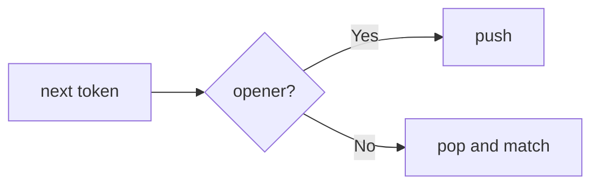
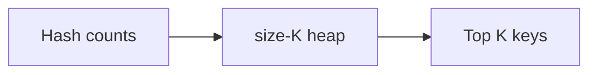
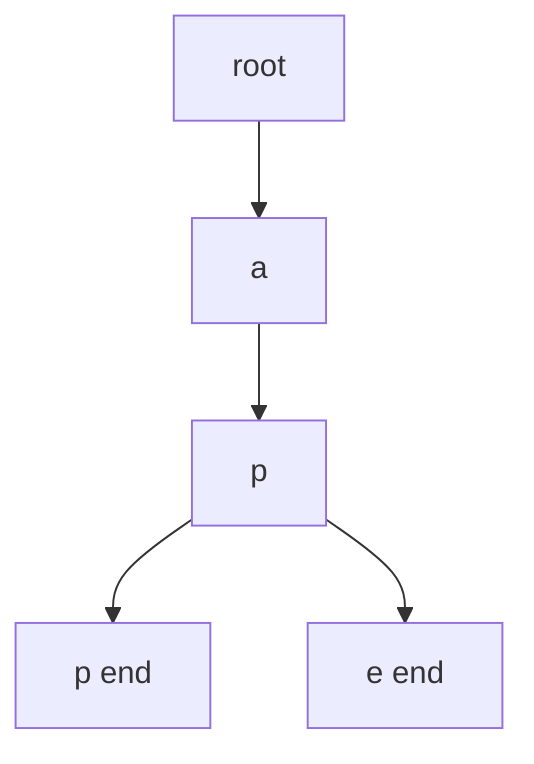

# Family 7 — Priority Structures

- [x] Stack
- [x] Queue
- [x] Heap / Priority Queue
- [x] Monotonic Stack
- [x] Trie

## Family Overview

These patterns control **processing order**: last-in-first-out, first-in-first-
out, “always the best next,” nearest-greater helpers, or prefix trees.

| Pattern | Owns | Does not own |
| --- | --- | --- |
| Stack | LIFO, matching, undo | Nearest greater (Monotonic Stack) |
| Queue | FIFO lunch line | Priority ordering (Heap) |
| Heap | Top K / continuous min-max | Pure frequency counting (Hash Map) |
| Monotonic Stack | Next greater/smaller | Plain parentheses matching |
| Trie | Shared-prefix dictionary | Flat hash set of whole words |

---

## Stack

**Scope:** Last-in-first-out for nesting, matching, and undo. Nearest-greater
problems → Monotonic Stack.

### Purpose

A **stack** is a stack of plates: the last plate you put on is the first you
take off (**LIFO**). Nested parentheses, undo buttons, and “decode this nested
string” all need that most-recent unfinished thing on top.

### Recognition Clues

- Valid parentheses; decode string; path simplify
- Min stack design
- Calculator / RPN
- "Nested," "matching pairs," "undo"

> 🧠 **Pattern Recognition:** If correctness depends on the **most recent**
> unmatched opener, you need a stack — not separate counters.

### Mental Model

**The problem.** Valid Parentheses: is `"([])"` okay? Is `"([)]"` okay?

**Naive idea.** Count each bracket type. Fails on `"([)]"` — counts match, order
doesn’t.

**The stuck part.** Counts forget order.

**The click.** Push openers. On a closer, pop and require a type match. Empty
stack at the end means success.

**Kid analogy.** Browser back button / undo — last action reversed first.

### Visualization



Each closer must match the **top** plate.

Worked `"([])"`: push `(`, push `[`, `]` pops `[`, `)` pops `(`, empty → valid.
`"([)]"`: after `( [` the next `)` doesn’t match `[` → reject.

### Generic Template

```pseudo
stack = empty
for ch in s:
    if ch is opener: stack.push(ch)
    else:
        if stack empty or not match(stack.pop(), ch): return false
return stack is empty
```

In plain English: put openers on the plate stack; every closer must fit the top
plate; nothing left at the end.

### Complexity

- **Time:** O(n)
- **Space:** O(n) worst case (all openers)

### Common Mistakes

- Counts instead of a stack for mixed types
- Popping an empty stack
- Putting next-greater problems here (Monotonic Stack)
- Min Stack forgotten second stack of running mins

> ⚠️ **Common Mistake:** Histogram rectangle looks “stacky” but needs a
> monotonic rule — see Monotonic Stack.

### Classic Interview Questions

**Easy:** Valid Parentheses · Min Stack · Implement Stack using Queues

**Medium:** Decode String · Daily Temperatures Warmup · Basic Calculator II

**Hard:** Largest Rectangle in Histogram · Basic Calculator

> See also: Simplify Path (Medium); Largest Rectangle under Monotonic Stack.

### Engineering Connections

Browser history, editor undo, and language call stacks are LIFO — same
discipline as parentheses matching.

> 🏗️ **Engineering Connection:** Every function call pushes a frame and every
> return pops one.

### Depth Note — Last In, First Out

A stack is a springy plate pile: last plate down is first plate up. Valid
parentheses: push openers; on a closer, pop and match. Decode String / basic
calculator: push nesting frames so inner work finishes before outer work.

Bottleneck of nested scanning with indexes: you lose the “most recent open”
context. The stack remembers it.

Queues are first-in-first-out; monotonic stacks keep values increasing/decreasing
for next-greater — different chapters even though both use a stack shell.

### Worked Recognition

Valid Parentheses / Min Stack / Decode String / Basic Calculator II. Always
ask: “do I need the most recent unfinished opener or frame?” If yes, stack. If
you need next greater, escalate to Monotonic Stack.

### Interview Dialogue

Interviewer: “Valid parentheses.” You: “Push openers; on closer, pop and
match.” Escalate to Decode String with a stack of frames (count + string). If
they ask next warmer day, switch to Monotonic Stack. Clear LIFO ownership keeps
you from overusing deques.

### Why Reach For This

Patterns exist so you stop reinventing the same bottleneck fix under interview
pressure. Name the wasted work first — nested pair scans, rebuilding range
sums, rescanning a grid, forgetting visited marks, sorting when membership was
enough. Then name the structure that removes that waste. Practice saying the
bottleneck in one sentence before you touch the keyboard; that sentence is how
interviewers score pattern recognition.

When the pattern is dual-homed, say the primary owner and the helper out loud.
When an Easy list is a warmup rather than a famous LeetCode Easy, label it as
prep for the Medium that carries the real idea. Prefer deriving the template
from the mental model over memorizing a number. If you can redraw the diagram
from memory and retell the naive-to-insight arc, you own the chapter.

Engineering systems reuse these habits daily: indexed lookups, rollups, layer
exploration, schedulers, prefix trees, and priority queues. Connecting the toy
example to a named production mechanism keeps the knowledge sticky beyond the
whiteboard.

Re-check complexity after you pick the pattern: time should match a single
pass, a log factor from sort or heap, or a bounded state space — not a hidden
quadratic walk disguised as a helper list scan. Space should match the map,
queue, recursion depth, or heap you actually allocated. If a follow-up forbids
extra memory, revisit in-place index surgery. If weights appear on edges,
upgrade from BFS to Dijkstra. If the answer is any feasible set of choices with
overlap, upgrade from greedy to DP. Those upgrades are pattern recognition too.

Finally, keep the voice simple: short sentences, one worked example, one
diagram, one template. That is the handbook bar that Hash Maps set — clarity
first, then implementation.

### Summary

- Nesting and undo ⇒ stack; match the top, not counts alone
- Empty pop and type mismatch are the usual rejects
- Next greater ⇒ Monotonic Stack
- Min Stack tracks an aux peak stack

---

## Queue

**Scope:** First-in-first-out. BFS uses queues as a tool; this section owns the
queue ADT and streaming FIFO windows.

### Purpose

A **queue** is a school lunch line: first kid in is first kid served (**FIFO**).
Moving averages and “calls in the last 3000 ms” keep a fair window: new samples
join the back; expired samples leave the front.

### Recognition Clues

- Implement queue with stacks; circular queue
- Moving average from data stream; number of recent calls
- "FIFO," preserve arrival order
- Sliding window maximum sometimes uses a deque (see Mono)

### Mental Model

**The problem.** Moving Average size `k`: after each `next(val)`, average the
last at most `k` values.

**Naive idea.** Store forever; rescan last k each time.

**The stuck part.** Drop the expired front cheaply while updating a sum.

**The click.** Queue of last k + running sum: enqueue, add; if size > k,
dequeue front and subtract.

**Kid analogy.** Ticket line — leave from the front; join at the back. Priority
cutting is a Heap, not a Queue.

### Visualization

```text
front → [a, b, c] ← back     enqueue d → [a, b, c, d]
dequeue → [b, c, d]
```

Worked `k=3`: `1` → avg 1; `10` → 5.5; `3` → ~4.67; `5` drops `1` → avg 6.

### Generic Template

```pseudo
q = empty queue
sum = 0
on next(val):
    q.enqueue(val); sum += val
    if q.size > k:
        sum -= q.dequeue()
    return sum / q.size
```

In plain English: add to the back; if the line is too long, boot the front;
return the average.

### Complexity

- **Time:** O(1) amortized per enqueue/dequeue
- **Space:** O(k) for a sized window

### Common Mistakes

- Front-delete on a normal array that is secretly O(n)
- Confusing queue (fair) with heap (priority)
- Circular queue wrap math bugs
- Calling Sliding Window Maximum “just a queue” without the mono deque rule

> ⚠️ **Common Mistake:** Task Scheduler is mostly Heap + cooldown, not plain
> FIFO.

### Classic Interview Questions

**Easy:** Implement Queue using Stacks · Number of Recent Calls · Design Circular Queue

**Medium:** Binary Tree Level Order Traversal · Design Hit Counter · Moving Average from Data Stream

**Hard:** Sliding Window Maximum · Design Snake Game
Shortest Subarray with Sum at Least K _(mono deque)_

### Engineering Connections

Message brokers (SQS, RabbitMQ) are FIFO queues at city scale — arrival order
until a worker pulls the front.

> 🏗️ **Engineering Connection:** Oldest ready message first = this chapter;
> hottest priority first = Heap.

### Depth Note — First In, First Out

A queue is a lunch line: first in, first out. Tree/graph level order is the
interview classic — enqueue root; while queue non-empty, drain one level’s
worth of nodes (or drain until empty while tracking size).

BFS owns the “shortest unweighted distance” story; this chapter owns the data
structure and the level-size loop. Sliding windows sometimes use deques (double
ended queues) for max — see Monotonic Stack / Window Maximum.

Easy: Implement Queue using Stacks; number of recent calls in a counter queue.

### Worked Recognition

Implement Queue using Stacks; Design Circular Queue; Binary Tree Level Order;
Number of Recent Calls (sliding timeline queue). Dual-home with BFS: you
explain FIFO here; they explain distance layers there.

### Interview Dialogue

Interviewer: “Level order traversal.” You: “Queue; while not empty, process
`size = queue.length` nodes as one level.” That size loop is the tell. BFS
shortest path reuses it with distances. Recent Calls is a time queue: pop from
front while too old. Dual-home quietly: structure here, distance story in BFS.

### Why Reach For This

Patterns exist so you stop reinventing the same bottleneck fix under interview
pressure. Name the wasted work first — nested pair scans, rebuilding range
sums, rescanning a grid, forgetting visited marks, sorting when membership was
enough. Then name the structure that removes that waste. Practice saying the
bottleneck in one sentence before you touch the keyboard; that sentence is how
interviewers score pattern recognition.

When the pattern is dual-homed, say the primary owner and the helper out loud.
When an Easy list is a warmup rather than a famous LeetCode Easy, label it as
prep for the Medium that carries the real idea. Prefer deriving the template
from the mental model over memorizing a number. If you can redraw the diagram
from memory and retell the naive-to-insight arc, you own the chapter.

Engineering systems reuse these habits daily: indexed lookups, rollups, layer
exploration, schedulers, prefix trees, and priority queues. Connecting the toy
example to a named production mechanism keeps the knowledge sticky beyond the
whiteboard.

Re-check complexity after you pick the pattern: time should match a single
pass, a log factor from sort or heap, or a bounded state space — not a hidden
quadratic walk disguised as a helper list scan. Space should match the map,
queue, recursion depth, or heap you actually allocated. If a follow-up forbids
extra memory, revisit in-place index surgery. If weights appear on edges,
upgrade from BFS to Dijkstra. If the answer is any feasible set of choices with
overlap, upgrade from greedy to DP. Those upgrades are pattern recognition too.

Finally, keep the voice simple: short sentences, one worked example, one
diagram, one template. That is the handbook bar that Hash Maps set — clarity
first, then implementation.

### Summary

- FIFO for fairness and streaming windows
- Pair with running sums for O(1) averages
- Deques power window maxima with an extra mono rule
- Priority needs a Heap

---

## Heap / Priority Queue

**Scope:** Always grab the current smallest/largest; Top K **selection**.
Counting stays Hash Map.

### Purpose

A **heap** (priority queue) is a trophy shelf that always shows the current
extreme at the top. Insertions reshuffle so the top stays correct — without
fully resorting every time. “Top K Frequent” = map counts, then heap picks
winners.

### Recognition Clues

- Kth largest; K closest; Top K frequent
- Merge K sorted lists
- Running median (two heaps)
- Always process the current hottest task

> 🧠 **Pattern Recognition:** Need Top K / running min-max? Count with a map if
> needed, then select with a size-K heap.

### Mental Model

**The problem.** Top K Frequent: `[1,1,1,2,2,3]`, `k=2` → `[1,2]`.

**Naive idea.** Sort every unique by count.

**The stuck part.** Full sort when only K winners matter.

**The click.** Count with a hash map. Keep a **min-heap of size K** keyed by
frequency: if the shelf is full, the newcomer only needs to beat the weakest
trophy (the root).

**Kid analogy.** A shelf that only holds K medals — challengers fight the
weakest medal on the shelf.

### Visualization



Counting and crowning are two stages on purpose.

### Generic Template

```pseudo
# Top K Frequent — canon path
count = hash map          # value → frequency
for x in nums:
    count[x] += 1

heap = empty min-heap     # entries are (freq, key)
for key, freq in count:
    heap.push((freq, key))
    if heap.size > K:
        heap.pop()        # drops smallest frequency
return [key for (freq, key) in heap]
```

In plain English: count first, then keep only K trophies on a size-K min-heap
keyed by frequency — kick the weakest frequency so the shelf holds Top K.
(K largest raw values is the same heap muscle without the count map.)

### Complexity

- **Time:** O(n log K) for Top K when K ≪ n
- **Space:** O(K) (+ O(n) for counts)

### Common Mistakes

- Full sort when a size-K heap is enough
- Max vs min heap confusion for K largest
- Heaping without counting first
- Merge k lists only under Linked List Ops — picking the next smallest head is
  Heap-owned

> 💡 **Insight:** Say `O(n log K)` when K is clearly smaller than n.

### Classic Interview Questions

**Easy:** Kth Largest Element in a Stream · Last Stone Weight · Relative Ranks

**Medium:** Top K Frequent Elements · K Closest Points to Origin · Kth Largest Element in an Array

**Hard:** Find Median from Data Stream · Merge k Sorted Lists

> See also: Task Scheduler (Medium). Top K counting under Hash Maps; selection
> here.

### Engineering Connections

OS schedulers pop the next highest-priority ready task — heaps under the hood.

> 🏗️ **Engineering Connection:** `heap.pop()` ≈ “who runs next?”

### Depth Note — Top K Frequent Template

A heap keeps the extreme (min or max) at the front. Interview king path — **Top
K Frequent Elements**:

1. Hash map: count frequencies.
2. Keep a **size-K min-heap** of `(freq, key)` (or max-heap of size n — less common).
3. For each key, push; if heap size > K, pop the smallest frequency.
4. Remaining heap entries are the Top K.

“K largest numbers” is the same muscle with values instead of frequencies.
Merge k sorted lists: heap of current heads. Do not stop the Generic Template
at “push all, pop K” when frequency ranking is the real lesson — **count map
first, then sized heap**.

### Worked Recognition

Top K Frequent (count → size-K heap) is the canon template. K Closest Points
and Kth Largest Element are cousins. Merge k Sorted Lists pushes list heads.
Say “min-heap of size K keyed by frequency” in the first minute of the interview.

### Interview Dialogue

Interviewer: “Top K frequent words/elements.” You: “Count with a hash map, then
a size-K min-heap of (freq, key); pop when size exceeds K.” That two-step is
mandatory. Kth largest is the same heap muscle on raw values. Median data
stream uses two heaps — Hard cousin. Never skip the count map when the metric
is frequency.

### Why Reach For This

Patterns exist so you stop reinventing the same bottleneck fix under interview
pressure. Name the wasted work first — nested pair scans, rebuilding range
sums, rescanning a grid, forgetting visited marks, sorting when membership was
enough. Then name the structure that removes that waste. Practice saying the
bottleneck in one sentence before you touch the keyboard; that sentence is how
interviewers score pattern recognition.

When the pattern is dual-homed, say the primary owner and the helper out loud.
When an Easy list is a warmup rather than a famous LeetCode Easy, label it as
prep for the Medium that carries the real idea. Prefer deriving the template
from the mental model over memorizing a number. If you can redraw the diagram
from memory and retell the naive-to-insight arc, you own the chapter.

Engineering systems reuse these habits daily: indexed lookups, rollups, layer
exploration, schedulers, prefix trees, and priority queues. Connecting the toy
example to a named production mechanism keeps the knowledge sticky beyond the
whiteboard.

Re-check complexity after you pick the pattern: time should match a single
pass, a log factor from sort or heap, or a bounded state space — not a hidden
quadratic walk disguised as a helper list scan. Space should match the map,
queue, recursion depth, or heap you actually allocated. If a follow-up forbids
extra memory, revisit in-place index surgery. If weights appear on edges,
upgrade from BFS to Dijkstra. If the answer is any feasible set of choices with
overlap, upgrade from greedy to DP. Those upgrades are pattern recognition too.

Finally, keep the voice simple: short sentences, one worked example, one
diagram, one template. That is the handbook bar that Hash Maps set — clarity
first, then implementation.

### Summary

- Heap = continuous extremes / Top K
- Maps count; heaps crown
- Size-K heap beats full sort when K ≪ n
- Two heaps for running median

---

## Monotonic Stack

**Scope:** Keep a stack that only goes up or only goes down so you can find the
next greater/smaller in cheap average time.

### Purpose

A **monotonic stack** is a plate stack with a house rule: plates must stay in
decreasing (or increasing) height order. When a taller plate arrives, shorter
waiting plates finally learn “my next greater is here!” and leave. Daily
Temperatures and stock span use this.

### Recognition Clues

- Next greater element; daily temperatures
- Online stock span; final prices with discount
- Largest rectangle in histogram
- Maximal rectangle in a binary matrix

### Mental Model

**The problem.** Daily Temperatures: days until a warmer day.
`[73,74,75,71,69,72,76,73]` → `[1,1,4,2,1,1,0,0]`.

**Naive idea.** For each day, scan forward — slow.

**The stuck part.** Repeated forward scans.

**The click.** Keep a decreasing stack of **indexes**. While today is warmer
than the top, pop and write the wait. Push today. Each index enters/leaves once.

**Kid analogy.** Kids in line facing forward — shorter kids leave when a taller
kid appears behind them (they found next greater).

### Visualization

```text
temps: 73 74 75 71 69 72 76 73
stack holds indexes with decreasing temps;
74 pops 73 (wait 1); 75 pops 74; …
```

```mermaid
flowchart LR
  I[i] --> W{temps[i] > temps[top]?}
  W -->|Yes| Pop[pop; ans[j]=i-j]
  W -->|No| Push[push i]
  Pop --> W
```

Many pops at one `i` are fine — those indexes never return.

### Generic Template

```pseudo
stack = empty   # indices; temps[stack] strictly decreasing
ans = [0]*n
for i in 0..n-1:
    while stack and temps[i] > temps[stack.top]:
        j = stack.pop()
        ans[j] = i - j
    stack.push(i)
```

In plain English: while today’s weather beats waiting days, resolve those waits;
then today joins the waiting line.

### Complexity

- **Time:** O(n) amortized — each index push/pop ≤ once
- **Space:** O(n)

### Common Mistakes

- Storing values without indexes when distance matters
- Wrong `<` vs `<=` with duplicates
- Telling a “parentheses stack” story without the mono house rule
- Circular next-greater needs a second pass

> 🚀 **Interview Tip:** Say “decreasing stack of indexes” up front.

### Classic Interview Questions

**Easy:** Next Greater Element I · Remove All Adjacent Duplicates · Online Stock Span Warmup

**Medium:** Daily Temperatures · Next Greater Element II · Online Stock Span

**Hard:** Largest Rectangle in Histogram · Maximal Rectangle

### Engineering Connections

Streaming “when does this metric next beat yesterday?” monitors use the same
pop-while-beaten loop.

> 🏗️ **Engineering Connection:** Threshold-breach waits on a live series are
> next-greater on a stream.

### Depth Note — Next Greater and Histogram

A monotonic stack stays strictly increasing or decreasing so the top always
answers “previous / next greater or smaller.” Daily Temperatures: indices of
warmer days — while stack top is cooler than today, pop and label distance.

Largest Rectangle in Histogram: for each bar, know first shorter bar left and
right; width = right−left−1; area = height×width. Same mono stack of indices.

This is not Valid Parentheses (plain Stack). Name the invariant (“stack
values increasing”) before coding.

### Worked Recognition

Next Greater Element, Daily Temperatures, Largest Rectangle in Histogram,
Online Stock Span. Keep indices, not only values, so you can compute widths and
distances. State the mono invariant every time you pop.

### Interview Dialogue

Interviewer: “Daily temperatures.” You: “Monotonic decreasing stack of indices;
while today is warmer than the top, pop and write the day gap.” Histogram
rectangle: for each bar find first shorter left/right with the same mono stack
of indices. State the invariant before you touch the keyboard.

### Why Reach For This

Patterns exist so you stop reinventing the same bottleneck fix under interview
pressure. Name the wasted work first — nested pair scans, rebuilding range
sums, rescanning a grid, forgetting visited marks, sorting when membership was
enough. Then name the structure that removes that waste. Practice saying the
bottleneck in one sentence before you touch the keyboard; that sentence is how
interviewers score pattern recognition.

When the pattern is dual-homed, say the primary owner and the helper out loud.
When an Easy list is a warmup rather than a famous LeetCode Easy, label it as
prep for the Medium that carries the real idea. Prefer deriving the template
from the mental model over memorizing a number. If you can redraw the diagram
from memory and retell the naive-to-insight arc, you own the chapter.

Engineering systems reuse these habits daily: indexed lookups, rollups, layer
exploration, schedulers, prefix trees, and priority queues. Connecting the toy
example to a named production mechanism keeps the knowledge sticky beyond the
whiteboard.

Re-check complexity after you pick the pattern: time should match a single
pass, a log factor from sort or heap, or a bounded state space — not a hidden
quadratic walk disguised as a helper list scan. Space should match the map,
queue, recursion depth, or heap you actually allocated. If a follow-up forbids
extra memory, revisit in-place index surgery. If weights appear on edges,
upgrade from BFS to Dijkstra. If the answer is any feasible set of choices with
overlap, upgrade from greedy to DP. Those upgrades are pattern recognition too.

Finally, keep the voice simple: short sentences, one worked example, one
diagram, one template. That is the handbook bar that Hash Maps set — clarity
first, then implementation.

### Summary

- Mono house rule ⇒ next/previous greater or smaller
- Store indexes; amortize pops
- Histogram / maximal rectangle are the hard classics
- Plain Valid Parentheses stays under Stack

---

## Trie

**Scope:** Tree of letters that share prefixes. Autocomplete and Word Search II.

### Purpose

A **trie** (prefix tree) is a family tree of letters. Words that share a
beginning share the same upper branches. You walk one letter at a time —
perfect for `startsWith`, autocomplete, and “is this prefix even possible?”

### Recognition Clues

- Implement Trie; replace words; prefix scores
- Autocomplete system
- Word Search II (trie of words + board DFS)
- "Starts with," dictionary of prefixes

### Mental Model

**The problem.** Implement Trie with `insert`, `search`, `startsWith`. After
`"app"` and `"ape"`, `startsWith("ap")` is true, `search("ap")` is false.

**Naive idea.** Hash set of whole words — `startsWith` scans every word.

**The stuck part.** Prefix queries shouldn’t rescan the whole dictionary.

**The click.** Each node has child letters and an `is_end` flag for “a full word
ends here.”

**Kid analogy.** A phone book grown as a letter tree — `"app"` and `"ape"` both
hang under `a → p`.

### Visualization



Shared `a→p`; `is_end` marks word tails. Prefix `ap` can succeed even if `ap`
isn’t a full word.

### Generic Template

```pseudo
class Node:
    children = map
    is_end = false

function insert(word):
    node = root
    for ch in word:
        if ch not in node.children: node.children[ch] = Node()
        node = node.children[ch]
    node.is_end = true

function walk(prefix):
    node = root
    for ch in prefix:
        if ch not in node.children: return null
        node = node.children[ch]
    return node
```

In plain English: walk/create letter doors; `search` needs `is_end`;
`startsWith` only needs the walk to succeed.

### Complexity

- **Time:** O(L) per op for length L
- **Space:** O(total letters) with sharing savings

### Common Mistakes

- Forgetting `is_end` (prefix ≠ whole word)
- Huge maps when a size-26 array would do
- Building a trie when only exact match is needed (hash set enough)
- Word Search II continuing after the trie node is already null

> 💡 **Insight:** Path exists ≠ word ends here.

### Classic Interview Questions

**Easy:** Implement Trie · Longest Common Prefix · Reverse String Prefix Soft

**Medium:** Replace Words · Design Add and Search Words · Map Sum Pairs

**Hard:** Word Search II · Prefix and Suffix Search

### Engineering Connections

Autocomplete UIs, spellcheckers, and IP “longest prefix match” tables are
trie cousins — same letter walk as `startsWith`.

> 🏗️ **Engineering Connection:** Typeahead filtering as you type is a trie (or
> a sorted list + binary search) with the same mental model.

### Depth Note — Prefix Trees

A Trie (prefix tree) stores strings character-by-character in a tree of maps.
`startsWith` is a walk that must not fall off the tree; `search` also checks
an end-of-word flag. Word Search II / autocomplete: heavy prefix sharing makes
tries beat scanning a whole dictionary each time.

Recognition: many queries on shared prefixes, not a single hash of full words
only. Implementing Trie is the Easy/Medium doorway; Word Search II is the Hard
payoff.

### Worked Recognition

Implement Trie; Replace Words; Word Search II; Design Search Autocomplete.
If queries are full exact keys only, a hash set may win. If prefixes dominate,
Trie wins.

### Interview Dialogue

Interviewer: “Word Search II.” You: “Build a trie of the words, DFS the board
while walking the trie; prune when the node dies.” For autocomplete,
startsWith walks are the win over scanning the dictionary. If only exact full
keys matter, say when a Hash Set is enough instead.

### Why Reach For This

Patterns exist so you stop reinventing the same bottleneck fix under interview
pressure. Name the wasted work first — nested pair scans, rebuilding range
sums, rescanning a grid, forgetting visited marks, sorting when membership was
enough. Then name the structure that removes that waste. Practice saying the
bottleneck in one sentence before you touch the keyboard; that sentence is how
interviewers score pattern recognition.

When the pattern is dual-homed, say the primary owner and the helper out loud.
When an Easy list is a warmup rather than a famous LeetCode Easy, label it as
prep for the Medium that carries the real idea. Prefer deriving the template
from the mental model over memorizing a number. If you can redraw the diagram
from memory and retell the naive-to-insight arc, you own the chapter.

Engineering systems reuse these habits daily: indexed lookups, rollups, layer
exploration, schedulers, prefix trees, and priority queues. Connecting the toy
example to a named production mechanism keeps the knowledge sticky beyond the
whiteboard.

Re-check complexity after you pick the pattern: time should match a single
pass, a log factor from sort or heap, or a bounded state space — not a hidden
quadratic walk disguised as a helper list scan. Space should match the map,
queue, recursion depth, or heap you actually allocated. If a follow-up forbids
extra memory, revisit in-place index surgery. If weights appear on edges,
upgrade from BFS to Dijkstra. If the answer is any feasible set of choices with
overlap, upgrade from greedy to DP. Those upgrades are pattern recognition too.

Finally, keep the voice simple: short sentences, one worked example, one
diagram, one template. That is the handbook bar that Hash Maps set — clarity
first, then implementation.

### Summary

- Shared prefixes + `startsWith` ⇒ trie
- `is_end` vs prefix existence is the core detail
- Word Search II pairs a trie with board backtracking
- Exact-only membership may only need a hash set

---
