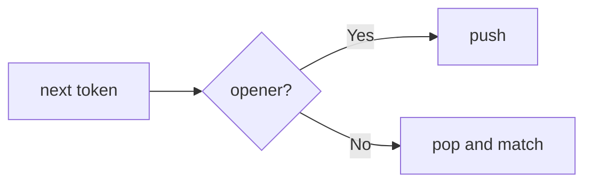
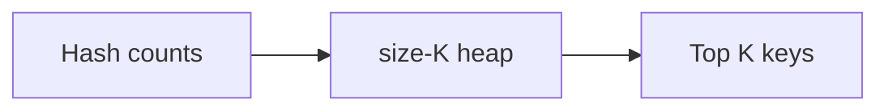
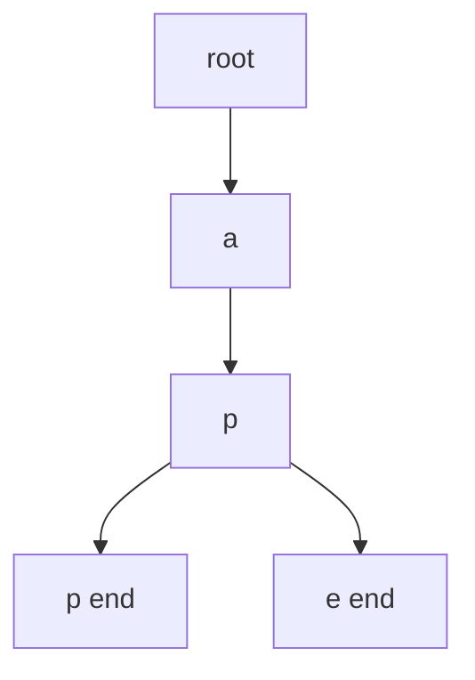

# Family 7 — Priority Structures

- [x] Stack
- [x] Queue
- [x] Heap / Priority Queue
- [x] Monotonic Stack
- [x] Trie

## Family Overview

These patterns control **processing order**: last-in-first-out, first-in-first-
out, “always the best next,” nearest-greater helpers, or prefix trees.

| Pattern | Owns | Does not own |
| --- | --- | --- |
| Stack | LIFO, matching, undo | Nearest greater (Monotonic Stack) |
| Queue | FIFO lunch line | Priority ordering (Heap) |
| Heap | Top K / continuous min-max | Pure frequency counting (Hash Map) |
| Monotonic Stack | Next greater/smaller | Plain parentheses matching |
| Trie | Shared-prefix dictionary | Flat hash set of whole words |

---

## Stack

**Scope:** Last-in-first-out for nesting, matching, and undo. Nearest-greater
problems → Monotonic Stack.

### Purpose

A **stack** is a stack of plates: the last plate you put on is the first you
take off (**LIFO**). Nested parentheses, undo buttons, and “decode this nested
string” all need that most-recent unfinished thing on top.

### Recognition Clues

- Valid parentheses; decode string; path simplify
- Min stack design
- Calculator / RPN
- "Nested," "matching pairs," "undo"

> 🧠 **Pattern Recognition:** If correctness depends on the **most recent**
> unmatched opener, you need a stack — not separate counters.

### Mental Model

**The problem.** Valid Parentheses: is `"([])"` okay? Is `"([)]"` okay?

**Naive idea.** Count each bracket type. Fails on `"([)]"` — counts match
(one of each), order doesn't: the closer `)` shows up while `[` is still the
most recently opened, unmatched bracket, and a count can't see that.

**The stuck part.** Counts forget order.

**The click.** Push openers. On a closer, pop and require a type match. Empty
stack at the end means success.

**Kid analogy.** Browser back button / undo — last action reversed first.

**Second sketch — Decode String.** Push a `(count, string-so-far)` frame every
time you meet `[`. On `]`, pop the frame, repeat the string built since then
by that count, and glue it onto the popped string. Nested brackets just mean
nested frames — the stack remembers every unfinished outer layer while you
finish the inner one.

### Visualization



Each closer must match the **top** plate.

Worked `"([])"`: push `(`, push `[`, `]` pops `[`, `)` pops `(`, empty → valid.
`"([)]"`: after `( [` the next `)` doesn’t match `[` → reject.

### Generic Template

```pseudo
stack = empty
for ch in s:
    if ch is opener: stack.push(ch)
    else:
        if stack empty or not match(stack.pop(), ch): return false
return stack is empty
```

In plain English: put openers on the plate stack; every closer must fit the top
plate; nothing left at the end.

### Complexity

- **Time:** O(n)
- **Space:** O(n) worst case (all openers)

### Common Mistakes

- Counts instead of a stack for mixed types
- Popping an empty stack
- Putting next-greater problems here (Monotonic Stack)
- Min Stack forgotten second stack of running mins
- Basic Calculator: forgetting that a `-` before an opening `(` must flip the
  sign of everything inside that parenthesis, not just the next number

> ⚠️ **Common Mistake:** Histogram rectangle looks “stacky” but needs a
> monotonic rule — see Monotonic Stack.

### Classic Interview Questions

**Easy:** Valid Parentheses · Min Stack · Implement Stack using Queues

**Medium:** Decode String · Daily Temperatures Warmup · Basic Calculator II

**Hard:** Largest Rectangle in Histogram · Basic Calculator

> See also: Simplify Path (Medium); Largest Rectangle under Monotonic Stack.

### Engineering Connections

Browser history, editor undo, and language call stacks are LIFO — same
discipline as parentheses matching.

> 🏗️ **Engineering Connection:** Every function call pushes a frame and every
> return pops one.

JSON and XML parsers push a frame per open bracket/tag to know which object
or element is currently being filled in, and text editors' redo/undo stacks
are literally two stacks — pop one, push onto the other — to move actions
back and forth.

### Summary

- Nesting and undo ⇒ stack; match the top, not counts alone
- Empty pop and type mismatch are the usual rejects
- Next greater ⇒ Monotonic Stack
- Min Stack tracks an aux peak stack

---

## Queue

**Scope:** First-in-first-out. BFS uses queues as a tool; this section owns the
queue ADT and streaming FIFO windows.

### Purpose

A **queue** is a school lunch line: first kid in is first kid served (**FIFO**).
Moving averages and “calls in the last 3000 ms” keep a fair window: new samples
join the back; expired samples leave the front.

### Recognition Clues

- Implement queue with stacks; circular queue
- Moving average from data stream; number of recent calls
- "FIFO," preserve arrival order
- Sliding window maximum sometimes uses a deque (see Mono)

### Mental Model

**The problem.** Moving Average size `k`: after each `next(val)`, average the
last at most `k` values.

**Naive idea.** Store forever; rescan last k each time: every single call to
`next` re-sums the last k values from scratch, so m calls cost O(m·k) instead
of O(m).

**The stuck part.** Drop the expired front cheaply while updating a sum.

**The click.** Queue of last k + running sum: enqueue, add; if size > k,
dequeue front and subtract.

**Kid analogy.** Ticket line — leave from the front; join at the back. Priority
cutting is a Heap, not a Queue.

**Second sketch — Implement Queue using Stacks.** Keep two stacks: `in` for
enqueue, `out` for dequeue. Push new items onto `in`. When `out` is empty and
a dequeue is needed, pour everything from `in` onto `out` (reversing the order
once), then pop from `out`. Each element only gets poured once, so the
amortized cost per operation stays O(1).

### Visualization

```text
front → [a, b, c] ← back     enqueue d → [a, b, c, d]
dequeue → [b, c, d]
```

Worked `k=3`: `1` → avg 1; `10` → 5.5; `3` → ~4.67; `5` drops `1` → avg 6.

### Generic Template

```pseudo
q = empty queue
sum = 0
on next(val):
    q.enqueue(val); sum += val
    if q.size > k:
        sum -= q.dequeue()
    return sum / q.size
```

In plain English: add to the back; if the line is too long, boot the front;
return the average.

### Complexity

- **Time:** O(1) amortized per enqueue/dequeue
- **Space:** O(k) for a sized window

### Common Mistakes

- Front-delete on a normal array that is secretly O(n)
- Confusing queue (fair) with heap (priority)
- Circular queue wrap math bugs
- Calling Sliding Window Maximum “just a queue” without the mono deque rule
- Design Hit Counter: keeping every timestamp forever instead of evicting ones
  older than the window, which silently grows memory without bound

> ⚠️ **Common Mistake:** Task Scheduler is mostly Heap + cooldown, not plain
> FIFO.

### Classic Interview Questions

**Easy:** Implement Queue using Stacks · Number of Recent Calls · Design Circular Queue

**Medium:** Binary Tree Level Order Traversal · Design Hit Counter · Moving Average from Data Stream

**Hard:** Sliding Window Maximum · Design Snake Game · Shortest Subarray with Sum at Least K _(mono deque)_

### Engineering Connections

Message brokers (SQS, RabbitMQ) are FIFO queues at city scale — arrival order
until a worker pulls the front.

> 🏗️ **Engineering Connection:** Oldest ready message first = this chapter;
> hottest priority first = Heap.

Rate limiters that count "requests in the last N seconds" keep a queue of
timestamps and evict expired ones the same way Moving Average evicts old
samples, and video buffering keeps a fixed-size queue of frames so playback
stays smooth even if decoding briefly outpaces or lags the display.

### Summary

- FIFO for fairness and streaming windows
- Pair with running sums for O(1) averages
- Deques power window maxima with an extra mono rule
- Priority needs a Heap

---

## Heap / Priority Queue

**Scope:** Always grab the current smallest/largest; Top K **selection**.
Counting stays Hash Map.

### Purpose

A **heap** (priority queue) is a trophy shelf that always shows the current
extreme at the top. Insertions reshuffle so the top stays correct — without
fully resorting every time. “Top K Frequent” = map counts, then heap picks
winners.

### Recognition Clues

- Kth largest; K closest; Top K frequent
- Merge K sorted lists
- Running median (two heaps)
- Always process the current hottest task

> 🧠 **Pattern Recognition:** Need Top K / running min-max? Count with a map if
> needed, then select with a size-K heap.

### Mental Model

**The problem.** Top K Frequent: `[1,1,1,2,2,3]`, `k=2` → `[1,2]`.

**Naive idea.** Sort every unique by count: sorting all the distinct values
costs O(u log u) for u unique values, most of which you then throw away —
you only ever wanted the top K, not a full ranking.

**The stuck part.** Full sort when only K winners matter.

**The click.** Count with a hash map. Keep a **min-heap of size K** keyed by
frequency: if the shelf is full, the newcomer only needs to beat the weakest
trophy (the root).

**Kid analogy.** A shelf that only holds K medals — challengers fight the
weakest medal on the shelf.

**Second sketch — Merge k Sorted Lists.** Push the head node of each of the k
lists onto a min-heap keyed by value. Pop the smallest, append it to the
answer, and if that node has a `next`, push the next node from the same list.
The heap holds at most k candidates at any time, so each pop/push is
O(log k) across n total pops.

### Visualization



Counting and crowning are two stages on purpose.

### Generic Template

```pseudo
# Top K Frequent — canon path
count = hash map          # value → frequency
for x in nums:
    count[x] += 1

heap = empty min-heap     # entries are (freq, key)
for key, freq in count:
    heap.push((freq, key))
    if heap.size > K:
        heap.pop()        # drops smallest frequency
return [key for (freq, key) in heap]
```

In plain English: count first, then keep only K trophies on a size-K min-heap
keyed by frequency — kick the weakest frequency so the shelf holds Top K.
(K largest raw values is the same heap muscle without the count map.)

### Complexity

- **Time:** O(n log K) for Top K when K ≪ n
- **Space:** O(K) (+ O(n) for counts)

### Common Mistakes

- Full sort when a size-K heap is enough
- Max vs min heap confusion for K largest
- Heaping without counting first
- Merge k lists only under Linked List Ops — picking the next smallest head is
  Heap-owned
- Running Median: using one heap instead of two — a single heap can give you
  the min or the max, but the median needs a max-heap of the smaller half and
  a min-heap of the larger half, kept balanced in size

> 💡 **Insight:** Say `O(n log K)` when K is clearly smaller than n.

### Classic Interview Questions

**Easy:** Kth Largest Element in a Stream · Last Stone Weight · Relative Ranks

**Medium:** Top K Frequent Elements · K Closest Points to Origin · Kth Largest Element in an Array

**Hard:** Find Median from Data Stream · Merge k Sorted Lists

> See also: Task Scheduler (Medium). Top K counting under Hash Maps; selection
> here.

### Engineering Connections

OS schedulers pop the next highest-priority ready task — heaps under the hood.

> 🏗️ **Engineering Connection:** `heap.pop()` ≈ “who runs next?”

Event-driven simulations keep a min-heap of "next event time" so they can
always jump straight to the next thing that happens instead of scanning a
clock tick by tick, and search engines keep a size-K heap of top-scoring
documents while scanning an index so they never have to fully sort millions
of candidates just to return the top 10.

### Summary

- Heap = continuous extremes / Top K
- Maps count; heaps crown
- Size-K heap beats full sort when K ≪ n
- Two heaps for running median

---

## Monotonic Stack

**Scope:** Keep a stack that only goes up or only goes down so you can find the
next greater/smaller in cheap average time.

### Purpose

A **monotonic stack** is a plate stack with a house rule: plates must stay in
decreasing (or increasing) height order. When a taller plate arrives, shorter
waiting plates finally learn “my next greater is here!” and leave. Daily
Temperatures and stock span use this.

### Recognition Clues

- Next greater element; daily temperatures
- Online stock span; final prices with discount
- Largest rectangle in histogram
- Maximal rectangle in a binary matrix

### Mental Model

**The problem.** Daily Temperatures: days until a warmer day.
`[73,74,75,71,69,72,76,73]` → `[1,1,4,2,1,1,0,0]`.

**Naive idea.** For each day, scan forward — slow: for n days that's up to n²
comparisons, and on a long streak of falling temperatures almost every scan
runs nearly to the end before finding a warmer day.

**The stuck part.** Repeated forward scans.

**The click.** Keep a decreasing stack of **indexes**. While today is warmer
than the top, pop and write the wait. Push today. Each index enters/leaves once.

**Kid analogy.** Kids in line facing forward — shorter kids leave when a taller
kid appears behind them (they found next greater).

**Second sketch — Largest Rectangle in Histogram.** For each bar, you need the
first shorter bar to its left and to its right — the same monotonic-stack scan
as Daily Temperatures, run once left-to-right. Once both boundaries are known,
that bar's best rectangle is `height × (right − left − 1)`; take the max over
all bars.

### Visualization

```text
temps: 73 74 75 71 69 72 76 73
stack holds indexes with decreasing temps;
74 pops 73 (wait 1); 75 pops 74; …
```

```mermaid
flowchart LR
  I[i] --> W{temps[i] > temps[top]?}
  W -->|Yes| Pop[pop; ans[j]=i-j]
  W -->|No| Push[push i]
  Pop --> W
```

Many pops at one `i` are fine — those indexes never return.

### Generic Template

```pseudo
stack = empty   # indices; temps[stack] strictly decreasing
ans = [0]*n
for i in 0..n-1:
    while stack and temps[i] > temps[stack.top]:
        j = stack.pop()
        ans[j] = i - j
    stack.push(i)
```

In plain English: while today’s weather beats waiting days, resolve those waits;
then today joins the waiting line.

### Complexity

- **Time:** O(n) amortized — each index push/pop ≤ once
- **Space:** O(n)

### Common Mistakes

- Storing values without indexes when distance matters
- Wrong `<` vs `<=` with duplicates
- Telling a “parentheses stack” story without the mono house rule
- Circular next-greater needs a second pass
- Online Stock Span: forgetting that a popped day's own span should be folded
  into the current day's span, not discarded — spans can chain together

> 🚀 **Interview Tip:** Say “decreasing stack of indexes” up front.

### Classic Interview Questions

**Easy:** Next Greater Element I · Remove All Adjacent Duplicates · Online Stock Span Warmup

**Medium:** Daily Temperatures · Next Greater Element II · Online Stock Span

**Hard:** Largest Rectangle in Histogram · Maximal Rectangle

### Engineering Connections

Streaming “when does this metric next beat yesterday?” monitors use the same
pop-while-beaten loop.

> 🏗️ **Engineering Connection:** Threshold-breach waits on a live series are
> next-greater on a stream.

Compilers use a monotonic stack to match indentation levels in
whitespace-sensitive languages, and stock-span-style analytics ("how many
consecutive prior days closed lower than today?") are a direct product
feature built on this exact template.

### Summary

- Mono house rule ⇒ next/previous greater or smaller
- Store indexes; amortize pops
- Histogram / maximal rectangle are the hard classics
- Plain Valid Parentheses stays under Stack

---

## Trie

**Scope:** Tree of letters that share prefixes. Autocomplete and Word Search II.

### Purpose

A **trie** (prefix tree) is a family tree of letters. Words that share a
beginning share the same upper branches. You walk one letter at a time —
perfect for `startsWith`, autocomplete, and “is this prefix even possible?”

### Recognition Clues

- Implement Trie; replace words; prefix scores
- Autocomplete system
- Word Search II (trie of words + board DFS)
- "Starts with," dictionary of prefixes

### Mental Model

**The problem.** Implement Trie with `insert`, `search`, `startsWith`. After
`"app"` and `"ape"`, `startsWith("ap")` is true, `search("ap")` is false.

**Naive idea.** Hash set of whole words — `startsWith` scans every word: with
a 100,000-word dictionary, every single `startsWith` query costs up to
100,000 string comparisons, even though most words don't even start with the
right letter.

**The stuck part.** Prefix queries shouldn’t rescan the whole dictionary.

**The click.** Each node has child letters and an `is_end` flag for “a full word
ends here.”

**Kid analogy.** A phone book grown as a letter tree — `"app"` and `"ape"` both
hang under `a → p`.

**Second sketch — Word Search II.** Build one trie from all the target words
first. DFS the board from every cell, walking down the trie alongside the
board path instead of restarting a fresh search per word. The moment the
current path no longer matches any trie edge, stop — that shared-prefix
pruning is what makes searching for many words at once cheaper than running
Word Search once per word.

### Visualization



Shared `a→p`; `is_end` marks word tails. Prefix `ap` can succeed even if `ap`
isn’t a full word.

### Generic Template

```pseudo
class Node:
    children = map
    is_end = false

function insert(word):
    node = root
    for ch in word:
        if ch not in node.children: node.children[ch] = Node()
        node = node.children[ch]
    node.is_end = true

function walk(prefix):
    node = root
    for ch in prefix:
        if ch not in node.children: return null
        node = node.children[ch]
    return node
```

In plain English: walk/create letter doors; `search` needs `is_end`;
`startsWith` only needs the walk to succeed.

### Complexity

- **Time:** O(L) per op for length L
- **Space:** O(total letters) with sharing savings

### Common Mistakes

- Forgetting `is_end` (prefix ≠ whole word)
- Huge maps when a size-26 array would do
- Building a trie when only exact match is needed (hash set enough)
- Word Search II continuing after the trie node is already null
- Replace Words: walking to the end of every dictionary root instead of
  stopping at the *first* `is_end` you hit along the word's path — the
  shortest matching root is the one that should replace the word

> 💡 **Insight:** Path exists ≠ word ends here.

### Classic Interview Questions

**Easy:** Implement Trie · Longest Common Prefix · Reverse String Prefix Soft

**Medium:** Replace Words · Design Add and Search Words · Map Sum Pairs

**Hard:** Word Search II · Prefix and Suffix Search

### Engineering Connections

Autocomplete UIs, spellcheckers, and IP “longest prefix match” tables are
trie cousins — same letter walk as `startsWith`.

> 🏗️ **Engineering Connection:** Typeahead filtering as you type is a trie (or
> a sorted list + binary search) with the same mental model.

IP routers store routing tables as a trie over address bits to find the
longest matching prefix for a packet's destination, and DNS resolvers walk a
domain trie from the root down (`.com` → `example` → `www`) to find the
authoritative server for a hostname.

### Summary

- Shared prefixes + `startsWith` ⇒ trie
- `is_end` vs prefix existence is the core detail
- Word Search II pairs a trie with board backtracking
- Exact-only membership may only need a hash set

---
