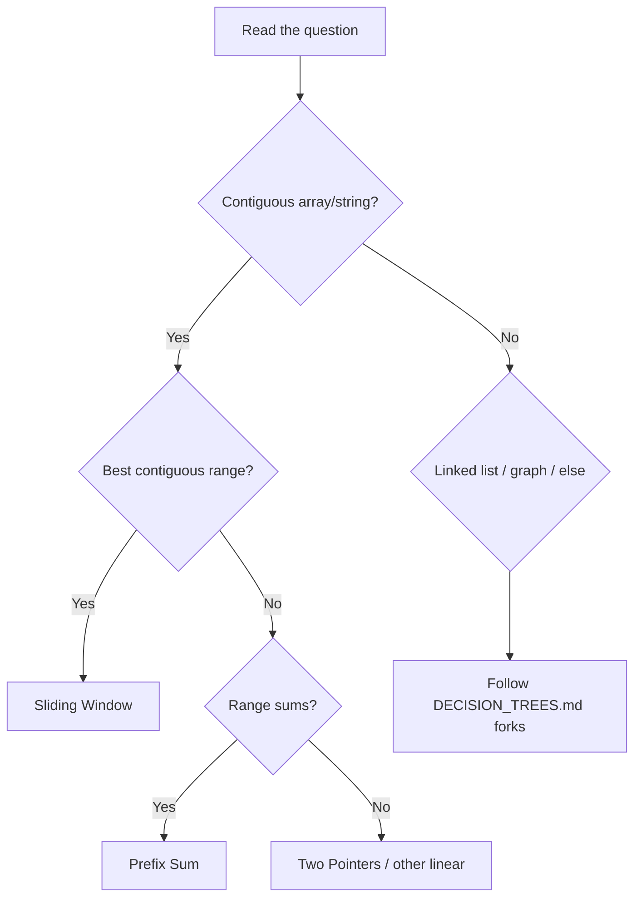

# Part 3 — Pattern Recognition Guide

Read the question for **structure**, not story. This part turns
[`DECISION_TREES.md`](../DECISION_TREES.md) into a walkthrough and gives
self-test stems (answers sit under each stem — cover them first when drilling).

## How to Use This Guide

1. Skim the master walkthrough once.
2. Drill stems family by family (cover the **Expected pattern** line).
3. When wrong, open the matching Part 2 section — fix the mental picture, not
   the memorized title.

---

## Master Decision Tree Walkthrough

Start at **Read the question**, then branch:

1. **Contiguous array/string?** (one unbroken stretch of items)  
   - Need best contiguous range → **Sliding Window**  
   - Repeated range sums / sum equals K → **Prefix Sum** (window only if
     the shrink rule is monotone, e.g. all non-negative)  
   - Sorted / ends move → **Two Pointers**
2. **Linked list?** (beads on a string)  
   - Cycle / middle / kth from end → **Fast & Slow**  
   - Reverse / merge / splice → **Linked List Pointer Manipulation**
3. **Tree or graph?** (branching map of friends / roads)  
   - Level / unweighted shortest → **BFS**  
   - Weighted shortest (non-negative) → **Dijkstra**  
   - Components / deep explore → **DFS**  
   - All combinations under constraints → **Backtracking**  
   - Same group / merges → **Union Find**  
   - Prerequisites order → **Topological Sort**
4. **Otherwise**  
   - Top K / running extremes → **Heap**  
   - Nearest greater/smaller → **Monotonic Stack**  
   - LIFO nesting → **Stack**  
   - Prefix dictionary → **Trie**  
   - Overlapping subproblems → **DP / Memoization**  
   - Provable local choice → **Greedy** (check a proof exists; see Family 5)

Use the full diagram in [`DECISION_TREES.md`](../DECISION_TREES.md) when the
short walkthrough above is unclear — it has every fork.

---

## Focused Trees (Quick)

| Situation | Prefer |
| --- | --- |
| Top K | Heap (count with Hash Map if needed) |
| Connected groups, many merges | Union Find |
| Connected groups, need paths/print | DFS / BFS |
| Shortest path unweighted | BFS |
| Shortest path weighted ≥0 | Dijkstra |
| Contiguous sum equals K (any ints) | Prefix Sum + map (not Sliding Window) |

---

## Practice Stems

Full stem bank (Families 1–7, including dual-home traps) lives in
[`recognition-stems.md`](recognition-stems.md). Sample:

> "Longest contiguous substring with all unique characters."

**Expected pattern:** Sliding Window.

> "How many contiguous subarrays sum to K?"

**Expected pattern:** Prefix Sum + map — **not** Sliding Window unless all
values are non-negative.

> "Minimum number of meeting rooms?"

**Expected pattern:** Sweep Line (max active events).

> "K most frequent elements."

**Expected pattern:** Hash Map count + Heap select.

Drill all stems in `recognition-stems.md` before interviews — Part 2 supplies
templates; this part supplies the **reflex**.

---

## Dual-Home Reminders

- **Top K Frequent** — Map counts; Heap selects  
- **Subarray Sum Equals K** — Prefix + map (not Sliding Window by default)  
- **Meeting Rooms II** — Sweep (not only Interval merge)  
- **Daily Temperatures** — Monotonic Stack  
- **Word Search** — Backtracking (DFS shape + undo)

---

## Next Steps

- Refresh templates: [Part 4 Cheat Sheets](../part-4-cheat-sheets/)
- Drill curated lists: [Part 5 Practice Roadmap](../part-5-practice-roadmap/)
