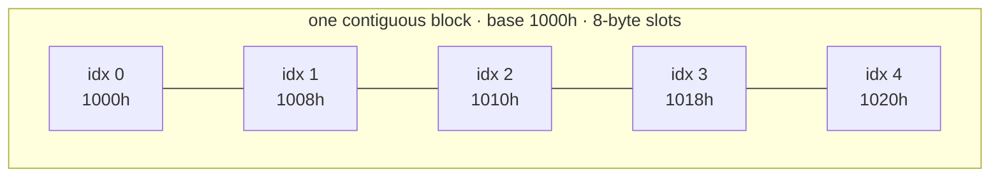

## What an array actually is

An array is **one contiguous block of memory** holding equal-sized slots.
That single sentence explains everything arrays are good and bad at.

Because the block is contiguous and slots are equal-sized, the address of
slot i is pure arithmetic:

> address(i) = base_address + i × slot_size

That's why `arr[i]` is O(1): the computer doesn't *search* for index 7 — it
computes 7's address and goes there directly. No other position is touched.
Compare a chain of linked nodes (Linked Lists module), where reaching item
7 means walking 7 hops: same "get the i-th item" request, completely
different mechanics.



## The costs, from the layout

Every array cost is a consequence of "contiguous, equal-sized, packed":

```complexity
{
  "operations": [
    { "name": "read / write arr[i]", "time": "O(1)", "why": "address arithmetic — base + i × size" },
    { "name": "append at end (capacity free)", "time": "O(1)", "why": "write into the next unused slot" },
    { "name": "insert at index i", "time": "O(n − i)", "why": "every element after i must shift right one slot — contiguity forbids gaps" },
    { "name": "delete at index i", "time": "O(n − i)", "why": "every element after i shifts left to close the gap" },
    { "name": "search unsorted", "time": "O(n)", "why": "no structure to exploit — must scan" }
  ]
}
```

The shifting cost is the one people forget. `list.insert(0, x)` /
`arr.unshift(x)` reads as one line but moves the entire array. A loop doing
n front-insertions is the triangular sum again: 1 + 2 + ⋯ + n = O(n²) —
one of the most common accidental quadratics in real code.

## Cache locality: the hidden second superpower

Modern CPUs don't fetch one value from RAM at a time — they pull a **cache
line** (typically 64 bytes) into fast cache. When you scan an array in
order, each fetch brings the next several elements along for free; the CPU
even detects the pattern and prefetches ahead. Scanning a linked structure
scattered across memory defeats both effects — every hop is a potential
cache miss costing ~100× a cache hit.

This doesn't change any Big O class — a scan is O(n) either way — but it's
a constant factor of 10–100× in real time, and it's why "array + index
arithmetic" beats fancier structures in practice far more often than
asymptotics alone predict. When two designs tie on paper, bet on the
contiguous one.

## What Python lists and JS arrays really are

Neither language gives you raw fixed-size arrays. `list` and `Array` are
**dynamic arrays**: a contiguous block *plus* bookkeeping (current length,
allocated capacity) and a growth policy. Two footnotes worth knowing:

- **Python** lists store pointers to objects, not the objects themselves —
  contiguity applies to the pointer block. (True packed storage exists in
  `array`/`numpy`.)
- **JavaScript** engines store arrays contiguously as long as you keep them
  dense and same-typed; writing far past the end or mixing types can demote
  them to hash-map mode. Keep arrays dense.

The next lesson builds the dynamic array from scratch — including the
growth policy that keeps append O(1) amortized, which you proved in the
Big O module.

```quiz
{
  "questions": [
    {
      "question": "Why is reading `arr[500000]` O(1) rather than requiring a walk to position 500,000?",
      "options": [
        "Its address is computed directly: base + 500000 × slot_size — contiguity plus equal slot sizes make location a formula, not a search",
        "Caches make walks fast — the CPU's prefetcher recognizes the access pattern of stepping through a sequence and pre-loads the target position before the walk even reaches it",
        "The runtime keeps an index of every position — a hidden lookup table maps each index to a memory address so that access doesn't need to be computed on the fly"
      ],
      "answer": 0,
      "explanation": "Random access is address arithmetic. This is THE defining array property, and it requires both contiguity and uniform slot size."
    },
    {
      "question": "A loop builds a list by always inserting each new item at index 0. Total cost for n items?",
      "options": [
        "O(n²) — insert at the front shifts all existing elements, giving 1 + 2 + ⋯ + n shifts",
        "O(n log n) — each front-insertion shifts a shrinking fraction of the array as later inserts land closer to a full block, giving the same total as a merge-style halving pattern",
        "O(n) — each insert is one operation, and since it's a single built-in call rather than an explicit loop, its cost is counted as constant regardless of how many elements it touches"
      ],
      "answer": 0,
      "explanation": "Front insertion is O(current length) because contiguity forbids gaps. Summing over the loop is the triangular series. Build at the end (O(1) amortized) and reverse once, or use a deque."
    },
    {
      "question": "Array scan and linked-list scan are both O(n). Why is the array scan often 10–100× faster in practice?",
      "options": [
        "Cache lines: contiguous elements arrive in fast cache together and get prefetched; scattered nodes miss cache on every hop",
        "It isn't — same class, same speed; any measured difference in practice is noise from benchmarking methodology rather than a real property of the two data layouts",
        "Arrays use less total memory — linked-list nodes carry pointer overhead per element, and it's this smaller total footprint, not access pattern, that accounts for the speedup"
      ],
      "answer": 0,
      "explanation": "Big O counts operations, not memory-hierarchy behavior. Contiguity turns most element accesses into cache hits — a constant factor, but a huge one."
    }
  ]
}
```
