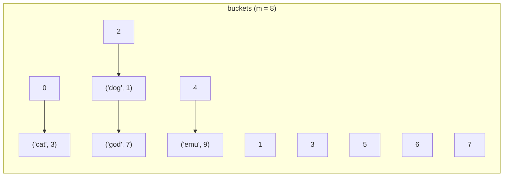

## Strategy 1: separate chaining

Each bucket holds a **list** of the entries that hashed there. Insert
appends to the bucket's list (after checking for the key); lookup scans
only that one list.



The cost of any operation is the length of one chain. So the whole
performance question becomes: *how long are chains?*

## The load factor argument — why O(1) average is honest

Define the **load factor** α = n / m (entries per bucket). Under uniform
hashing, each of the n keys lands in a given bucket with probability 1/m,
so the **expected** chain length is exactly α. Keep α bounded by a
constant (say ≤ 1) and the expected work per operation is O(1 + α) =
**O(1)** — a real theorem, not a slogan, and now you know its two
premises:

1. **uniformity** — the hash spreads keys evenly (last lesson's job);
2. **bounded load factor** — the table resizes before α grows (this
   lesson's job).

The worst case never disappears: an adversary (or a terrible hash) can
put all n keys in one chain → O(n) per operation. When you quote "hash
lookup is O(1)," you are quoting the average case under these premises —
the Big O module's case-discipline, applied.

## Resizing: the dynamic array trick, again

To hold α down as entries accumulate: when α crosses a threshold
(commonly 0.75–1), allocate a table with **2× the buckets** and re-insert
every entry — each key's slot is `hash mod m`, and m changed, so
*everything may move* (a full O(n) **rehash**). Sound familiar? It's the
dynamic array's growth policy with a rename, and the same amortized
argument applies verbatim: doubling means rehashes cost 1 + 2 + 4 + ⋯ +
n/2 < n total, so insert stays **O(1) amortized** on top of O(1) average.

One practical corollary: iteration order can change after any insert that
triggers a rehash — one reason you never rely on bucket order. (Python
dicts and JS Maps *do* guarantee insertion order — a deliberate extra
mechanism layered on top, not a property of hashing.)

Watch a chain form, the load factor cross 0.75, and every surviving key
get re-filed under the doubled modulus — including one that collides
again at the new size, because doubling reduces collisions statistically,
not individually:

```viz
{ "id": "hash-buckets", "keys": [10, 3, 18, 7, 25, 11], "capacity": 4 }
```

## Strategy 2: open addressing, briefly

Store entries directly in the bucket array; on collision, **probe** for
the next free slot by a fixed rule (linear probing: try i+1, i+2, …).
Denser and more cache-friendly than chaining (no per-entry lists — the
Arrays module's locality argument), but two costs appear:

- **clustering** — runs of occupied slots grow and snowball, so
  performance degrades sharply as α → 1 (open-addressed tables resize
  earlier, α ≈ 0.5–0.7);
- **deletion is subtle** — emptying a slot could break the probe chain
  that passes *through* it, so deletions leave **tombstone** markers that
  say "keep probing past me."

Python's dict and most modern runtimes use open addressing; textbook
implementations mostly chain because the code is simpler. We build the
chaining version next lesson; the complexity story is the same for both.

```complexity
{
  "operations": [
    { "name": "insert / lookup / delete", "time": "O(1) average", "why": "expected chain (or probe) length is the load factor α, held constant by resizing — premises: uniform hash + bounded α" },
    { "name": "same, worst case", "time": "O(n)", "why": "all keys in one chain — bad hash, adversarial keys, or plain bad luck" },
    { "name": "insert incl. rehash", "time": "O(1) amortized", "why": "doubling: total rehash work over n inserts is < n (the dynamic-array theorem, reused)" },
    { "name": "iterate all entries", "time": "O(n + m)", "why": "must walk every bucket, occupied or not" }
  ]
}
```

```quiz
{
  "questions": [
    {
      "question": "What EXACTLY does the load factor α = n/m measure, and why does keeping it constant make lookups O(1) on average?",
      "options": [
        "Entries per bucket. Under a uniform hash, expected chain length equals α — so bounded α means each operation scans an expected-constant number of entries",
        "The fraction of memory used; smaller is faster — α measures how much of the allocated table capacity sits empty, and a sparser table always means less work per lookup",
        "The probability of any collision existing — α directly gives the chance that at least one pair of keys shares a bucket, so keeping it low is about avoiding collisions rather than bounding their cost"
      ],
      "answer": 0,
      "explanation": "The average-case theorem is literally 'expected chain length = α'. Both premises matter: uniformity spreads keys; resizing bounds α. Break either and the average degrades."
    },
    {
      "question": "Why does doubling the bucket count force re-hashing every stored entry?",
      "options": [
        "Slots are computed as hash(key) mod m — changing m changes almost every key's slot, so entries must be re-filed under the new modulus",
        "It doesn't; entries stay put — the new, larger bucket array is populated by copying each existing chain to the same index it already occupied, since the relative bucket structure is preserved",
        "To defragment memory — repeated inserts and deletes fragment the chains' underlying memory over time, and a full re-file during resize is really a cleanup pass rather than a consequence of the modulus changing"
      ],
      "answer": 0,
      "explanation": "The address was never stored WITH the entry — it's recomputed from the key each time. New m, new addresses. This is also why rehashing costs a full O(n)."
    },
    {
      "question": "In open addressing, why can't delete simply mark a slot empty?",
      "options": [
        "A later key may have probed PAST this slot at insert time; a hole would stop lookups early and make that key unfindable — hence tombstones ('keep probing')",
        "Because the slot is shared by a chain — open addressing still keeps a linked list of colliding entries at each index behind the scenes, so clearing the slot would only remove the chain's head",
        "It can — that's how it works; open addressing tables are designed so that lookups always restart from a fresh probe sequence, unaffected by holes left behind by earlier deletions"
      ],
      "answer": 0,
      "explanation": "Probe sequences are paths; an entry's reachability depends on every slot along its path staying non-empty-looking. Tombstones preserve paths while freeing slots for reuse."
    }
  ]
}
```
