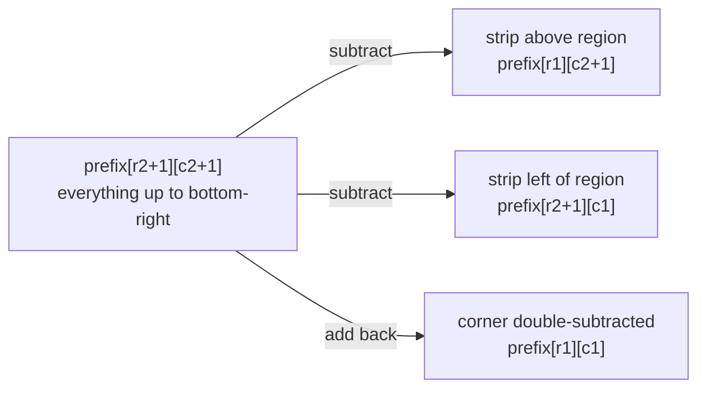

## Extending to a grid

A matrix version of the same problem: given a 2D grid, answer many
"sum of the rectangle from (r1, c1) to (r2, c2)" queries in O(1) each,
after preprocessing. The 1D idea generalizes — but the subtraction
needs care, because a 2D rectangle isn't a simple prefix-minus-prefix
the way a 1D range was.

## Building the 2D prefix sum

Define `prefix[i][j]` as the sum of every cell in the rectangle from
(0,0) to (i−1, j−1) — the top-left rectangle "ending" at row i, column j
(again 1-indexed to sidestep boundary special cases, `prefix[0][*] =
prefix[*][0] = 0`). The recurrence builds each cell from three
neighbors already computed:

```text
prefix[i][j] = grid[i-1][j-1]                  (this cell's own value)
             + prefix[i-1][j]                   (rectangle above)
             + prefix[i][j-1]                   (rectangle to the left)
             - prefix[i-1][j-1]                 (the overlap, counted twice above)
```

```text
grid:              prefix (1-indexed, padded):
1  2  3             0  0  0  0
4  5  6             0  1  3  6
7  8  9             0  5 12 21
                     0 12 27 45
```

The `- prefix[i-1][j-1]` term is the crux: the "above" rectangle and the
"left" rectangle both already include the top-left overlapping
rectangle, so adding both double-counts it — subtracting it once
corrects the overcounting. This is **inclusion-exclusion**, the same
principle behind counting unions of overlapping sets, applied to areas
instead of set sizes.

````tabs
```python
def build_prefix_2d(grid: list[list[int]]) -> list[list[int]]:
    rows, cols = len(grid), len(grid[0])
    prefix = [[0] * (cols + 1) for _ in range(rows + 1)]
    for i in range(1, rows + 1):
        for j in range(1, cols + 1):
            prefix[i][j] = (
                grid[i - 1][j - 1]
                + prefix[i - 1][j]
                + prefix[i][j - 1]
                - prefix[i - 1][j - 1]
            )
    return prefix
```

```typescript
function buildPrefix2D(grid: number[][]): number[][] {
  const rows = grid.length;
  const cols = grid[0].length;
  const prefix = Array.from({ length: rows + 1 }, () =>
    new Array(cols + 1).fill(0),
  );
  for (let i = 1; i <= rows; i++) {
    for (let j = 1; j <= cols; j++) {
      prefix[i][j] =
        grid[i - 1][j - 1] +
        prefix[i - 1][j] +
        prefix[i][j - 1] -
        prefix[i - 1][j - 1];
    }
  }
  return prefix;
}
```
````

## Querying a rectangle in O(1)

The sum of the rectangle from (r1, c1) to (r2, c2) inclusive (0-indexed
into `grid`) is another inclusion-exclusion, in reverse — start from the
big rectangle ending at (r2, c2), then subtract the strip above the
region and the strip to its left, then add back the corner that got
subtracted twice:

```text
sum = prefix[r2+1][c2+1]
    - prefix[r1][c2+1]        (strip above the region)
    - prefix[r2+1][c1]        (strip to the left of the region)
    + prefix[r1][c1]          (corner subtracted twice — restore it once)
```



Four terms, four array lookups, O(1) regardless of the rectangle's size
— exactly the 1D case's guarantee, extended by one dimension of
inclusion-exclusion.

```complexity
{
  "operations": [
    { "name": "build the 2D prefix array", "time": "O(rows × cols)", "why": "one pass over every cell, O(1) work each using the three-neighbor recurrence" },
    { "name": "rectangle sum query", "time": "O(1)", "why": "four lookups and three arithmetic operations, independent of rectangle size" },
    { "name": "space", "time": "O(rows × cols)", "why": "one extra (rows+1) × (cols+1) array" }
  ]
}
```

## The pattern behind the pattern

Both formulas — build and query — are the same move: **express a region
as a combination of easier-to-know regions, correcting for
double-counted overlap.** This is worth recognizing as a general
technique (inclusion-exclusion), not a 2D-prefix-sum-specific trick — it
resurfaces anywhere you need "count/sum of A or B" from "count/sum of A"
and "count/sum of B" when A and B might overlap.

```quiz
{
  "questions": [
    {
      "question": "In the build recurrence, why does the formula SUBTRACT prefix[i-1][j-1] rather than just adding prefix[i-1][j] + prefix[i][j-1]?",
      "options": [
        "To keep the numbers smaller",
        "The rectangle 'above' and the rectangle 'to the left' both include the same top-left overlapping rectangle — adding them both counts that overlap twice, so subtracting it once corrects the double-count. This is inclusion-exclusion",
        "It's a normalization step required for correctness of unrelated cells"
      ],
      "answer": 1,
      "explanation": "Draw the two rectangles: they share a smaller rectangle in their intersection. Any time you combine two overlapping regions by addition, you must subtract the overlap once — this is the identical logic used later for the query formula, just running the same correction in reverse."
    },
    {
      "question": "The query formula for a rectangle subtracts prefix[r1][c2+1] and prefix[r2+1][c1], then ADDS BACK prefix[r1][c1]. Why does the corner need to be added back rather than left subtracted?",
      "options": [
        "It's an arbitrary sign convention",
        "The top strip and the left strip both include the same top-left corner region OUTSIDE the target rectangle — subtracting both strips removes that corner TWICE, so it must be added back once to correct the over-subtraction",
        "Because grid indices start at 0"
      ],
      "answer": 1,
      "explanation": "Same inclusion-exclusion principle as the build step, applied to REMOVAL instead of addition: over-subtracting a shared region needs a compensating addition, exactly mirroring how over-adding needs a compensating subtraction."
    }
  ]
}
```
